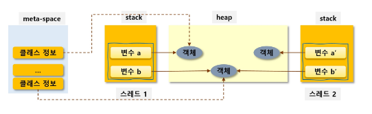
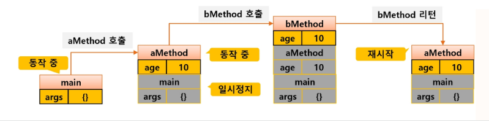

# D+14 JAVA

## OOP
- APIE
  - Abstraction: 현실 객체를 추상화
  - Polymorphism: 하나의 객체를 여러 가지 타입으로 참조
  - Inheritance: 부모 클래스의 자산을 물려받아 자식을 정의 -> 코드를 재사용
  - Encapsulation: 데이터를 외부에 노출시키지 않고 메서드를 이용해 보호
- OOP: Object Oriented Programming
  - 블록 형태의 모듈화된 프로그래밍
    - 신뢰성
    - 재사용성
    - 추가/수정/삭제 용이

- 현실 객체 -> (추상화) -> 클래스
- 클래스 -> (구체화) -> 객체(instance, obj)

### 객체 생성과 메모리 - JVM 메모리 구조


- meta-space
  - 클래스 정보 처리
    - 타입 정보
    - field 정보
    - Method 정보
    - 상수 풀
- stack
  - 메서드 실행 공간
  - 스레드별 별도 관리
  - 메서드 호출 시 마다 메서드 프레임 적충
  - 메서드 프레임에 로컬 변수도 쌓임
- heap
  - 객체를 저장하는 영역
  - thread에 의해 공유
  - 객체 생성 / GC에 의해 정리


## 변수
### 변수의 종류
- 타입에 따른 분류
  - primitive / reference
- 선언 위치에 따른 분류
  - 멤버 변수
    - 클래스 영역 (static)
      - 클래스 멤버 변수 (글로벌 느낌)
    - non-static
      - 인스턴스 멤버 변수
  - 지역 변수
    - 함수 내부
      - 지역 변수
    - 함수 선언부
      - 파라미터 변수

### 인스턴스 멤버 변수
- 선언 위치: 클래스 {} 내부
- 변수 생성: <mark>객체</mark> 생성 시 heap에 객체 별로
- 변수 초기화: 타입 별 defauld -> 할당된 값으로 명시적 초기화
- 변수 접근: 객체 생성(메모리에 올림) -> 객체마다 고유한 값 유지
- 소멸 시점: GC에 의해 객체가 없어질 때 동시에 사라짐 (명시적으로 소멸 x)


### 클래스 멤버 변수 (static)
- 선언 위치: 클래스 {}영역, static 키워드 포함
- 변수 생성: <mark>클래스</mark>가 로딩될 때 구성
  - 값은 heap에 있음
  - 개별 객체 생성과 무관
  - 모든 객체가 공유
  - 공유변수라고도 함 
- 변수의 초기화
  - 타입 별 default -> 할당된 값으로 명시적 초기화
- 변수 접근
  - 객체 생성과 무관, 클래스명.이름으로 적븐
  - 객체 생성 후 접근이 가능은 한데, 스태틱한 접근은 아님
- 소멸 시점
  - 클래스 언로드 때 함께 제거

### 지역 변수 & 파라미터 변수
- 선언 위치: 클래스 {} 이외 모든 중괄호 안에 선언되는 변수
  - 메서드, 생성자, 초기화 블록 등
- 변수 생성
  - 선언된 라인 실행 시
  - stack의 메서드 프레임 내부
- 변수 초기화: 반드시 명시적 초기화 필요
- 변수 접근: 내부에서만 가능
- 소멸 시점: 중괄호 벗어날 때

<mark>day2 19p 손컴파일링 ㄱㄱ</mark>

## 메서드
- 현실 객체 동작을 프로그래밍화

- 결과를 받을 때 묵시적 형 변환 적용
```java
public int add(int a, int b) {
    return a + b;
}
double result2 = add(100, 200); // int->double 묵시적 형변환
```

- 파라미터 전달 시 묵시적 형변환 적용
```java
public long add(long a, long b) {
    return a + b;
}

add(100, 200); // int -> long
add(1.1, 2.2); // 불가능. double -> long은 묵시적 형변환 불가
```
- 리턴 시 묵시적 형변환 적용
### Variable arguments
- 메서드 선언 시 동일 타입 인자가 몇 개 들어올지 예상할 수 없는 경우
- 배열 써도 되는데 메서드 호출 전 생성/초기화해야 함
- ... 쓰면 자동으로 배열 생성 및 초기화
```java
    public void addAll(int... params) {
        int sum = 0;
        for (int i : params) {
            sum += i;
        }
    } System.out.println(sum);
```

### 클래스 멤버, 인스턴스 멤버 호출
- static member
  - 같은 클래스는 바로 호출
  - 다른 클래스는 `ClassName.staticMember`
- non-static member
  - 같은 클래스는 바로 호출
  - 다른 클래스는 객체 생성 후 `objName.memberName`

### 메서드 호출 스택 (call stack)



### 기본형 변수와 참조형 변수
- 메서드 호출 시 파라미터 값을 <mark>복사해서 전달</mark>

### Call by Value
- 인자를 복사해서 전달
- 인자로 받은 값을 변경해도 원본은 바뀌지 않음
- 반대는 call by reference


### 메서드 오버로딩
- 동일 기능을 수행하는 메서드의 추가 작성
- 동일 기능을 여러 형태로 정의할 때
- ex) 출력할 대상(타입)은 다르지만 동일한 메서드 이름으로 호출할 때
- 메서드 오버로딩의 예시
```java
void walk() {
    System.out.println("100m 이동");
}
void walk(double distance) {
    System.out.println(distance + "cm 이동")
}
void walk(double distance, String unit) {
    distance = swtch (unit) {
        case "cm" -> distance;
        case "inch" -> distance * 2.54;
        default -> {
            System.out.println("unknown");
            yield 0;
        }
    }
    System.out.println(distance+"cm");
}
```

## 생성자
- 객체를 생성할 때 호출 (메서드 아님)
- new 키워드와 함께 호출하는 것
- 리턴 타입이 없고 클래스 이름과 동일
```java
    제한자 클래스명 (타입변수) {
        // 멤버 변수 초기화
    }
```

### 기본 생성자
- 파라미터가 없고 구현부가 비어있는 깡통
- 생성자 코드가 없으면 컴파일러가 기본 생성자 제공


### 파라미터가 있는 생성자
- 객체 생성 시 멤버 변수 초기화
- 파라미터가 있는 생성자를 만들면 기본 생성자는 추가되지 않음

### this.
- 자기 자신을 의미
- 생성자에서 멤버 변수임을 명시적으로 나타냄
```java
Person(String name) {
    this.name = name;
}
```
- this는 객체에 대한 참조
  - 즉, static 영역에서는 사용 불가능
- this로 생성자 오버로딩 가능

```java
public class Test {
    int a = 0;
    String s = "s";
}
Test(int a, String s) {
    this.a = a;
    this.s = s;
}
Test(String s) {
    this(200, s); // 바로 위의 생성자 오버로딩
}
Test() {
    // 반드시 첫번째 라인에서만 가능함
    this(10000, "hgr"); 
}
```

## 초기화 블록
- 멤버 변수의 초기화를 목적으로 함
- {} 를 이용해 내부에 실행 코드 작성
- 이름이 없으므로 별도 호출 x, 파라미터도 못받음
### 초기화 블록의 종류
- 클래스 초기화 블록 (static)
  - 클래스 멤버 변수의 초기화를 위해
  - 클래스 로딩 시 1회 호출
- 인스턴스 초기화 블록
  - 인스턴스 멤버 변수의 초기화를 위해
  - <mark>생성자보다 먼저 호출된</mark>
  - 객체 생성시마다 1회 호출


```java
public class Test {
    int i;
    static int si;

    static { // 클래스 초기화 블록
        System.out.println("static init");
        si = 100;
    }

    { // 인스턴스 초기화 블록
        System.out.println("instance init");
        i = 50;
    }
}
```

### 클래스 구성 요소의 로딩, 초기화 순서
#### static 요소
1. static 변수 로딩 - default init
2. statc Method 로딩
3. static Initializer 실행
4. static Method 중 main 실행

#### 인스턴스 요소
1. 멤버 변수 로딩 - defauld init
2. instance initializer
3. 생성자 호출

