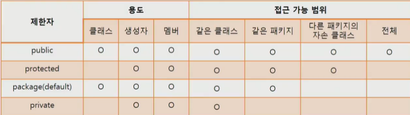
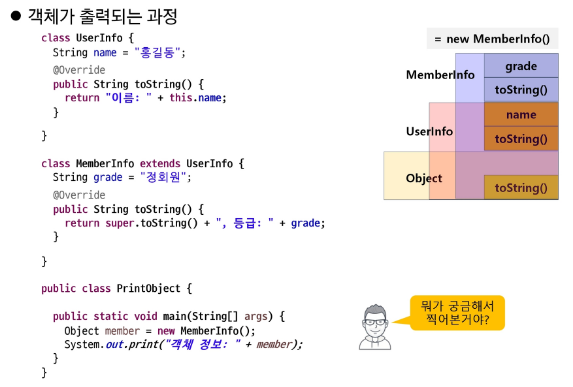
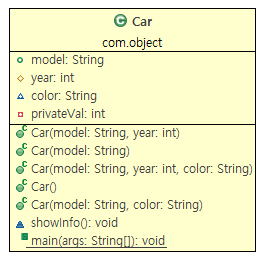

# D+15 JAVA

## 상속 (inheritance)
- 기존 클래스의 멤버(필드 + 메서드)를 자식 클래스에서 재사용하기 위함  
- 상위 클래스의 멤버를 물려받음 -> 코드 중복 최소화  
- 상위 클래스 변경 시 하위 모든 클래스에 적용 -> 유지보수성 향상
- extends 키워드 사용
- is a (kind a) 관계
  - Person is a Object

### Object 클래스
- 모든 클래스의 조상 클래스
- extends Object 생략됨
- 모든 클래스에서 Object 클래스에 정의된 메서드가 있음


### 단일 상속
- 자바는 단일 상속만 지원
- 대신 interface, 포함 관계(has a)로 단점 극복
  - ```java
    public class Spiderman2 extends Person {
        Spider spider;
        boolean isSpider;
    }
    ```
  - Spiderman2와 Spider는 has a 관계
  - uml에서 마름모 모양

### 포함 vs 상속
- 문법 문제 x. 플젝 관점 문제임
- 상속: is a (SpiderMan is a Person)
- 포함: has a (SpiderMan has a Spider)

### Sealed class (java 17~)
- 자바에서의 상속은 자식이 상속받을 부모를 선택
- 부모 입장에서 상속을 허용할 클래스를 고를 수 있음
- Sealed class
  - 봉인된 클래스
  - 내가 관리하는 특정 클래스에만 상속 가능
  - class에 sealed 클래스 사용, 상속 허락하는 클래스를 permits 뒤에 나열
  - 구현 클래스는 다음 키워드 중 하나를 사용해야 함.
    - sealed: 여전히 봉인된 클래스. 추가적으로 permits로 하위클래스 나열 필요
    - final: 더이상 상속 받을 수 없는 클래스
    - non-sealed: 봉인이 해제된 클래스. 자유롭게 상속 가능

```java
sealed class SealedStudyGroup permits Algo, Java, CS {
    public void study() {
        System.out.println("공부 공부 공부!!");
    }
}

// sealed 클래스를 상속받으려면 final, sealed, non-sealed 키워드를 반드시 포함해야 함
final class Algo extends SealedStudyGroup{} 
sealed class Java extends SealedStudyGroup permits Spring{}
non-sealed class CS extends SealedStudyGroup {}
 

final class Spring extends Java{} // Java는 sealed, Spring을 permit했으므로 상속 가능
class Network extends CS{} // CS는 non-sealed. 자유롭게 상속 가능

public class SealedTest {

    public static void main(String[] args) {
        SealedStudyGroup group = new SealedStudyGroup();
        group.study();
    }
}

```
## 메서드 재정의 (오버라이딩)
- 조상 클래스에 정의된 메서드를 자식 클래스에서 적합하게 수정하는 것
```java
	@Override
	void jump() { // 오버라이딩 -> 덮어쓰기
		if (this.isSpider) {
			spider.jump();
		} else {
			System.out.println("tiny jump");
		}
	}
	
	// 오버로딩 ->메모리 추가적재
	void jump(int num) {
		System.out.println("jump " + num);
	}
```

### 오버라이딩의 조건
1. 메서드 이름이 같아야 함
2. 매개변수의 개수, 타입, 순서가 같아야 함
3. 리턴타입이 같아야 함
4. 접근 제한자는 부모보다 범위가 넓거나 같아야 함
5. 조상보다 더 큰 예외를 던질 수 없음

### super
- this는 자기 멤버에 접근
- super는 조상 클래스 멤버에 접근
- super.~ 이용해 조상 메서드 사용 가능

- 현재 예제에서, SpiderMan 클래스 기준으로
  - `spiderMan.jump() == this.jump();`
  - `person.jump() == super.jump();`
  - `spider.jump() == spider.jump(); // 포함관계, 객체로 호출`

- this()는 해당 클래스의 다른 생성자를 호출
- super()는 조상 클래스의 생성자 호출
- super()는 자식 클래스 <mark>생성자의 맨 첫 줄에서만 호출 가능</mark>
  - 생성자의 첫 줄에만 this() | super()가 올 수 있음
- 명시적으로 this() | super() 호출하지 않은 경우 컴파일러가 super()를 삽입한다. 
- 결론적으로 맨 상위 Object까지 객체가 다 만들어짐
  - (super이 계속 불리므로 끝까지 올라가면 Object 클래스임)

- 3중 이상 상속 관계일 때, super는 바로 위를 의미함. 조상 A, 부모 B, 자식 C가 모두 동일한 이름의 메서드를 갖고 있을 때, C가 super.method 하면 B의 method가 호출된다.
- 가장 위로 올라가고 싶으면 B의 메서드에서도 super로 올리면 된다. 

```java
class Employee {
	int num;
	String name;
	int salary;
	// 사용자 지정 생성자 만드는 경우 기본 생성자 사용 불가
	// 따라서 자식 클래스인 Manager에도 동일한 인자를 받는 생성자가 반드시 필요. 
	// 기존의 디폴트 생성자 사용 불가 -> Manager의 첫줄에 super()이 생략되었지만, 
	// 부모인 Employee는 인자를 받지 않는 기본 생성자 사용이 불가능해졌음. 
	// 따라서 Manager에 반드시 num, name, salary 세 개를 받는 생성자를 만들어야 함. 
	
	public Employee(int num, String name, int salary) { 
		super();
		this.num = num;
		this.name = name;
		this.salary = salary;
	}
	public double getBonus() {
		return salary * 0.1;
	}
}

public class Manager extends Employee {
	 // 아래 생성자를 만들지 않는다면 오류 발생함
//	public Manager(int num, String name, int salary) {
//		super(num, name, salary);
//		// TODO Auto-generated constructor stub
//	}

	int mcode;
	
	@Override
	public double getBonus() {
		return salary * 0.3;
	}

	
	
}
```


### 변수 스코프
- 사용된 위치에서 점점 확장, 처음 만난 선언부에 연결
- method 내부 -> 해당 클래스 멤버 변수 -> 조상 클래스 멤버 변수

```java
Class Parent {
    String x = "X"; // 우선순위 3
}
Class Child extends Parent {
    String x = "XX"; // 우선순위 2
    void method() {
        String x = "XXX"; //  우선순위 1
    }
}
```

### Annotation
- 컴파일러, JVM, 프레임워크 등이 보는 주석
- 소스코드에 메타데이터 삽입하여 정보 제공
- 소스코드에 붙여 놓은 라벨
- 코드에 대한 정보 추가 (구조 변경, 환경 설정 정보 추가)

- `@Deprecated`
- `@Override`
  - 이 메서드가 오버라이드했음을 알림
  - 이 메서드는 반드시 super 클래스에 선언된 메서드여야 함
  - super 클래스에 이 메서드가 없으면 컴파일 에러 발생


## package & import 
- Package
  - 폴더
  - 계층적 접근
  - package name + class name = fully qualified name
  - 첫번째 문장에 하나의 패키지만 선언
  - 모든 클래스는 반드시 하나의 패키지에 속함
  - 선언 안하면 디폴트 패키지에 속하는데 그러지 마셈
- naming rule
  - <mark>소속.프로젝트.용도</mark>
  - com.ssafy.pjname.service

- import
  - 다른 패키지에 선언된 클래스를 사용하기 위한 키워드
  - import 패키지명.클래스명;
  - import 패키지명.*;
    - 하위 패키지까지 import하지 않음
  - import한 패키지 클래스 이름이 동일하여 명확히 구분해야 할 때
    - `java.util.List list = new java.util.ArrayList();` 
      - List는 AWT에도 있음. 이런 경우 전체 패키지 명을 입력
  - default import package: java.lang.*; <-- 얘는 자동 임포트

## 제한자
- 클래스, 변수, 메서드 선언부에 함께 사용되어 부가적인 의미 부여
- 접근 제한자 (public, protected, default(package), private)
- 그 외 제한자 (static, final, abstract, synchronized)
- 여러 제한자 조합 가능, 단 접근 제한자는 하나만

### final
- 더 이상 바뀔 수 없음
- final class: 상속 금지, 오버라이드 방지(모든 메서드에 final이 붙는 효과)
- final method: 재정의 불가(오버라이드)
- final variable: 더이상 값을 바꿀 수 없음
- blank final: 값이 할당되지 않은 멤버 변수
  - 생성자에서 딱 한 번 초기화 가능
  - 다시 말해, <mark>생성자에서 초기화를 강제하는 역할</mark>
  - 주민번호, 성별, 혈액형 등
  - ```java
    class A {
        final int num; // <- 디폴트 초기화되지 않음. 생성자에서 딱 한 번 초기화 가능. 초기화하지 않으면 에러뜸
    }
    ```
- static final
  - 진정한 상수
  - Math.PI

### 접근 제한자


```java
public class Parent {
    public int publicVar;
    protected int protectVar;
    int defaultVar;
    @SuppressWarnings("unused")
    private int privVar;

    public void useMember() {
    	// 같은 클래스 -> 노상관
        this.publicVar = 10;
        this.protectVar = 10;
        this.defaultVar = 10;
        this.privVar = 10;
    }
}
```

1. 같은 패키지, 상속받음
```java
 public class SamePackageChildClass extends Parent{
	// 같은 패키지
	// private 빼고 다 가능 
    public void useMember() {
    	// 같은 클래스 -> 노상관
        this.publicVar = 10;
        this.protectVar = 10;
        this.defaultVar = 10; // 같은 패키지니 가능
        this.privVar = 10; // 가지고는 있는데 접근을 못함
    }
	 
    // END
}
```
- 부모의 private 변수는 가지고 있지만 접근은 안됨

2. 같은 패키지, 상속 안받음
```java
public class SamePackageSomeClass {
    public void method() {
        // TODO: Parent 객체를 생성하고 이를 통해서 Parent의 멤버에 접근해보세요.
    	Parent p = new Parent();
    	p.publicVar = 1;
    	p.protectVar = 1;
    	p.defaultVar = 1;
    	p.privVar = 1; // 안됨
        // END
    }
}
```
- defaultVar 사용 가능

3. 다른 패키지, 상속 받음
```java
// TODO: Parent를 상속받고 Parent의 member들에 접근해보세요.
 public class OtherPackageChildClass extends Parent{
    public void useMember() {
    	// 같은 클래스 -> 노상관
        this.publicVar = 10;
        this.protectVar = 10;
        this.defaultVar = 10; // 상속 안받았고 패키지 달라서 못씀
        this.privVar = 10; // 가지고는 있는데 접근을 못함
    }
    // END
}
```
- public, protect는 사용 가능

4. 다른 패키지, 상속 x
```java
public class OtherPackageSomeClass {
    public void method() {
        // TODO: Parent 객체를 생성하고 이를 통해서 Parent의 멤버에 접근해보세요.
    	Parent p = new Parent();
    	
    	p.publicVar = 1;
    	p.protectVar = 1; // 안됨
    	p.defaultVar = 1; // 안됨
    	p.privVar = 1; // 안됨
        // END
    }
}

```
- public 빼고 싹 다 안됨

### 접근 제한자
- method override 조건의 확인
- 부모의 제한자 범위와 같거나 넓은 범위로만 사용 가능함
- 부모 메서드가 public이라면 오버라이드 메서드는 반드시 퍼블릭이 되어야 함


## Encapsulation
### 데이터 은닉과 보호
- 변수는 private로 선언
- 공개되는 메서드를 통한 접근 통로 마련
  - public getter, setter

## Singleton
- 객체이 생성을 제한해야 할 때
- 여러 개의 객체가 필요 없는 경우
  - (객체를 구별할 필요가 없는 경우)
  - (객체에 수정 가능한 멤버 변수가 없는 경우)
  - (객체가 기능만 갖고 있는 경우) ( == stateless )
- 객체 생성 삭제보다 재사용이 유리한 경우

### 싱글톤 작성법
- 외부에서 생성자 접근 금지
  - 외부 객체에서 new 생성 불가
- 생성자의 접근 제한자를 <mark>private</mark>로 설정
- 내부에서 생성자 호출 -> 객체 생성
- 외부에서 private member에 접근 가능한 getter 생성. setter 불필요
- 객체 없이 외부에서 접근할 수 있도록 getter와 변수에 <mark>static</mark> 추가

- <mark>외무에서는 항상 getter를 통해 객체를 참조함</mark>
```java
class SingletonClass {
    private static SingletonClass instance = new SingletonClass(); // 객체를 static으로 생성
    private SingletonClass() {} // 생성자가 private
    public static SingletonClass getInstance() {
        return instance; // 객체에 접근할 수 있는 getter를 퍼블릭으로 제공
    }
}

```

## Polymolphism
- 다형성: 하나의 객체가 많은 타입을 가질 수 있는 성질
- 상속 관계에 있을 때 조상 클래스의 타입으로 자식 클래스 객체를 참조할 수 있다. 

### 다형성의 활용
1. 다른 타입의 객체를 다루는 배열  
- ```java
    Person[] people = new Person[10];
    person[0] = new Person();
    person[1] = new SpiderMan();
    ```
- Object는 모든 클래스의 조상이므로 Object[]에는 모든 객체를 다 담을 수 있음.
- 이런 특성으로 Collection 만들었음

2. 매개변수의 다양성
- 조상을 파라미터로 처리하면 객체 타입에 따라 메서드를 만들 필요가 없음
- ```java
  public void println(Person p) {}
  public void println(int i) {}
  // 이러면 끝이 없음

  public void println(Object obj) {
    String s = String.valueOf(obj);
    synchronized(this) {
        print(s);
        newLine();
    }
  }
  ```  
  - 조상 객체로 메서드를 만들자.
  - API에서 파라미터로 Object를 받으면 모든 객체를 처리한다는 의도임


## 객체의 형변환
### 다형성과 참조형 객체의 형 반환
- `Person person = new SpiderMan();
  - 메모리에는 SpiderMan의 모든 멤버가 적재되어 있음
  - 하지만 Person으로 선언했으므로 SpiderMan만 갖고 있는 멤버에는 접근할 수 없음

- 하위 타입을 상위 타입으로 형 변환 (자식을 조상으로 참조) -> 묵시적 캐스팅
  - ```java
    Person person = new Person();
    Object obj = person;
    ```
  - Object의 모든 멤버가 person에 있으므로 상관이 없음
- 상위 타입(조상)을 하위 타입(자식)으로 변환 -> 명시적 캐스팅
  - ```java
    Person person = new SpiderMan();
    SpiderMan sman = (SpiderMan) person;
    ``` 
  - 조상 타입을 자식 타입으로 참조 -> 명시적 형변환 필수
  - Spider의 모든 기능이 Person에 없기 때문. 

```java
private void unsafeCasting() {
    	// o는 object가 가진 멤버에만 접근 가능
    	Object o = new SpiderMan();
    	
    	// SpiderMan은 o에 비해 기능이 매우 많음. 
    	// 상위 타입(object)를 하위 타입에 캐스팅 -> 명시적 형변환
    	SpiderMan sman = (SpiderMan) o;
    	
    	
        Object obj = 1; // int -> Integer wrapping
        // 상위 타입(obj) -> 하위 타입(String) 캐스팅 -> 명시적 형변환
        // 이 코드는 불가능함. 런타임 익셉션임. 컴파일땐 문제가 없었음.. 
        String s = (String) obj;
        
        // 불가능. s는 obj이고, obj는 length() 메서드를 가지고 있지 않음.
        System.out.println(s.length());
    }

    private void safeCasting() {
        // TODO: 위 메서드가 안전하게 형 변환할 수 있도록 수정해보자.
    	Object obj = 1;
    	if (obj instanceof String s) {
    		System.out.println(s.length());
    	} else {
    		System.out.println("문자열이 아닙니다. ");
    	}
        // END
    }
```
- 이를 방지하기 위해 instanceof 연산자를 사용
```java
Person person = new Person();

if (person instanceof SpiderMan) {
    SpiderMan sman = (SpiderMan) person;
}

// 자바 16부터 가능
if (person instanceof SpiderMan sman) {}
```


### 정적 바인딩과 동적 바인딩
```java
Class SuperClass {
    String x = "super";

    public void method() {
        System.out.println("super class method");
    }
}

class SubClass extends SuperClass {
    String x = "sub";

    @Override
    public void method() {
        System.out.println("sub class method");
    }
}

public class MemberBindingTest {
    psvm() {
        Subclass subClass - new SubClass();
        System.out.println(subClass.x);
        
        // 당연히 Subclass method가 출력
        subClass.method();

        SuperClass superClass = subClass;

        // SuperClass.x가 출력
        System.out.println(SuperClass.x);
        
        // 이거 실행해도 재정의된 SubClass.method가 호출됨!!!!
        // 동적 바인딩
        superClass.method(); 
    }
}
```
- <mark>재정의된 메서드가 있다면 그거 출력됨
</mark>

### 정적 바인딩
- 컴파일 단계에서 참조 변수의 타입에 따라 연결이 달라짐
  - 상속 관계에서 객체의 멤버 변수가 중복될 때
  - static method일 때

### <mark>동적 바인딩</mark>
- 다형성을 이용해서 메서드 호출이 발생할 때 runtime에 메모리의 실제 객체의 타입으로 결정
- <mark>상속 관계에서 객체의 instance method가 재정의되었을 때 마지막에 재정의된 자식 클래스의 메서드가 호출된다.</mark>
    - toString은 Object 클래스의 메서드
    - 그냥 해시코드를 뱉음 <- 쓸모가 없음
    - 우리는 이걸 상속받고 재정의할거임. 
    - 그럼 당연히 재정의한 메서드를 출력하는 것이 최선임.
- 
- <mark>비즈니스 로직 상 최상위 객체 기준으로 메서드를 구성하는 것이 옳음</mark>
## Object 메서드 재정의
- toString
  - 객체를 문자열로 변경
- equals()
  - 참조형 객체는 == 비교 불가 (참조값 비교해서 뭐함)
  - 값이 같은지 판단하기 위해 사용
- hashCode()
  - 시스템에서 객체를 구별하기 위해 사용하는 정수 값
  - equals()를 재정의할 때 hashCode도 함께 재정의해야 함
  - HashSet, HashMap 등에서 객체의 동일성을 확인하기 위해 사용
  - `s1.equals(s2) && s1.hashCode() == s2.hashCode();`
  - Object class에 정의된 hashCode
    - public native int hashCode();
    - 미리 작성된 String이나 Number 등에서 재정의된 hashCode 활용 권장

## 아마테라스
- 이클립스 UML 그리는 툴

- 초록 원: public
- 노랑 마름모: protected
- 파랑 세모: default
- 빨간 네모: private