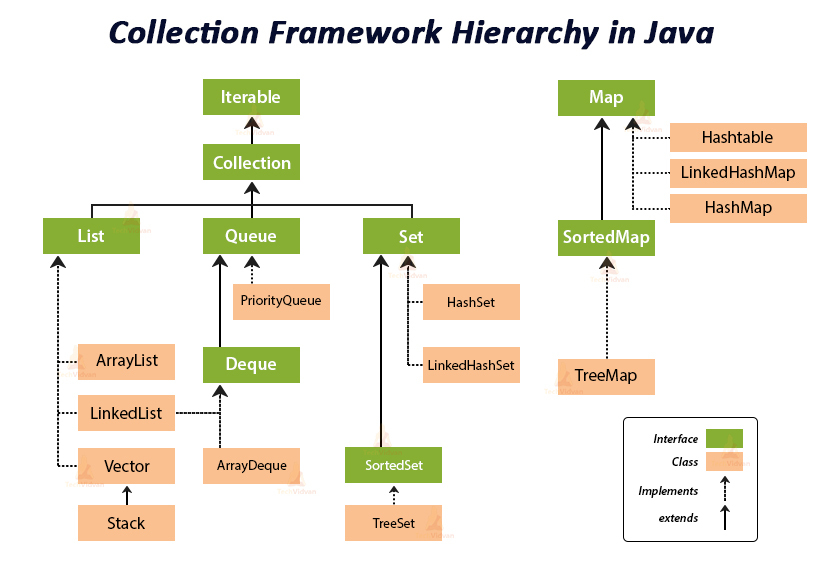

# 자바 코테용 문법

## 입출력

- BufferedReader
  - `BufferedReader br = new BufferedReader(new InputStreamReader(System.in));`
    - `System.in`: 키보드로부터 입력받음
    - `InputStreamReader`: 바이트를 char로 변환
    - `BufferedReader`: buffer 단위로 대용량으로 한 번에 읽어옴
- StringTokenizer
  - `StringTokenizer st = new StringTokenizer(br.readLine());`
    - `br.readLine()`: 한 문장을 통째로 읽음 ex: "1 4"
    - `StringTokenizer`: 읽어온 문자열을 공백 기준으로 찢어줌. 파이썬의 input().split()
- Integer.parseInt
  - `int a = Integer.parseInt(st.nextToken());`
    - `st.nextToken()`: 찢은 문자열 중 하나를 꺼냄
    - `Integer.parseInt()`: 문자열을 int로 바꿈
- StringBuilder
  - ```java
        StringBuilder sb = new StringBuilder();
        sb.append(ans).append('\n');
        System.out.println(sb);
    ```
    - <mark>자바에서 String은 Immutable이므로 파이썬처럼 String += 연산 하면 계속 복사한다. -> 시간초과<\mark>
    - StringBuilder는 가변이다. 파이썬처럼 String 뒤에 붙일 수 있음.

### 핵심요약

- 이거 치고 시작

```java
    BufferedReader br = new BufferedReader(new InputStreamReader(System.In));
    StringTokenizer st;
    StringBuilder sb = new StringBuilder();
```

## static

- static은 전역 선언
- `static class Node`
  - Main 클래스를 객체로 만들지 않아도 독립적으로 Node 클래스를 만들 수 있음
  - 코테 환경에서 new Main() 하는거 아님. 즉 클래스를 선언하려면 반드시 static을 붙여야함
- `static int[]`, `static bfs()`
  - 파이썬의 전역 변수와 동일함
  - 프로그램이 시작되면 바로 static 영역에 올라감
  - static 메서드도 마찬가지
  - 단, static 메서드 내부에서는 반드시 static 변수만 사용할 수 있음
  - main 함수 실행 시, Main 객체는 만들어지지 않은 상태이므로 main에서 bfs를 호출하기 위해선 반드시 static이어야 함.

## util

- Collections의 상위 패키지
- 걍 java.util.\*로 다 땡겨오셈
- 
  - Queue에선 PriorityQueue, ArrayDeque 많이 씀
  -
