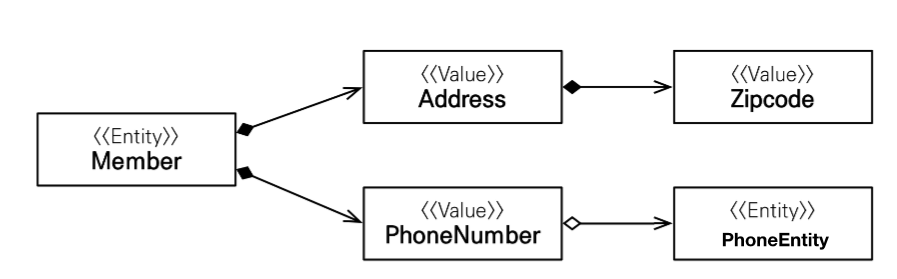

## 기본값 타입

### JPA의 데이터 타입 분류

- 엔티티 타입
  - @Entity로 정의하는 객체
  - 데이터가 변해도 식별자로 지속해서 추적 가능
  - 회원 엔티티의 키나 나이 값을 변경해도 식별자로 인식 가능
- 값 타입
  - int, Integer, String처럼 단순히 값으로 사용하는 자바 기본 타입이나 객체
  - 식별자가 없고 값만 있으므로 변경 시 추적이 불가
    - 숫자 100을 200으로 변경하면 완전히 다른 값으로 대체

### 값 타입 분류

1. 기본 값 타입
   - 자바 기본 타입(int, double)
   - 래퍼 클래스(Integer, Long)
   - String
   - 엔티티의 생명 주기에 의존
     - 회원을 삭제하면 이름, 나이 필드도 함께 삭제된다.
   - 값 타입은 공유해서는 안 된다.
     - 회원 이름 변경 시 다른 회원의 이름도 변경되어서는 안 된다.
       ```java
           Integer a = new Integer(10);
           Integer b = a;
       ```
       - 물론, 이렇게 하면 b에는 a의 주소가 넘어간다. 하지만, 자바에서 기본 제공하는 클래스의 경우 a.setInteger()과 같은 메소드를 제공하지 않는다. <mark>즉, 공유 가능하지만 변경이 불가능하게 되어 있다.
       - 바꿔 말하면, 자바에서 기본적으로 제공하지 않는 클래스의 경우 set()을 통하여 값을 변경할 수 있다는 것을 의미한다. 변경된 값은 당연히, 같은 주소를 가진 a, b에게 동일하게 적용된다.
2. 임베디드 타입
   - 커스텀하게 만드는 타입. 복합 값 타입
3. 컬렉션 값 타입

## 임베디드 타입 (복합 값 타입) (객체 타입)

- 새로운 값 타입을 직접 정의할 수 있음
- JPA는 임베디드 타입이라고 한다
- 주로 기본 값 타입을 모아서 만들기 때문에, 복합 값 타입이라고도 한다.
- <mark>int, String과 같은 값 타입이다.</mark>

- 회원 엔티티는 이름, 근무 시작일, 종료일, 주소 도시, 주소 번지, 주소 우편번호를 갖는다.
- 근무 시작일과 근무 종료일을 workPeriod로 묶고, 주소 도시, 번지, 우편번호를 homeAddress로 묶자.
  
- @Embeddable: 값 타입을 정의하는 곳에 표시하자. 위의 경우 Period와 Address에 표시하면 된다.
- @Embedded: 값 타입을 사용하는 곳에 표시하자. 위의 경우 Member 엔티티에 표시하면 된다.
- 기본 생성자가 필수이다.

### 왜 사용?

- <mark>객체지향적으로 좋은 설계</mark>
- 재사용이 가능하다.
- 높은 응집도를 갖는다.
- Period.isWork()와 같이, 해당 값 타입만 사용하는 의미 있는 메소드를 만들 수 있다.
- <mark>임베디드 타입을 포함한 모든 값 타입은, 당연히 이를 소유한 엔티티의 생명주기에 의존한다. </mark>

### 테이블 매핑


```java
@Entity
public class member {
    ~~~
    @Embedded // 값 타입을 받는 곳.
    private Period workPeriod;

    @Embedded // 값 타입을 받는 곳.
    private Address homeAddress;
}

@Embeddable // 값 타입을 정의하는 곳.
@Setter // 기본 생성자는 반드시 있어야 함.
public class Period {

    public boolean isWork() {
        ~~~ // 이런 식으로 period만 사용하는 메소드를 만들 수 있다.
    }
    private LocalDateTime startDate;
    private LocalDateTime endDate;

}

@Embeddable // 값 타입을 정의하는 곳.
@Setter // 기본 생성자는 반드시 있어야 함.
public class Address {
    private String city;
    ~~~
}
```

- DB 입장에서는 딱히 달라질 것이 없다.
  - 임베디드 타입을 사용하기 전과 후의 매핑하는 테이블은 같다.
  - 임베디드 타입은 엔티티의 값일 뿐이다.
- 객체와 테이블을 아주 세밀하게 매핑하는 것이 가능하다.
- 잘 설계한 ORM 애플리케이션은 매핑한 테이블의 수보다 클래스의 수가 더 많다.

### 임베디드 타입과 연관관계



- 임베디드 타입은 임베디드 타입을 가질 수 있다.
- <mark>임베디드 타입은 엔티티 타입을 가질 수 있다.</mark>

  - 엔티티의 외래 키만 갖고 있으면 되기 때문.

    ```java
    @Embeddable
    public class Address {
        ~~~
        private Member member; // 이게 가능하다!
    }
    ```

- 만약, 한 엔티티 내에서 같은 값 타입을 사용한다면?

  - Member 클래스 내부에서 workAddress, homeAddress를 둘 다 가져야 한다면?
  - @AttributeOverrides, @AttributeOverride를 사용하여 컬럼 명을 재정의해야 한다.
    - 그렇지 않을 경우 중복된 컬럼명이 생기게 되어 예외가 발생한다.

- <mark>임베디드 타입의 값이 null이면 매핑한 컬럼 값은 당연히 모두 null이 된다.</mark>

## 값 타입과 불변 객체

<mark>값 타입은 반드시 불변으로 만들어야 함!!!</mark>

- 값 타입은 복잡한 객체 세상을 조금이라도 단순화하려고 만든 개념.
- 단순하고 안전하게 다룰 수 있어야 함.

- 임베디드 타입(값 타입)을 여러 엔티티에서 공유할 수 있다.
- 다만, 이러면 부작용이 발생하기 쉽다.

  - 같은 Address를 member1, member2가 모두 사용하는 경우.
  - 이 주소를 변경하는 경우 두 멤버의 주소가 모두 변경된다.

- `Address copyAddr = new Address(address.getCity(), address.getStreet());`과 같이, 기존의 어드레스를 복사하여 member2에 넣어주어야 한다.

### 객체 타입의 한계

- 항상 값을 복사해서 사용하면 공유 참조로 인한 부작용을 피할 수 있다.
- 문제는, 임베디드 타입은 <mark>객체 타입이다.</mark> (기본 타입이 아니다.)
- 자바 기본 타입에 값을 대입하면 값을 복사한다.
  - `int a = 4; b = a;` 해도 b와 a는 다른 값이다. b를 수정해도 a가 바뀌지 않는다.
- 하지만, 객체 타입은 참조를 넘기게 된다.
- 객체 타입은 참조 값을 직접 대입하는 것을 막을 수 없다.
- <mark>객체 타입을 컴파일러 레벨에서 공유하지 못하게 하는 방법이 있을까?</mark>

### 불변 객체

- 객체 타입을 수정할 수 없게 만들자.
- <mark>값 타입은 불변 객체로 설계해야 한다.</mark>
  - 불변 객체: 생성 시점 이후 절대 값을 변경할 수 없는 객체
- <mark>생성자로만 값을 설정하고, 수정자(Setter)를 만들지 않으면 된다.</mark>
  - 혹은, private로 만들자.
- Integer, String은 대표적인 불변 객체이다.

  - Integer.setInt() 이런게 없다. 값을 바꿀 수 있는 방법이 없음.

- 값을 바꾸고 싶으면?
  - new Address()를 새로 만들어서, member.setHomeAddress(newAddress)를 다시 해야 함.

<mark>값 타입은 반드시 불변으로 만들어야 함!!!</mark>

## 값 타입의 비교

<mark>equals() 메소드를 재정의하여 사용하자!!</mark>

- 값 타입: 인스턴스가 달라도 그 안에 값이 같다면 같은 것으로 봐야 한다.
- `Addr a = new Addr("서울");`, `Addr b = new Addr("서울");`에서, a==b하면 주소가 다르기 때문에 false가 나온다. 근데, 이게 true로 나와야 한다는 의미이다.

- 동일성 비교 (identity): 인스턴스의 참조 값을 비교. ==
- 동등성 비교 (equivalence): 인스턴스의 값을 비교. equals()
- 값 타입은 a.equals(b)를 사용하여 동등성 비교를 해야 함.
- 값 타입의 equals() 메소드를 적절하게 재정의(오버라이드)하자.(주로 모든 필드 값을 사용한다.)

## 값 타입 컬렉션

- 자바 컬렉션도 매핑해서 사용할 수 있다. (물론, 새 엔티티로 사용하는 것이 아닌, 엔티티 내부에서 임베디드 타입과 같이 사용 가능하다.)
- 스스로의 라이프사이클이 없다. 즉, 속한 엔티티의 라이프사이클을 따른다.
- <mark>값 타입 컬렉션은 영속성 전이(cascade) + 고아 객체 제거 기능(orphanremoval) 기능을 필수적으로 가진다.</mark>
- 컬렉션들은 모두 지연로딩이다. (부를 때 쿼리가 나간다.)
  
- FAVORITE_FOOD, ADDRESS 테이블에 별도의 id가 없는 이유
  - 얘네가 아이디를 갖는 순간, 엔티티가 되어버린다.
  - 값 타입을 사용하는 이유가, 테이블에 값만을 갖기 위한 것인데,(주소의 경우 CITY, STREET, ZIPCODE) ADDRESS_ID 이런 컬럼이 들어오면 이미 엔티티가 된다. 값 타입 객체를 쓸 이유가 없음.

```java
public class Member {
    ~~~
    @Embedded // 임베디드 타입 매핑
    private Address homeAddress;

    @ElementCollection // 컬렉션 타입 매핑
    @CollectionTable(name = "FAVORITE_FOOD", joinColumns =
        @JoinColumn(name = "MEMBER_ID")) // 컬렉션 타입의 컬럼명 지정
        // MEMBER_ID를 외래키로 잡음
    @Column(name = "FOOD_NAME") // 컬럼 이름
    private Set<String> favoriteFoods = new HashSet<>();

    @ElementCollection
    @CollectionTable(name = "ADDRESS", joinColumns =
        @JoinColumn(name = "MEMBER_ID")) // 컬렉션 타입의 컬럼명 지정
    private List<Address> addressHistory = new ArrayList<>();
}
```

- 값 타입을 하나 이상 저장할 때 사용
- <mark>@ElementCollection, @CollectionTable 사용</mark>
- 데이터베이스는 컬렉션을 같은 테이블에 저장할 수 없다.
- 컬렉션을 저장하기 위한 별도의 테이블이 필요하다.(CollectionTable)

- <mark>값 타입 컬렉션도 값 타입이므로, setter를 만들면 안된다.(혹은 private)
- <mark>따라서, 이를 수정하기 위해서는 `findMember.setHomeAddress(new Address("~~"));`와 같이, 새로 만들어줘야 한다.
- `Set<String> favoriteFoods`의 값을 수정할 때에는 다음과 같이 하자.
- `findMember.getFavoriteFoods().remove("치킨");`
- `findMember.getFavoriteFoods().add("피자");`

### 값 타입 컬렉션의 제약사항

- 값 타입은, 엔티티와 다르게 식별자가 없다.
- 즉, 값을 변경하면 추적이 어렵다.
- 값 타입 컬렉션에 변경 사항이 발생하면, 주인 엔티티와 관련된 모든 데이터를 삭제하고, 값 타입 컬렉션에 있는 현재 값을 모두 다시 저장한다.
- 값 타입 컬렉션을 매핑하는 테이블은 모든 컬럼을 묶어서 기본 키를 구성해야 한다.
- <mark>결론적으로, 원치 않는 쿼리가 나갈 수 있으므로 값 타입 컬렉션은 사용하지 않는 것이 좋다.</mark>

### 값 타입 컬렉션 대안

- <mark>실무에서는 값 타입 컬렉션 대신에 일대다 관계를 쓰자.</mark>
  - AddressEntity 만들자.

```java
public class AddressEntity {
    @GeneratedValue @Id
    private int id;
    ~~~
}

public class Member {
    ~~~
    @OneToMany(cascade = CascadeType.ALL, orphanRemoval = true) // 값 타입 컬렉션처럼 영속성 전이와 고아 객체 제거 속성을 모두 넣어주자.
    @JoinColumn(name = "MEMBER_ID") // 외래키 지정
    private List<AddressEntity> addressHistory = new ArrayList<>();
}
```

### 정리

- 엔티티 타입의 특징
  - 식별자가 있다.
  - 생명 주기를 관리한다.
  - 공유가 가능하다.
- 값 타입의 특징

  - 식별자가 없다.
  - 생명 주기를 엔티티에 의존한다.
  - 공유하지 않는 것이 안전하다.(복사해서 사용한다.)
  - 불변 객체로 만드는 것이 안전하다.
    - setter를 만들지 않는다.
    - private로 setter를 만든다.

- 값 타입은 정말 값 타입이라 판단될 때에만 사용해야 한다.
  - 예를 들어, 단순한 체크박스 [치킨, 피자] 이런거
- 엔티티와 값 타입을 혼동해서 엔티티를 값 타입으로 만들면 안 된다.
- 식별자가 필요하고, 지속해서 값을 추적 변경해야 한다면 이는 값타입이 아닌 엔티티이다.

## 실전 예제


Address를 값 타입으로 만들자.
