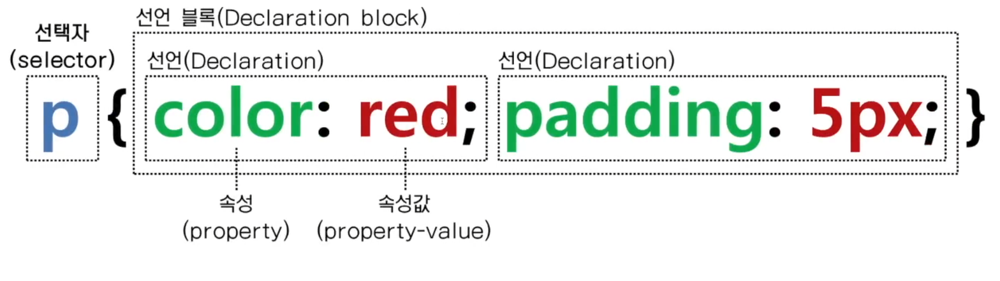
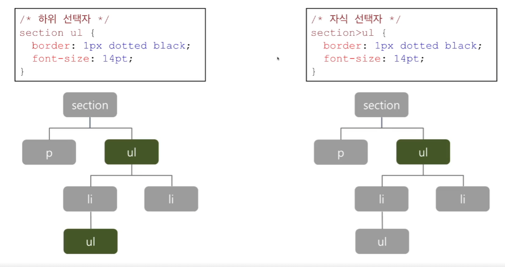
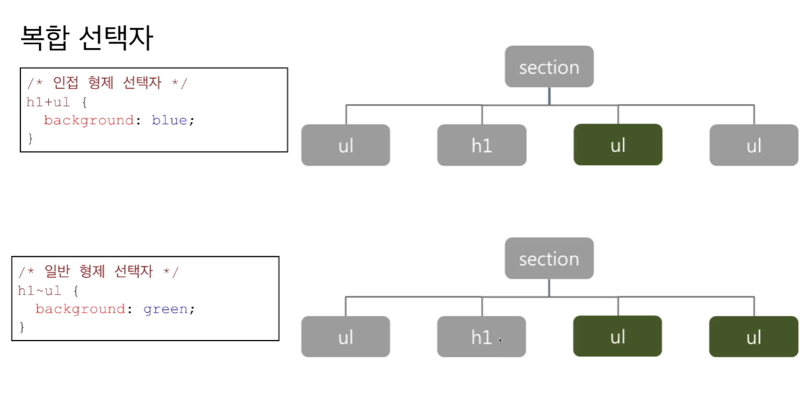
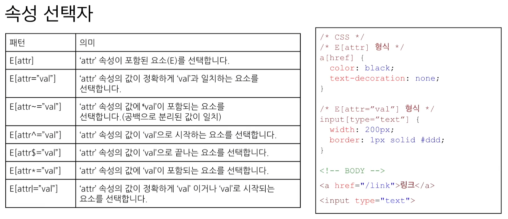
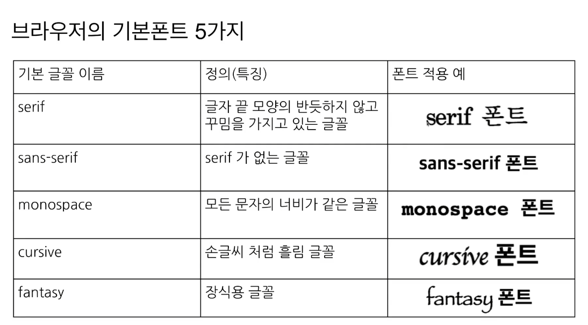
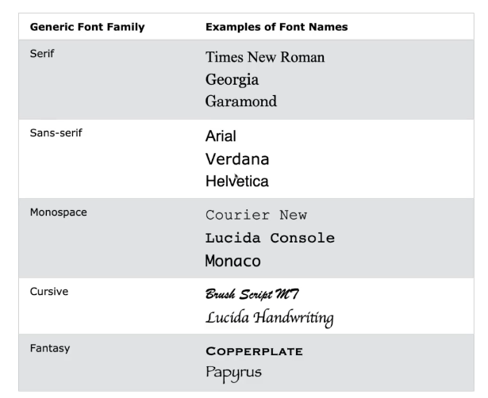
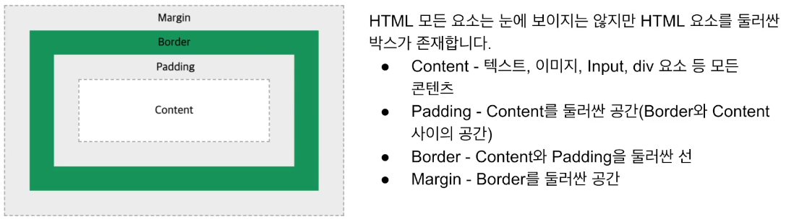

## css

##### Cascading Style Sheets

- 여러 웹 페이지의 레이아웃을 한 번에 컨트롤할 수 있다.

- css 파일로 스타일을 전체 웹 페이지에 한 번에 적용할 수 있기 때문에 많은 작업을 줄일 수 있다.

##### W3C 표준화 제정 단계 - https://caniuse.com/

- WD: 초안, 여러 커뮤니티로부터 검토를 받기 위해 공개한 문서. 실무에 적용하기 부담스럽다.

- CR: 후보권고안, 충분한 검토를 받아 기술적인 요구사항이 충족된 단계. 실무에 적용할 수 있음.
- PR: 제안권고안, 최종 승인을 얻기 위해 검토하는 단계
- REC: 권고안, 승인이 완료되어 표준화됨

## CSS selector

[01_universal_selector.html](01_universal_selector.html)
[02_class_selector.html](02_class_selector.html)
[03_tag_selector.html](03_tag_selector.html)
[04_id_selector.html](04_id_selector.html)
[05_combinator_selector.html](05_combinator_selector.html)
[06_attribute_selector.html](06_attribute_selector.html)
[07_pssudo_selector.html](07_pssudo_selector.html)

- CSS selector 사용법을 기억하자. JS때와도 동일하기 때문이다.
- <mark>전체(universal) 선택자: \*{ }</mark> head의 style 태그 내부에 쓰자.  
  
- <mark>클래스 선택자: .{ } 점으로 시작. 가장 많이 사용된다. </mark> 동일한 클래스 값을 가진 태그의 스타일을 변경한다.
- main, secondary, info, danger 등의 color 선택자를 따로 만들어놓자.
- \<p class="selector1 selector2 .. ">와 같이, 한 태그 내에 여러 개의 선택자를 적용시킬 수 있다.
- <mark>태그 선택자: 태그명을 선택자로 사용한다.</mark> 특정 태그에만 적용시킬 스타일을 작성하자.
- <mark>아이디 선택자: #id_name{ } #으로 시작.</mark> 태그 내부의 유일한 속성값인 id, 그 id를 찾아 스타일을 적용시킨다.  
  실무에서 많이 사용되지는 않는다. inline으로 하면 되지, 굳이 selector를 쓸 이유가 없기 때문이다.
- <mark>복합 선택자(combination selector): 4가지 방식이 존재한다.</mark>

  1. <mark>하위 선택자 방식: parentTag childTag { } 식으로 쓴다.</mark> parentTag 내부의 모든 childTag에 적용시킨다.
  2. <mark>자식 선택자 방식: parentTag > childTag { } 식으로 쓴다.</mark> 하위 선택자와의 차이점은 childTag 하나만 찾는다는 점. (깊이가 1)  
     
  3. <mark>인접 형제 선택자 방식: tag1 + tag2 { }</mark> 형식. tag1 뒤에 나오는 tag2 한 개에 적용.
  4. <mark>일반 형제 선택자 방식: tag1 ~ tag2 { }</mark> 형식. tag1 뒤에 나오는 모든 tag2에 적용.

  

- <mark>속성(attribute) 선택자: [name="name"] { } 특정 name을 가진 태그를 선택하여 스타일을 적용시킨다. </mark>  
  input[type="text"] { } 식으로도 쓸 수 있다. 이 경우 특정 타입에만 스타일을 적용시킨다. 복합 선택자와 조합하여 사용할 수 있다.  
  

- <mark>가상(pseudo) 클래스 선택자: 특정한 조건이 만족했을 때에만 수행되는 클래스. tagName:pseudClass{ }</mark>
  - tag:hover: 마우스가 tag 요소 위에 올라올 때 수행된다.
  - tag:link: 사용자가 방문한 적이 없는 링크일 때 수행된다.
  - tag:visited: 사용자가 방문한 적이 있는 링크일 때 수행된다.
  - tag:focus: focus되어있는 tag 요소에 수행된다. 주로 input에 사용.
  - tr:nth-child(odd): 홀수 행마다 적용. even도 가능.

## applying CSS

[08_css_method.html](08_css_method.html)
[style.css](./css/style.css)

##### css를 적용하는 세 가지 방법

1. inline: 태그에 style 속성을 통해 직접 지정
2. internal css: style 태그 사용
3. external css: 별도 문서 작성. 실무에서는 거의 대부분 이 방법을 쓴다.  
   title tag 아래에 link tag를 삽입하자.

##### <mark> 동일한 클래스 선택자가 있는 경우?</mark>

```css
.table {
  border: 1px solid black;
  border-collapse: collapse;
  width: 100%;
}
.table {
  border: 5px solid red;
  /* border-collapse: collapse; */
  width: 300px;
}
```

이런 경우, 두 선택자가 합쳐진다고 보면 된다. border의 경우 아래의 선택자에 의해 red가 될 것이고, collapse는 위의 속성이 collapse이므로 이를 따른다. width의 경우 300px로 덮어씌워진다.

## coloring CSS

[09_css_color.html](09_css_color.html)

- css에서 색깔을 적용하는 방법은 크게 네 가지가 있다.

1. 키워드 사용

2. RGBA: rgba(255, 0, 0, 0.1)  
   A(alpha)는 투명도. 1이면 투명, 0이면 불투명이다.
3. HEX: color:#ff0000
4. HSLA: hue(색조, 0~360), saturation(채도), lightness(밝기), alpha(투명도)  
   hsla(9, 100%, 65% 0.2)

## text styling

[10_css_text.html](10_css_text.html)

- text-align: center, right, left 정렬
- text-decoration: underline, overline(윗줄), line-through(취소선), none
- text-decoration의 4가지 하위 프로퍼티

1. text-decoration-style: 장식선 스타일(직선, 점선)
2. text-decoration-line: 선 위치(밑줄, 윗줄, 취소선)
3. text-decoration-color: 선 색상
4. text-decoration-thickness: 선 굵기  
   <mark>위의 네 가지 속성을 text-decoration: 뒤의 한 줄로 쓸 수 있다. </mark>

- text-transform: uppercase, lowercase, capitalize(첫번째 글자 대문자)

##### <mark>uppercase 주의점</mark>

사용자에게 대문자로만 이루어져 있는 문자열을 입력받아야 할 때가 있다. 이 때 input class에 uppercase를 적용시키는 경우, 보이는 것만 대문자화된다. 이 경우, JS의 toUpperCase()함수까지 적용시켜야 넘어가는 값까지 대문자화된다.

## font

[11_css_font.html](11_css_font.html)

- 브라우저의 기본 폰트 5가지
    
  cursive, fantasy는 브라우저마다 차이점이 큼. 신중하게 사용.  
  
- font-family:'courier New', Courier, monospace;  
  와 같이 작성했다고 하자. 앞의 폰트부터 우선 적용되며, 만약 브라우저가 해당 폰트를 지원하지 않는다면 뒤의 폰트를 사용한다.
- font-style: italic, oblilque(기본 글씨를 기울임)
- font-weight: normal(400), bold(700), bolder, lighter

- bolder(상대적): 부모가 100~300일 때, bolder은 400 // 부모가 400~500일 때, bolder은 700, 부모가 600 이상일 때, bolder은 900
- lighter(상대적): 부모가 100~500일 때 lighter은 100, 600~700일 때 400, 그 이상일 때 700

- font-size

  1. 절대 값: xx-small, x-small, small, medium, large, x-large, xx-large

  2. 상대 값: larger, smaller
  3. 길이 값: em(부모 요소의 폰트 크기 기준), rem(루트 요소의 폰트 크기 기준), px, pt(1pt == 0.72inch)  
     ex) 부모가 18px면 1em = 9px
  4. 퍼센트 값  
     <mark>대부분 12pt == 16px == 1em == 100%</mark>

  <mark>요즘은 스마트폰에서도 사용하기 때문에, em, rem으로만 작성하는 경우가 많아졌다. </mark>

## list styling

[12_css_list.html](12_css_list.html)

1. 순서 없는 리스트

- <mark>tagName.classname { } 식으로 하면 특정 태그 내부의 클래스만 선택할 수 있다. </mark>

- list-style-type: disc, circle, square
- list-style-type: "-"와 같이, 원하는 문자를 커스텀할 수 있다.

2. 순서 있는 리스트

- decimal, lower-roman, armenian...

## link and curser styling

[13_css_link.html](13_css_link.html)

- 링크: 페이지가 이동하는 것을 의미함.
- 커서
  - auto: 커서 모양을 알아서 판단함.
  - default: 기본 커서 모양과 같다.
  - pointer: 손가락으로 가리키는 모양. 가장 많이 쓴다.  
    이 외에도 많은 커서가 존재한다. 자세한 예시는 13_css_link.html로

## table styling

[14_css_table.html](14_css_table.html)

## css box model and size of elements

[15_box_model.html](15_box_model.html)
[16_box_sizing.html](16_box_sizing.html)



- padding: padding-top, bottom, right, left를 하나로 합친 속성.  
  시계 방향으로, padding: 10px 5px 8px 7px와 같이 쓸 수 있다.  
  값을 하나만 입력하면 4면 모두 같은 값으로.  
  padding: 10px 5px: top, bottom == 10px, right left == 5px
  padding: 10px 5px 1px: top == 10px, right left == 5px, bottom == 1px  
  border, margin 모두 동일한 원리.

- box-sizing: content-box: 디폴트. 지정해준 width height 값이 content 영역의 크기를 의미함.
- box-sizing: border-box: 지정해준 width height 값이 border 영역을 포함한 박스의 크기이다.  
  <br>예를 들어, width 300px, height 100px, padding 10px, border 10px라 하자. cb의 경우 content 영역이 300px \* 100px이고, padding과 border 값이 각각 10px이다. 하지만, bb의 경우 border 영역까지의 크기가 300px \* 100px가 되어야 하므로 content 영역의 크기는 260px \* 60px가 된다.

- width를 %로 주는 방법도 있다. 부모 요소가 있다면, 그 요소 크기의 백분율만큼 적용된다. 이 때 요소가 너무 커지거나 작아지는 것을 방지하기 위해 <mark>max-width, min-width</mark>를 속성으로 줄 수 있다.

## background styling

[17_background.html](17_background.html)

- background-image: 지정한 이미지를 x축, y축 방향으로 반복하여 배경을 모두 채운다.

- background-repeat: repeat-x(y), no-repeat
- background-position: x축 y축 순서대로. ex) center top  
  기준으로부터 얼마나 띄울 것인지 지정하는 것도 가능. ex) right 20px top 50px; : x축 오른쪽으로부터 20px, y축 위로부터 50px 띄움.
- background-attachment  
  fixed: 스크롤을 해도 항상 화면의 그 위치에 고정. 즉, 스크롤을 해도 화면에 배경이 계속 남아있다.  
  scroll: 같이 스크롤된다. 스크롤을 내리면 배경이 올라가버린다.
- <mark>background: color, image, repeat, position</mark> 순서대로 작성하자.  
  background: yellow url("url") no-repeat right top;

## border styling

- border: border-width border-style border-color의 속성이 합쳐진 속성이다.

- border-style: dashed, dotted, solid, double, groove(테두리가 파임), ridge(테두리가 튀어나옴), inset(요소가 파임), outset(요소가 튀어나옴)
- border-width: thin, medium, thick
- border-radius: 테두리를 동그랗게 할 수 있다.
- border-top, right, bottom, left 순으로 지정할 수 있다.  
  border: 5px: 4면 모두 5px  
  border: 5px 10px: 위아래 5px 좌우 10px  
  border: 5px 10px 15px: 위 5px 좌우 10px 아래 15px

## position of HTML elements

[18_position_relative.html](18_position_relative.html) [19_position_absolute.html](19_position_absolute.html) [20_position_sticky.html](20_position_sticky.html)

- position: HTML elements의 위치를 정의함.  
  static, relative, absolute, fixed, sticky

  - position: static: default. 일반적인 문서의 흐름에 따라 요소의 위치가 정해진다.
  - position: relative: 일반적인 문서의 흐름에 따라 요소의 위치가 정해지지만, top right bottom left 4가지 속성을 활용하여 offset을 적용시킨다.
  - position: fixed: 특정 위치에 고정시킴. 마찬가지로 위치 속성을 이용하자.  
    html symbols를 검색하면 특수한 기호들을 사용할 수 있다.
  - position: absolute: 현재 요소의 부모 요소 중에서, position: relative가 설정된 가장 가까운 요소와의 상대적 위치.
  - position: sticky: 스크롤이 되기 전에는 원래 요소가 있어야 할 위치에 있음. 스크롤이 되면 지정된 위치에 고정.

  ## overflow

  [21_overflow.html](21_overflow.html)

- html 자식 요소가 부모 요소보다 클 경우 자식 요소를 어떻게 보여줄지를 결정해준다.
- overflow-x, overflow-y, overflow(둘 다)
- overflow:scroll: 자식 요소가 overflow됐다면, 부모 요소에 스크롤을 만들어준다.
- overflow:auto: 자식 요소의 길이에 따라 스크롤바 생성 여부를 결정한다.
