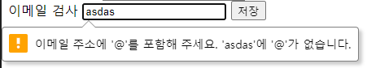
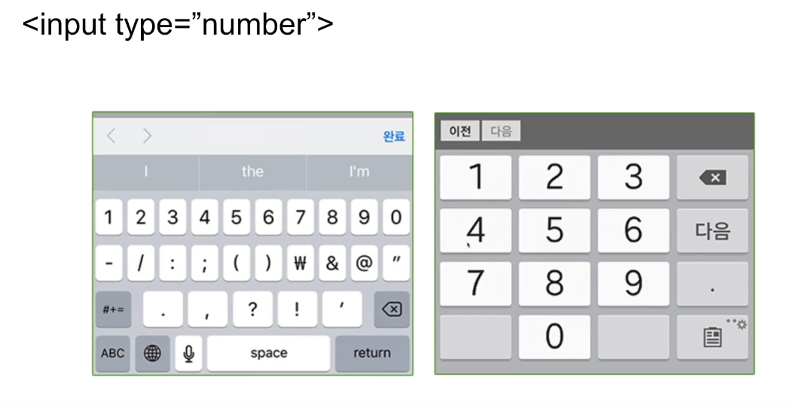
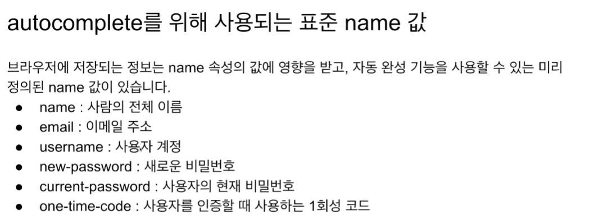
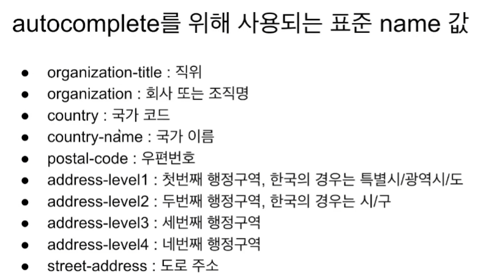
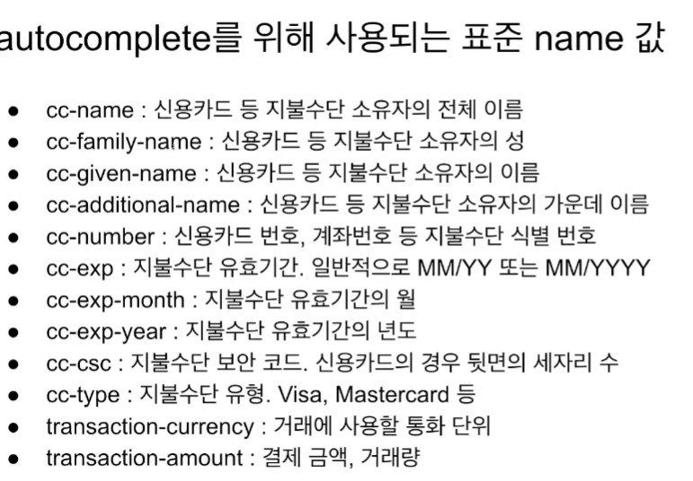
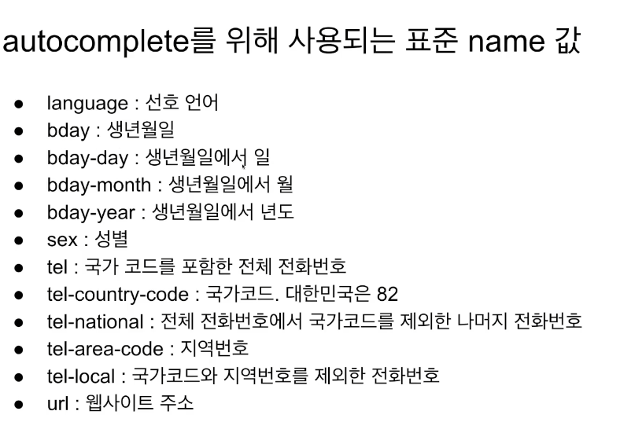

## TOC

- [HTML](#html) - [Hyper Text Markup Language](#hyper-text-markup-language)
- [웹 개발 라이프사이클](#웹-개발-라이프사이클)
- [작업 환경 (extensions)](#작업-환경-extensions)
- [기본 구조 및 기본 요소](#기본-구조-및-기본-요소)
- [글로벌 속성](#글로벌-속성)
- [로컬 속성](#로컬-속성)
- [스타일 속성](#스타일-속성)
- [의미에 맞는 태그 사용하기](#의미에-맞는-태그-사용하기)
  - [의미 없는 태그: div, span](#의미-없는-태그-div-span)
- [리스트 태그](#리스트-태그)
- [표](#표)
- [form elements](#form-elements)
- [input 요소의 주요 속성](#input-요소의-주요-속성)
- [그 외 폼 요소](#그-외-폼-요소)
- [form 태그](#form-태그)
- [iframe](#iframe)
- [video, audio](#video--audio)
- [map](#map)
- [semantic tag](#semantic-tag)

## HTML

##### Hyper Text Markup Language

## 웹 개발 라이프사이클

1. 정보 수집 단계

2. 기획 단계  
   기술 스택 정하기

3. 디자인 단계  
   여러 가지 디자인 시안

4. 콘텐츠 생성 단계

5. 개발 단계  
   HTML, CSS, JS, 서버, DB

6. 테스트 및 품질 보증 단계  
   QA(Quality Assurance), Test. 문제 발생 시 다시 개발.

7. 배포 및 운영 단계

## 작업 환경 (extensions)

- live server
- snippets
- HTML CSS support
- open in browser
- Prettier - Code formatter

## 기본 구조 및 기본 요소

[01_helloworld.html](01_helloworld.html)
[02_basic.html](02_basic.html)

- 요소(element) : 태그 사이에 들어가 있는 내용들
- html을 작성한 후, 우클릭으로 open live server
- \<p> 태그는 문장을 나눔.
- <a href="naver.com">네이버</a>
- <a href="./01_helloworld.html">01_helloworld.html</a>
- \<a> 태그는 js로 작성된 함수를 작동시킬 수 있음.
- \ src에는 이미지 주소, alt에는 이미지 설명
- \<br> 줄바꿈 태그
- \<label>
- \<input>

## 글로벌 속성

[03_global_attribute.html](03_global_attribute.html)

- \<h1 draggable="true"> : 잡아 끌 수 있음.
- \<p lang = "ko">대한민국\<\p> : 이 문장의 언어가 무엇인지. 구글 검색 시 해당 문자가 한글로 반영된다.
- hidden: 화면에 보이지 않는 속성.
- id: body 내에 유일한 키 값.
- spellcheck: 스펠링 검사. 빨간 밑줄이 그어진다.
- contenteditable: 수정 가능한 문장.
- tabindex: 탭 키 눌렀을 때 이동 순서.
- title: 마우스를 갖다 댔을 때 뜨는 설명문.

## 로컬 속성

[04_local_attribute.html](04_local_attribute.html)

- \<a>에서 target: 링크를 눌렀을 때의 동작  
  \_blank: 새 창을 연다.  
  \_self(default): 기존 창에서 바로 연다.
- 참고하면 좋은 링크 https://developer.mozilla.org/ko/

## 스타일 속성

[05_style.html](05_style.html)

- inline 스타일: html 요소에서 직접 style 속성을 통해 정의
- internal 스타일: \<style> 태그를 써서 작성
- external 스타일: css 문서를 작성

## 의미에 맞는 태그 사용하기

[06_meaningful.html](06_meaningful.html)

- \<p style="font-weight: bold">, \<b>, \<strong> 태그는 모두 같은 결과를 보여주지만, 태그 자체가 가지고 있는 의미가 존재한다. 문장을 강조하려는 의미에서의 볼드라면 strong 태그를 쓰는게 좋다.
- 마찬가지로, \<em> 태그는 강조하는 이탤릭 태그이다.
- \<small>: 글자를 작게 하는 태그
- \<mark>: 하이라이트
- \<del>: 취소문
- \<ins>: 밑줄
- 마찬가지로, 위의 태그는 모두 스타일 태그로 구현 가능하지만, semantic 관점에서 위의 태그를 사용하는 것이 좋다.

- \<sub>: 아래첨자
- \<sup>: 윗첨자
- \<q>: 짧은 인용
- \<blockquote cite="">: 긴 인용. 출처를 적을 수 있다.
- \<abbr title = "">: 축약어. title에는 원래 문장을 적는다.
- \<address>: 주소는 주소에 쓰자.
- \<cite>: 작품명, 상품명, 영화이름 등등

### 의미 없는 태그: div, span

1. 컨테이너의 역할
2. 컨텐츠를 배치하기 위한 레이아웃 용도

- div, h1, p: block elements. 속성을 주었을 때 한 줄을 차지한다.
- span: inline elements. 딱 차지한 만큼만.

## 리스트 태그

[07_list.html](07_list.html)

- \<ul>\<li>: unordered list

- \<ol>\<li>: ordered list
- \<dl>: description list  
  \<dt>: define term  
  \<dd>: describe description

## 표

[08_table.html](08_table.html)

- \<table> 태그 이용

- \<thead>: 제목 부분의 \<tr>
- \<tbody>: 데이터 부분의 \<tr>
- \<tfoot>: 표의 제일 마지막. 예시에서는 합계
- \<tr>: 데이터. rowspan, colspan으로 셀 병합을 할 수 있음.
- \<td>, \<th>: 데이터, 열 제목

## form elements

##### 사용자로부터 데이터를 입력받기 위한 HTML elements

<strong>SPA (single page app)에서는 최근 잘 사용하지 않는 추세. FE framework에서는 form을 사용하지 않고 정보를 전달하는 방법을 사용한다!</strong>

[09_form_element.html](09_form_element.html)

- \<form> 내부에 같은 동작을 묶자.

- \<label> 태그의 for에 id 입력을 잊지 말자!

- \<input type="">에 들어갈 수 있는 타입들

  - checkbox  
    label과 함께 움직인다.  
    다중 선택 가능
  - radio  
    동글뱅이 버튼
    name으로 묶어주면 한 개만 선택 가능하게 된다.
  - color
    색을 선택할 수 있는 팔레트를 제공한다.
  - date  
    캘린더를 제공한다.
  - datetime-local  
    날짜와 시간 선택창을 제공한다.
  - email
    이메일 입력창을 제공한다.

    - <p style="color:yellow">이메일을 form 태그로 감싼 후, button type을 submit으로 두면 email 양식에 맞는지 검사를 해준다! submit 버튼은 누르면 form의 action의 위치로 정보를 던져버린다.</p>

      

  - file  
    파일 첨부를 제공한다.
  - hidden  
     개발자가 사용하기 위함. 보여지지 않는 태그
  - image  
    해당 이미지를 버튼처럼 만들 수 있음.
  - number  
    숫자 토글

  - password  
    공개되지 않는 비밀번호
  - tel  
    전화번호를 받음
  - text  
    디폴트. 문자를 받음.
  - time  
    시간을 받음.
  - url  
    주소를 입력받음. - 이메일과 마찬가지로, form으로 감싸고 button submit으로 설정하면 url 검사를 할 수 있다.
  - search  
    입력창 옆에 작은 x 표시를 해줌. 누르면 입력이 지워짐.

##### 왜 input type을 맞춰야 하는가??

- 모바일 환경에서, input type이 number라면 숫자 키보드가 올라온다! tel, date 등등 모두 전용 ui를 제공한다!
  

## input 요소의 주요 속성

[10_input_attribute.html](10_input_attribute.html)

- input: value에는 사용자가 브라우저에 입력한 값이 들어온다.

- readonly: 읽기만 가능. form 내부의 submit 버튼을 누르면 값이 전달됨.
- disabled: 읽기만 가능. submit 해도 값이 전달되지 않음.
- maxlength: 최대 글자 길이 제한
- placeholder: 입력할 때 가이드를 제시.
- required: 필수 입력 값.
- autocomplete="on": 브라우저 캐시 on. 한번 입력했으면 그 값이 저장됨. 표준 name 값이 있다.
- autofocus="on": 새로고침했을 때 자동으로 입력창 활성화. 아이디 입력창에 적합.
    
    
    
  

## 그 외 폼 요소

[11_form_other.html](11_forrm_other.html)

- select 태그 내부에 option 태그를 넣어 옵션 박스를 만들 수 있다. option 개수가 많을 때 사용한다. 공간을 적게 차지하기 때문이다.
- 선택지가 적은 경우 radio를 사용하자.
- textarea: row: 보이는 줄이 10줄. 더 입력 가능.
- fieldset:legend: 관련된 정보끼리 묶는 fieldset.
- <p style=color:yellow>datalist: select와 동일하게 선택지를 option으로 제공하지만, 키보드로 입력받을 수 있다는 것이 차이점. 아래와 같이 쓴다.</p>

```html
<input list="country" />
<datalist id="country">
  <label for="">나라를 선택하세요.</label>
  <option value="1">Korea</option>
  <option value="2">USA</option>
  <option value="3">Japan</option>
  <option value="4">China</option>
  <option value="5">Austrailia</option>
</datalist>
```

`<input list="country" id="country2"/>`와 같이 리스트 재사용이 가능하다.

## form 태그

- method: 데이터를 전송하는 방법

  - get: 전송하는 데이터가 url에 붙어서 감. 즉, 데이터가 노출됨. 보안에 취약. 네이버 쇼핑몰에서 특정 상품을 검색한 후, 그 링크를 공유하면 naver.com 뒤에 사용자가 입력한 데이터들이 따라 붙는 것을 확인할 수 있다.  
    페이지 주소를 공유해야 할 때 사용  
    전송할 수 있는 데이터의 크기에 제약이 있음.

  - post: 전송하는 데이터가 사용자 눈에 보이지 않음. 보안적으로 조금 더 안정적. (단 개발자 도구에서 확인 가능. 암호화 방식 사용 필요. https 프로토콜이 그 예시)  
    전송할 수 있는 데이터 크기의 제약을 받지 않음.

- target: 데이터를 전송할 창을 정함.

  - \_self: 자기 자신 창을 리다이렉트함.
  - \_blank: 새 창을 띄움.
  - \_parent: iframe의 부모에서 창을 띄움.
  - \_top: iframe의 가장 위 조상까지 올라감.

    <br>

- novalidate: form 태그 안의 input 요소의 정확성을 체크하지 않음.(submit 버튼 눌렀을 때 자동 검사하는 그거)

## iframe

[13_iframe.html](13_iframe.html)

##### iframe은 페이지 내에 다른 html을 삽입해서 사용하는 기술

##### 태그를 이용해서 다른 html 페이지를 불러올 수 있다.

메뉴 항목을 눌렀을 때, 위의 메뉴는 그대로 있고 아래의 컨텐츠만 바꾸고 싶을 때 적합한 태그. iframe 태그의 src는 자바스크립트 파일로 변경해주자.  
최근엔 잘 사용하지 않는 추세.

## video, audio

[14_video.html](14_video.html)

- video 태그의 controls 속성을 추가하면 재생 툴을 보여준다.

- autoplay 속성을 추가하면 영상이 자동으로 재생된다.
- muted: 음소거
- loop: 처음부터 다시 실행
- poster: 영상 썸네일 지정
- track: 자막 파일(.vtt)을 src에 추가하자.  
  srclang: 자막 언어  
  label: 자막 이름
- preload(auto, metadata, none): 영상을 미리 다운로드하는지 결정.
  - auto: 미리 다운로드한다. 시청할 확률이 높은 영상
  - metadata: 영상 관련된 메타 데이터만 미리 가져온다.
  - none: 미리 다운로드하지 않는다. 사용자가 영상을 시청하지 않을 확률이 높을 때.
- audio 태그도 비디오와 거의 동일. controls 속성을 추가하자.

## map

[15_map.html](15_map.html)

##### map 태그의 좌표를 잡아주기 위한 사이트 https://www.image-map.net/

href에 클릭했을 때 이동할 주소를 넣자.

## semantic tag

[16_semantic_div.html](16_semantic_div.html) [17_semantic.html](17_semantic.html)

- 태그명 자체가 의미를 갖고 있는 태그.

- table, address 등
- 예전에는 div 태그로 레이아웃을 나눴음.
- div는 semantic하지 않음. 즉, 아무 의미가 없는 태그.
- semantic tag: header, nav, main, section, article, aside, footer
- 내부적으로 div와 완전 같지만, 가독성이 올라간다.
