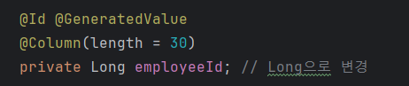
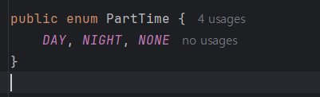
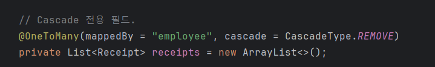
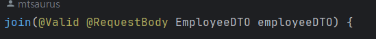

구현하다가 궁금한 점이 몇 가지 있어서 작성했습니다.. 자바로 처음 구현해봐서 코드에 미숙한 점이 많아요!!ㅜ 양해해주시면 감사하겠습니다ㅜㅜ

1. 작성하다가 Id 타입을 임의로 Long으로 변경한 후, `@GeneratedValue`를 사용했습니다. 혹시 괜찮을까요?  

1. Employee와 Reciept는 연관관계를 맺고 있습니다. Receipt 테이블 안에 Employee_id가 들어있습니다. 따라서, Employee에 대한 Delete를 구현할 때 이를 고려해야 합니다.

   - '직원 해고'와 '직원 기록 말소'를 분리해서 구현했습니다. 이유는 다음과 같습니다.
     - 직원을 해고하면 영수증의 Employee_id에 어떤 처리를 해야 할지 고민하다가, 직원의 partTime 컬럼을 수정하는 쪽으로 가닥을 잡았습니다.
     - 
     - partTime 컬럼에 대한 enum 클래스입니다. NONE은 partTime이 없는 직원으로, 퇴직했거나 해고된 직원을 의미합니다.
     - 이렇게 해야 퇴사한 직원이 담당한 영수증도 환불 처리가 가능하다고 생각했습니다. (퇴사 처리는 PartTime만 수정하는 PutRequest 매핑입니다. )
   - '직원 기록 말소'를 선택한 경우, 해당 직원이 처리한 영수증도 같이 삭제됩니다.
   - 
   - 이를 위해 기존에 없던 Employee.receipts 필드를 생성하고, `CascadeType.REMOVE` 옵션을 주었습니다.

1. FE쪽에서 데이터가 어떻게 넘어오는지 궁금합니다. 일단 `@RequestBody`로 받았습니다.   
 
3. 실례가 되지 않는다면 작성하신 BE쪽 코드 푸시 한 번 부탁드려도 될까요? 잘 짜여진 코드 보면서 하면 많은 공부가 될 것 같습니다!  

전 내일 Employee쪽 구현 마무리하고, Product쪽 한 번 건드려 보겠습니다. 다만, 주문-반품 핵심 로직 구현할 때 Product가 필수적일텐데, 혹시 이미 구현하셨거나, 직접 하실 계획이 있으시다면 연락 부탁드립니다! 만약 그렇게 하신다면, 도메인 중에 가장 독립적인 부분(그나마 Event, Disaposal쪽?)을 제가 맡겠습니다! 

