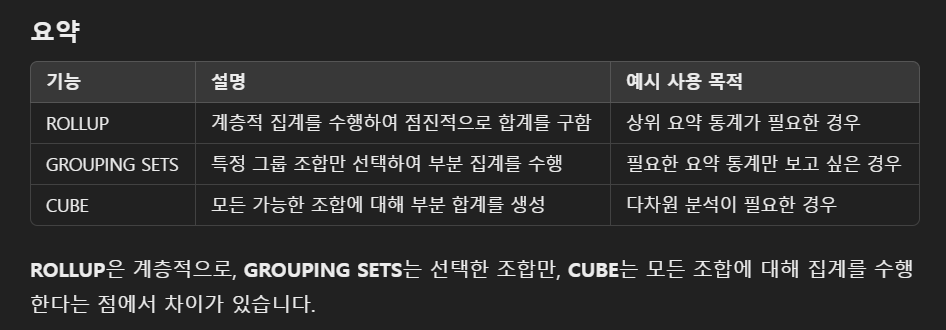
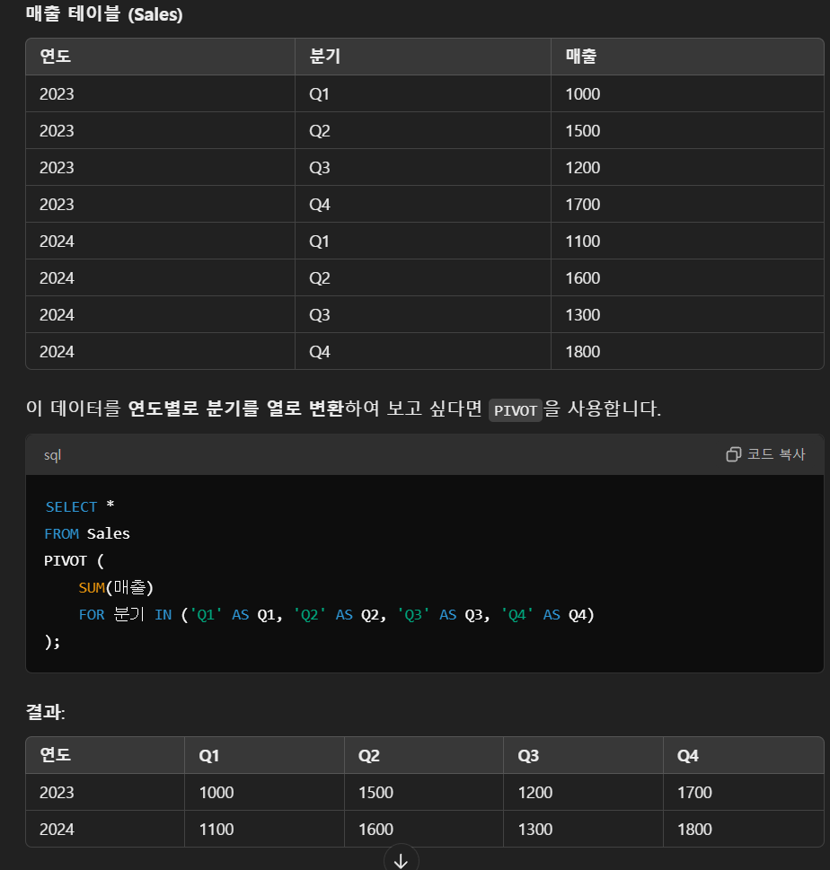

## 서브쿼리

- select문 내에 다시 select를 사용
- from절에 쓰면 인라인 뷰. 가상의 테이블을 만드는 효과
- select문에 subquery를 다시 날리면 스칼라 서브쿼리

- 단일행 서브쿼리
  - 결과가 한 행만 나옴
  - 비교 연산자 사용 (<, >, =)
- 다중행 서브쿼리

  - 여러 행 조회
  - 다중 행 비교 연산자 (ALL, EXISTS, ANY, IN)

### 조인

- EQUI 조인 (등가조인, 동등조인)
  - 두 테이블 간 일치하는 것을 조인.
  - '='만 사용하는 조인
  - 두 테이블의 값이 정확히 일치하는 경우에만 레코드 반환
  - 해시조인 사용 가능
- INNER 조인 (내부조인)
  - ON문 사용
  - 두 테이블 간에 공통된 값을 가진 레코드들만 반환
- <mark>INNER에서 =를 사용하면 EQUI</mark>
- INTERSECT
  - 그냥 교집합 구함
- OUTER 조인
  - EQUI 조인 한 후 한쪽 테이블에만 있는 데이터도 포함하여 조회
  - 예를 들어 DEPTNO가 같은 것을 조회했다면, DEPT 테이블에만 존재하는 DEPTNO까지 포함하여 FETCH
  - 왼쪽 테이블 값을 포함하면 LEFT, 반대면 RIGHT
  - FULL OUTER JOIN은 둘 다 함
  - ORACLE에선 +를 사용하여 OUTER JOIN을 할 수 있음.
- CROSS 조인

  - 카테시안 곱 리턴

- UNION

  - 합집합임. 두 테이블을 하나로 합침.
  - 즉, 데이터 형식, 칼럼 수 모두가 일치해야 함.
  - UNION은 중복된 데이터를 제거하므로 SORTING이 발생
  - UNION ALL은 SORTING하지 않으므로 더 빠르긴 함

- MINUS
  - 차집합임
  - MSSQL에선 EXCEPT

## 그룹 함수

- ROLLUP
  - GROUP BY에 대해 SUBTOTAL을 만들어줌
  - `GROUP BY ROLLUP(DEPTNO, JOB)` 하면 부서번호별, 직업별 SUBTOTAL을 계산해줌
- GROUPING
  - ROLLUP, CUBE, GROUPING SETS에 의해 소계 값이 계산되면 그 컬럼에 1을 리턴해주는 함수
  - 이걸 DECODE와 함께 사용하여 범례를 만들 수 있음.
- DECODE
  - `DECODE (GROUPING(DEPTNO), 1, '전체합계')`
  - 이렇게 하면 GROUPING(DEPTNO)가 1을 리턴할 때, 해당 부분에 '전체합계'를 출력
- GROUPING SETS
  - GROUP BY에 있는 칼럼의 순서와 상관없이 다양한 소계를 만듦
  - `GROUP BY GROUPING SETS(DEPTNO, JOB)` 하면 DEPTNO, JOB 별 소계를 계산
- CUBE
  - 조합 가능한 모든 경우의 소계를 계산
    

## 윈도우 함수

- 행별 계산, 그룹별 계산 가능
  ```SQL
  윈도우_함수() OVER (
      PARTITION BY 그룹_열
      ORDER BY 정렬_열
      ROWS 또는 RANGE 윈도우_크기
  )
  ```
- PARTITION BY로 데이터를 특정 열을 기준으로 그룹화
- ORDER BY: 그룹된 데이터를 특정 열 기준으로 정렬
- ROWS, RANGE: 계산 범위를 지정

- ROWS, RANGE

  - ROWS: 행의 집합 지정
  - RANGE: 논리적인 주소에 의해 행 집합 지정
  - BETWEEN ~ AND: 윈도우 끝과 시작 지정
  - UNBOUNDED PRECEDING: 윈도우 시작 위치가 첫번째 행임을 명시
  - UNBOUNDED FOLLOWING: 윈도우 끝 위치가 마지막 행임을 명시
  - CURRENT ROW: 윈도우 시작 위치가 현재 행임을 명시
  - ORDER BY 절에 `ROWS BETWEEN UNBOUNDED PRECEDING AND UNBOUNDED FOLLOWING`이라고 하면 시작부터 끝까지 계산하면 됨.
  - UNBOUNDED PRECEDING AND CURRENT ROW 하면 누적 합계를 구함.

- RANK

  - RANK: 동일한 순위는 동일값
  - DENSE_RANK: 동일한 순위를 하나의 건수로 계산
    - 즉, 2등이 2명이면 4등이 3등이 되는것
    - 숫자가 비지 않아서 DENSE
  - ROW_NUMBER: 동일한 순위에 대해 다른 순위 부여
    - 즉, 2등이 2명이면 2등, 3등 표시

- 행 순서 관련 함수
  - FIRST_VALUE: 파티션에서 첫 값. MIN을 사용해서 같은 결과 가능.
  - LAST_VALUE
  - LAG: 이전 행을 가져옴
  - LEAD: 특정 위치의 행을 가져옴. 기본값은 1, 그냥 쓰면 다음값 가져옴.

## 비율 관련 함수

- CUME_DIST
  - 파티션 전체 건수에서 누적 백분율을 조회
- PERCENT_RANK
  - 파티션에서 제일 나온 것을 0, 가장 늦게 나온 것을 1로 백분율
- NTILE(N)
  - 파티션 전체 건수를 ARGUMENT(N)만큼 N등분
- RATIO_TO_REPORT
  - 파티션 내 전체 SUM에 대한 행 별 칼럼값의 백분율을 소수점까지 조회

## TOP N 쿼리

- ROWNUM
  - 논리적 일련번호.
  - 조회되는 행 수를 제한할 때 사용
  - MYSQL에서는 LIMIT 사용
- ROWID
  - 오라클에서 데이터를 구분하는 유일한 값
  - 오브젝트 번호, 상대 파일 번호, 블록 번호, 데이터 번호로 구성

## 계층형 조회

- CONNECT BY: 부모 - 자식 간 관계 정의
- START WITH: 루트 노드 지정
  - 주로 `START WITH 부모 IS NULL` 식으로 많이 사용
- LEVEL: 현재 레벨을 나타내는 가상의 열. 루트는 1레벨
- PRIOR: 부모-자식 관계에서 부모 또는 이전 행을 나타내는 키워드

  - `CONNECT BY PRIOR EMPNO = MGR`
  - 부모 노드의 EMPNO가 자식 노드의 MGR이랑 같을 때. 즉 조인 조건임.

- LPAD

  - 왼쪽에서부터 특정 문자열을 채움
  - `LPAD(문자열, 원하는길이, 채울 문자)`
  - 여기서 원하는 길이는 최종적으로 맞추고 싶은 길이이다.
  - `SELECT LPAD('123', 5, '0') AS 결과 FROM DUAL;` 하면 00123이 된다.

- CONNECT BY

  - LEVEL
  - CONNECT_BY_ROOT
  - CONNECT_BY_ISLEAF
  - CONNECT_BY_ISCYCLE
  - NOCYCLE: 사이클이 발생하지 않게
  - SYS_CONNECT_BY_PATH

- 순방향 전개

  - (`PRIOR EMPNO = MGR`), 부모 노드의 EMPNO가 자식 노드의 MGR과 같을 때.

- PIVOT, UNPIVOT
  `SQL
    SELECT * 
    FROM 테이블명
    PIVOT (
        집계함수(값 열) 
        FOR 피벗 열 IN (값1, 값2, ...)
    );
    `
  

## 테이블 파티션

- 범위 파티션: 값의 범위를 기준으로 나눔
- 리스트 파티션: 특정 값을 기준으로 나눔
- 해시 파티션: 내부적으로 알아서 나눔

- 파티션 인덱스
  - GLOBAL INDEX: 여러 파티션에서 하나의 인덱스 사용
  - LOCAL INDEX: 파티션 별 인덱스
  - PREFIXED INDEX: 파티션 키와 인덱스 키가 동일
  - NON PREFIXED INDEX

# 정규표현식

- REGEXP_LIKE()
- REGEXP_REPLACE: 문자열 대체
- REGEXP_INSTR: 위치 반환
- REGEXP_SUBSTR: 문자열 추출
- REGEXP_COUNT: 개수 세기

`^[a-zA-Z0-9._%+-]+@[a-zA-Z0-9.-]+\.[a-zA-Z]{2,}$`

- `^[a-zA-Z0-9._%+-]+@`
  - 이메일의 첫 부분. 알파벳과 숫자, .\_%+-가 포함될 수 있음. 맨 뒤의 +는 이러한 패턴이 한 개 이상 나와야 한다는 것을 의미. 즉 앞부분은 한 글자 이상. 그 뒤 @가 반드시 포함되어야 함
- `[a-zA-Z0-9.-]+`
  - 도메인 이름. 알파벳, ., -가 포함됨.
- `\.`
  - 도메인 명 이후 .이 반드시 포함됨.
- `[a-zA-Z]{2,}$`
  - 알파벳 두 글자 이상으로 끝나야 함.
