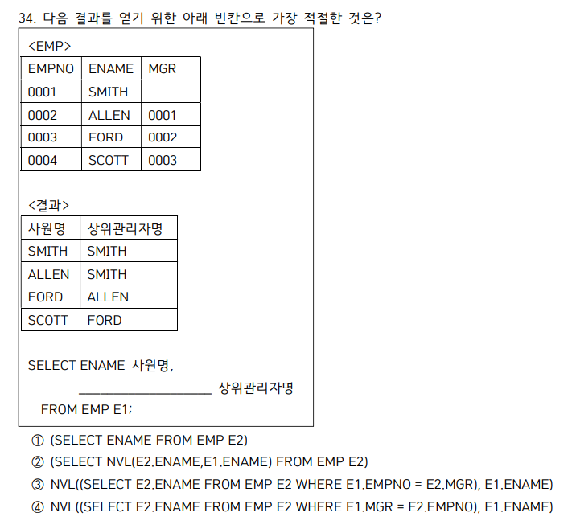

# 점수 10/10, 29/40

## 무결성

- 개체 무결성
  - 테이블의 기본키를 구성하는 컬럼은 null, 중복 값을 가질 수 없다.
- 참조 무결성
  - 외래키 값이 널이거나 참조 테이블의 기본키와 동일해야 한다.
- 도메인 무결성
  - 주어진 속성 값이 정의된 도메인에 의한 값이어야 한다.
- null 무결성
  - 특정 속성에 대해 널값을 허용하지 않는다.

## NULLIF, ISNULL 헷갈리지 맙시다

- ISNULL == NVL
- NULLIF는 둘이 같으면 널, 다르면 첫값

## LIKE

- %: 0개의 문자와 일치.
- A%: A로 시작하는 모든 문자
- %A: A로 끝나는 모든 문자
- %middle%: middle을 포함하는 모든 문자
- \_: 임의의 한 문자와 일치

## 21번 연산자 우선순위

- NOT>AND>OR
- 괄호가 없으면 이 순서대로 수행됨.

## Group by

- 컬럼 순서는 그룹에 영향을 주지 않는다.
- 컬럼 별칭을 사용할 수 없다.

## order by

- orderby를 안쓰면 그냥 입력데이터 순대로 출력된다.
- 기본은 오름차순
- 컬럼 별칭을 쓸 수 있다.
- 컬럼명과 숫자를 동시에 쓸 수 있다.

## (+), outer join

- null값이어도 출력되어야 할 컬럼의 반대편에 (+)를 붙인다. outer는 (+)의 반대.

## 33번 다중컬럼 서브쿼리

- 다중컬럼 서브쿼리는 from절이 아니라, where 절에 비교 상수로써 사용된다. (from 절에 사용되는 것은 인라인 뷰) 따라서 메인쿼리의 select에서 쓸 수 없다.

## 34번 스칼라 서브쿼리의 널값

- 4번 보기) 문제에서 E1.MGR이 널값이 될 수 있음.서브쿼리의 밖에서 널이 들어와야 NVL이 사용됨. 3번의 경우 E2.MGR에서 널이 발생하지만, 이는 스칼라 서브쿼리 내부에서 발생하는 널이므로 NVL이 실행되지 않는다. 따라서 4번이 정답.

## 37번 개지랄 파티션 지엽문제

- 아니 파티션 내에 누적합 구할 때 값이 같으면 그룹으로 묶는대요 이걸 어케알아

## 39번 씹지랄 with ties 동순위

- with ties의 동순위 출력은 마지막 순위일 때에만 ㅋㅋㅋㅋㅋㅋㅋㅋㅋㅋㅋㅋㅋㅋㅋㅋㅋㅋㅋㅋㅋㅋ

## 42번 pivot

- 피벗의 from 절에 사용하지 않은 컬럼이 출력되는 경우, 그 컬럼을 기준으로 피봇팅을 한다. **지랄**

## 정규표현식

- 'AB|C+'

  - AB거나 CCCCCCCC

- DML, DDL
- DML
  - manipulation
  - CRUD
  - insert, select, update, delete
  - rollback 가능
- DDL
  - definition
  - create, alter, drop, truncate
  - truncate는 존재 말소형
  - drop은 테이블 구조를 삭제함. 테이블 조회 불가능
  - truncate는 일부만 날리기 불가능.
