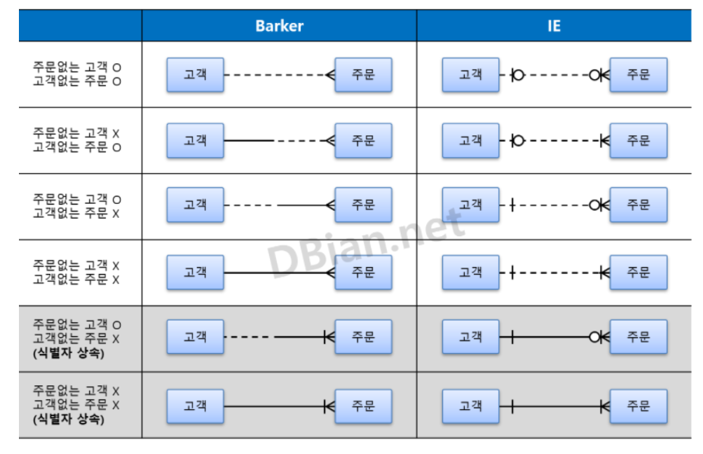

# 2회차

## 데이터 모델링 유의해야 할 점

- 같은 정보를 저장하지 않도록 중복성 최소화
- 데이터 간 상호 연관관계를 명확하게 정의. 일관성 있게 데이터가 유지되도록.
- 데이터의 정의를 프로세스와 분리하여 유연성을 높임
- 프로그램과 테이블 간 연계성을 낮춰야 함.

## 속성

- 업무상 인스턴스로 관리하고자 하는 더 이상 분리되지 않는 최소 데이터 단위
- 하나의 엔티티는 두 개 이상의 속성을 가짐
- 하나의 인스턴스에서 각 속성은 반드시 하나의 속성값을 가짐
- 속성은 주식별자에 함수적 종속성을 가져야 함

## 관계

- 관계는 존재에 의한 관계, 행위에 의한 관계로 나뉨. ERD에서는 이를 구분하지 않음
- 부서-사원 간 소속 관계는 존재적 관계
- 관계의 페어링은 엔티티 안의 인스턴스가 개별적으로 관계를 가지는 것을 의미.
- 하나의 엔티티와 다른 엔티티 간의 연결 방식을 나타내는 것은 관계의 차수이다.
- 관계 표기법은 관계명, 관계차수, 선택성 3가지

## 정규화

- 모델의 일관성 확보, 중복 제거, 모델의 독립성 확보
- 제1정규형: 속성의 원자성
- 제2정규형: 완전 함수 종속성 ( 2개 이상의 복합 주식별자에 대해, 각각의 주식별자가 속성과 종속성을 갖지 않아야 함 )
- 제3정규형: 이행적 함수 종속성 ( 일반 속성은 주식별자 전체에 종속적 )

## 트랜잭션

- 엔티티 간 두 관계가 필수적일 때 하나의 트랜잭션을 형성할 수 있다.
- 두 엔티티가 서로 독립적으로 수행 가능하다면 선택적 관계로 정의된다.
- 하나의 트랜잭션은 부분 커밋이 불가능하다.

## 바커 표기법과 IE 표기법



- 바커 표기법
  - #: 주 식별자
  - \*: 필수 입력값. 즉, 널을 허용하지 않음
  - o: 선택 입력값. 즉, 널 허용

## 본질식별자 vs 인조식별자

- 인조식별자를 사용하면 중복 데이터 발생 가능성을 높임. 데이터 품질을 저하시킬 수 있음
- 인조식별자를 사용하면 본질식별자에 비해 추가적인 인덱스가 필요
- 인조식별자는 본질식별자가 복잡할 때 사용
- 자동으로 증가하는 일련번호는 인조식별자

## SQL select 관련

- table alias를 사용하면 반드시 alias를 사용해야 한다. 즉, 테이블 이름 사용이 불가능하다.

### select

- order by 다음으로 늦게 실행

### where

- 그룹함수를 활용한 조건 전달이 불가능

### group by

- alias 사용이 불가능하다.
- 주로 집계함수와 함께 사용
- select 절에 나열된 모든 컬럼은 group by에 명시되어 있거나, 집계함수로 처리된 값이어야 한다.
- null 그룹을 생성할 수 있다..!

### having

- 그룹함수가 없는 일반 조건도 사용 가능

### order by

- 가장 늦게 실행된다.
- select 절에 없는 컬럼을 쓸 수 있다.
- group by 절과 함께 쓰는 경우 group by 절에 없는 컬럼을 쓸 수 없다.
- 집계함수에 의해 파생된 값도 사용할 수 있다. 즉 아래의 쿼리에서 'sum'으로 order by할 수 있다.

  ```sql
  select t.col1, col2, sum(col3) as "sum"
  from table t
  group by col1,  col2
  order by col3;
  ```

- 여기서 col3은 그룹화되지 않은 컬럼이므로 order by에 사용할 수 없다.
- 오라클에서, null을 포함하여 order by한 경우 null값은 가장 마지막에 배치된다.
- order by col nulls first 하면 null값을 가장 위에 둘 수 있다.
- order by col desc하면 null값은 가장 위로 간다.
- order by col col desc nulls last 하면 null 값은 가장 밑으로 간다.

## TO_DATE

- 'RRMMDD' 포맷
  - 두 자리 숫자가 1~49인 경우 2000년대, 50~99인 경우 1900년대를 써준다.

## INITCAP

- 첫글자를 대문자로, 나머지를 소문자로 바꿔준다.

## TO_CHAR

- to_char('123', '123.45')
  - 123을, 뒤의 123.45 포맷으로 바꿔준다. 즉, 세자리.두자리로 바꿔준다.
  - 123.00

## NOT IN 조건에서의 null

- null이 포함되면 그냥 무조건 리턴이 null일 수밖에 없다.
- `where col NOT IN (1, 2, null);`
- col이 어떤 값이 오더라도, col과 null 비교 자체가 성립되지 않기 때문에 아무 값도 리턴되지 않는다.
- 반대로, `where col IN (1, 2, null)` 이렇게 된다면 col이 1, 2면 그 값은 리턴된다.

## natural join

- 아무런 조인 조건이 없다. 알아서 한다.

## 연관 서브쿼리

- 일반적으로 메인쿼리가 먼저 수행된 후에 서브쿼리에서 조건이 맞는지 확인하고자 할 때 사용된다.
  29번 문제  
  

```sql
    SELECT SUM(T1.COL2)
    FROM TAB1 T1
    WHERE T1.COL2 = (
        SELECT MAX(COL2)
        FROM TAB1 T2
        WHERE T1.COL1 = T2.COL1);
```

- 위의 서브쿼리 부분에서, T1.COL1은 서브쿼리 밖에 있다.
- 즉, 서브쿼리 내부에서 사용되는 변수가 메인 쿼리의 컬럼을 참조할 때 발생한다.
- 이 경우 메인 쿼리의 각 행과 상관관계를 맺기 위해 메인 쿼리의 각 행에 대해 서브쿼리가 실행된다.
- 서브쿼리 맨 마지막의 WHERE 절 T1.COL1에는 A, A, A, A, B, B가 들어간다.
- SELECT MAX(COL2)이므로 A, A, A, A에 대해서는 서브쿼리의 값이 30이다.
- (A, 30) 행이 두개이므로 30이 두번 더해진다.
- B, B에 대해서는 서브쿼리의 값이 40이다.
- 40이 한 번 더해진다.
- 따라서 답은 100.

## offset

```sql
select * from 고객
order by 포인트 desc
offset 2 rows fetch first 2 rows only;
```

- 여기서 offset 2 rows는 2칸을 건너뛰라는 것이다. 즉, 첫 오프셋 디폴트가 1이므로 오프셋은 3이 된다.
- 따라서 3행, 4행의 값을 가져오는게 정답.

## 정규표현식 - substr

- `REGEXP_SUBSTR('string213 string123', '[^0-9]+')`
- ^는 not을 의미. 즉, 숫자가 아닌 문자열
- +는 앞의 패턴이 하나 이상 반복. 즉, 숫자가 아닌 글자가 하나 이상 나오는지.
- 따라서 위에서 결과값은 string
- 213에서 끊기므로.
- substr [^,]와 같은 형식으로 자주 쓰인다.
- ,를 구분자로 나누라는 의미.

## commit, rollback

- 한 번 커밋하면 롤백으로 못돌린다.
- DDL, DCL을 사용하면 자동으로 커밋된다.
- DDL: data defination. create, alter table..
- DCL: data control. grant

## alter table modify default

2회차 46, 47, 48번 문제

- 오라클에서 디폴트 값을 포함한 새로운 컬럼을 만들면 기존 데이터의 새로운 값에도 디폴트값이 적용된다.
- 하지만 그냥 컬럼을 만들고, alter table로 디폴트 값을 설정하면 기존의 데이터에는 반영되지 않는다.
- alter table 이후에 삽입되는 값에만 디폴트값이 적용된다.
- 그냥 그 col 자체 입력값이 없어야 디폴트가 들어간다.
- add col4 default 'aaa'를 해줘도 기존 데이터에는 디폴트 값이 들어가지 않는다. 그냥 널이 되어있다.
- 컬럼은 동시에 삭제할 수 없다.

## unique 제약조건

- 널값을 허용한다.

## create table as select

- 새 테이블을 생성함
- select문의 결과가 새 테이블에 삽입됨
- 원본 테이블의 제약조건(PK, unique, FK)를 복제하지 않음.
- 근데 또 NOT NULL만 복제됨 ㅋㅋㅋㅋㅋㅋㅋㅋ

```sql
CREATE TABLE new_table_name AS
SELECT column1, column2, ...
FROM existing_table
WHERE <condition>;
```

## 권한 관련

- 중간 관리자가 with grant option으로 부여 받은 권한을 제 3자에게 부여한 경우, 관리자가 직접 제 3자의 권한을 회수할 수 없다.
- 하지만 중간 관리자의 권한을 회수해버리면 제 3자의 권한도 회수된다.
- 관리자가 with admin option으로 중간 관리자에게 권한을 부여한 경우, 그 중간 관리자가 제 3자에게 그 권한을 부여하였다고 하자.
- 관리자가 중간 관리자의 권한을 회수해도, 제3자의 권한은 회수되지 않는다.
