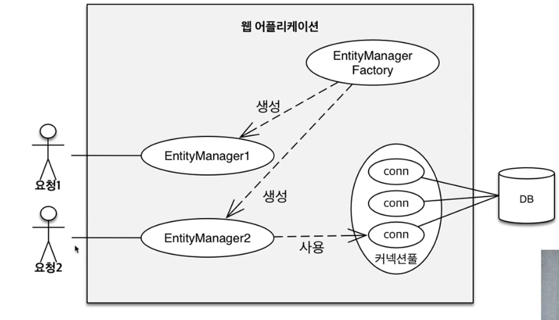
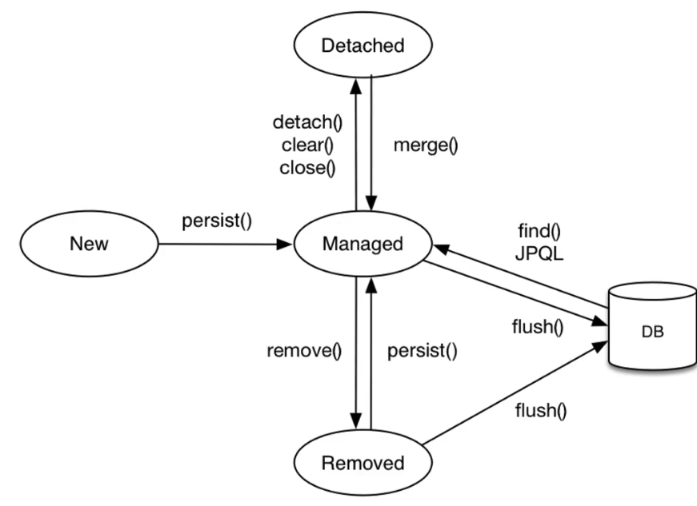
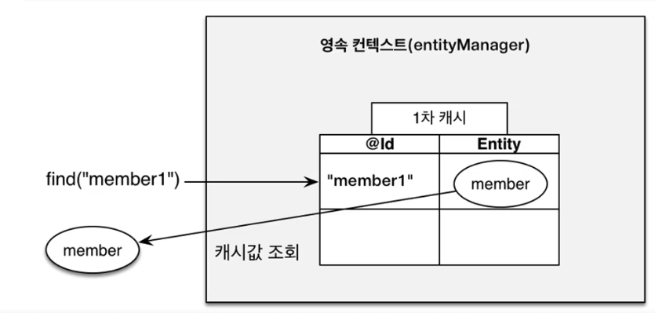
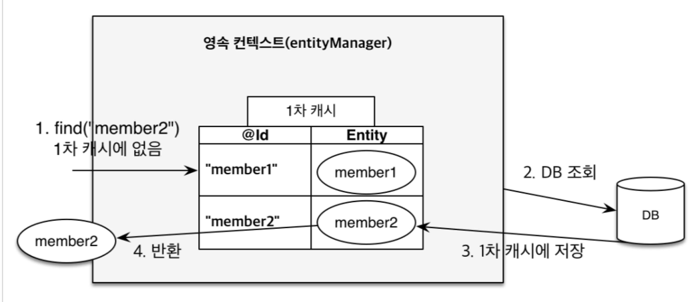
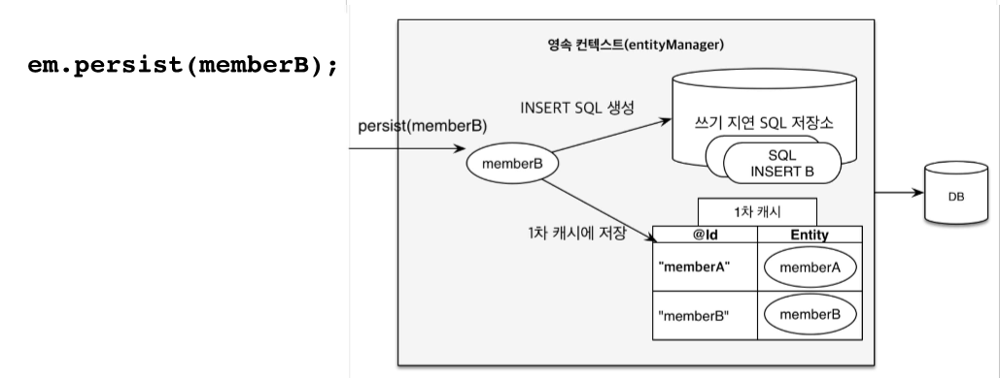

## 영속성 컨텍스트 1



- emf에서 em을 만들어줌
- 각 요청마다 em을 만들어야 함

### **영속성 컨텍스트**

JPA를 이해하는데 가장 중요한 용어. 엔티티를 영구 저장하는 환경이라는 뜻  
`EntityManager.persist(entity);` 엔티티를 디비에 저장하는 것이 아니라, 영속성 컨텍스트에 저장한다는 뜻.  
영속성 컨텍스트는 논리적인 개념이다. 엔티티 매니저를 통하여 영속성 컨텍스트에 접근한다.

### 엔티티의 생명주기

- 비영속 (new/transient): 영속성 컨텍스트와 전혀 관계가 없는 새로운 상태
- 영속 (managed): 영속성 컨텍스트에 관리되는 상태
- 준영속 (detached): 영속성 컨텍스트에 저장되었다가 분리된 상태
- 삭제 (removed): 삭제된 상태  
  

## 영속성 컨텍스트 2

**영속성 컨텍스트의 장점**

- 1차 캐시: persist()시 바로 DB에 반영되는 것이 아닌, 1차 캐시에 우선 저장된다.

  ```java
  Member member = new Member();
  member.setId("member1");
  member.setUsername("hgr");

  // 1차 캐시에 저장됨
  em.persist(member);
  // 1차 캐시에서 조회
  Member findMember = em.find(Member.class, "member1");
  ```

    
     
   `Member findMember2 = em.find(Member.class, "member2");`  
   1차 캐시에 없는 엔티티를 조회하는 경우, DB에서 해당 엔티티를 1차 캐시에 저장한 후 반환한다. 후에 다시 member2를 조회하는 경우 1차 캐시에서 가져온다.  
   <mark>의외로, 1차 캐시는 성능 개선에 크게 기여하지 않는다. 앞에서 언급했듯, JPA는 각 요청마다 em을 만들고, em별로 영속성 컨텍스트를 보유하고 있는데, 이 의미는 트랜잭션이 끝난다면 1차 캐시도 증발한다는 것이다. 대신, 전체 DB에 대한 캐시를 보유하고 있는데, 이를 **2차 캐시**라고 한다. </mark>

- 영속 엔티티의 동일성 보장
  ```java
  Member a = em.find(Member.class, "member1");
  Member b = em.find(Member.class, "member1");
  System.out.println(a==b); // True
  ```
  같은 트랜잭션 안에서, 같은 엔티티에 대한 동일성을 보장해준다. <br>
- 트랜잭션을 지원하는 쓰기 지연  
   

  ```java
  EntityManager me = emf.createEntityManager();
  EntityTransaction ts = em.getTransaction();
  ts.begin(); // 트랜잭션 시작

  em.persist(memberA);
  em.persist(memberB);
  // 아직 INSERT를 보내지 않음.

  ts.commit(); // 트랜잭션 커밋. 이제야 SQL 전송
  ```

  persist()하면 쓰기 지연 SQL 저장소에 차곡차곡 쌓인다. commit()할 때 flush하여 SQL이 전송된다.

- 엔티티 수정 - 변경 감지 (Dirty checking)  
   자바 컬렉션에서 하는 것처럼, 값을 변경하는 코드만 작성해도 된다(update 쿼리 관련 코드를 작성하지 않아도 된다)  
     
   영속성 컨텍스트에 엔티티가 들어올 때, 최초의 상태를 반영한 스냅샷을 만들어 놓는다. 스냅샷과 비교하여 해당 엔티티 값이 변경되었다면, UPDATE 쿼리를 작성하여 쓰기 지연 SQL 저장소에 넣어둔다. 그 후 트랜잭션이 커밋될 때 해당 쿼리를 flush한다.

### 플러시

<mark> 영속성 컨텍스트의 변경내용을 DB에 반영</mark>  
플러시 발생 과정

1. 변경 감지 (더티 체킹)
2. 수정된 엔티티를 쓰기 지연 SQL 저장소에 등록
3. 쓰기 지연 SQL 저장소의 쿼리를 데이터베이스에 전송(등록, 수정, 삭제 쿼리)

플러시 호출 방법

- em.flush()로 직접 호출: 테스트 환경에서 사용할 수 있음.
- 트랜잭션 커밋: 플러시 자동 호출됨.
- JPQL 쿼리 실행: 플러시 자동 호출됨.

<mark>플러시는 영속성 컨텍스트를 비우지 않고, 변경 내용을 데이터베이스에 동기화하는 과정이다. </mark>

### 준영속 상태

영속 상태 조건: persist(), em.find() 등, 어떤 엔티티가 <mark>영속성 컨텍스트 내부의 1차 캐시에 들어온 상황을 "영속 상태"라고 함.</mark>

준영속 상태?  
영속 상태의 엔티티가 영속성 컨텍스트에서 분리되는 것을 의미. (detached). 영속성 컨텍스트가 제공하는 기능을 사용할 수 없다.

준영속 상태로 만드는 방법

- em.detach(entity)
- em.clear(): 영속성 컨텍스트를 완전히 초기화
- em.close(): 영속성 컨텍스트를 종료
