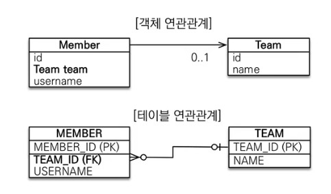
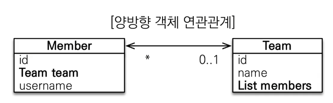
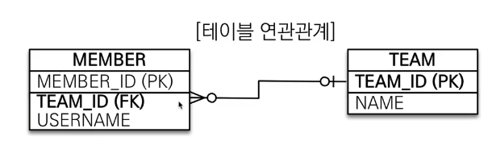
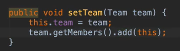

## 연관관계 매핑 기초

목표

- 객체와 테이블 연관관계의 차이를 이해
- 객체의 참조와 테이블의 외래 키를 매핑

### 단방향 연관 관계

예제 시나리오

> 1. 회원과 팀이 있다.
> 2. 회원은 하나의 팀에만 소속될 수 있다.
> 3. 회원과 팀은 다대일 관계이다. (회원이 다, 팀이 일)

객체를 테이블에 맞추어 데이터 중심으로 모델링하면, 협력 관계를 만들 수 없음.

- 테이블은 외래 키로 조인을 사용하여 연관된 테이블을 찾는다.
- 객체는 참조를 사용하여 연관된 객체를 찾는다.
- 테이블과 객체의 패러다임이 완전히 다름.



```java
    @ManyToOne // 멤버입장에서, 멤버가 다수, 팀이 1이므로 이를 JPA에게 알려준다.
    @JoinColumn(name = "TEAM_ID") // 조인해야 하는 컬럼을 알려줘야 함. 즉, member 테이블의 외래 키인 TEAM_ID를 매핑
    private Team team; // team 참조. 그냥 생성하면 에러가 난다. 1대다인지, 다대1인지 이런 관계를 알려줘야 함
```

## 양방향 연관관계와 연관관계의 주인

  
객체 연관관계의 경우 상대방의 참조를 각 객체에 넣어주어야 한다. Team 객체에 members라는 리스트를 만들어줘야 한다. <br>

  
하지만, 테이블의 경우 한 쪽에만 외래 키가 있더라도, 사실상 양방향 연관관계와 같다. TEAM 입장에서, TEAM에 소속되어 있는 멤버를 알고 싶으면 `SELECT * FROM TEAM T JOIN MEMBER M ON T.TEAM_ID = M.TEAM_ID`로 조인하면 된다. 반대의 경우도 마찬가지. <mark>사실상, 테이블의 연관관계는 외래키 하나만으로 성립된다.</mark>

### 객체와 테이블이 관계를 맺는 차이

```java
import jakarta.persistence.*;
// Member 클래스
@Entity
public class Member {
    @Id @GeneratedValue
    @Column(name = "MEMBER_ID")
    private Long id; // PK 매핑

    @Column(name = "USERNAME")
    private String username;

    @ManyToOne // 멤버입장에서, 멤버가 다수, 팀이 1이므로 이를 JPA에게 알려준다.
    @JoinColumn(name = "TEAM_ID") // 조인해야 하는 컬럼을 알려줘야 함. 즉, member 테이블의 외래 키인 TEAM_ID를 매핑
    // 참고로, 연관관계를 맺고 있는 상대방 엔티티의 컬럼을 참고하는 방법은 referencedColumnName이다. 그냥 name은 이 릴레이션의, 상대방 pk를 어떤 이름으로 외래키로써 저장할 것인지! 이다.
    private Team team; // team 참조. 그냥 생성하면 에러가 난다. 1대다인지, 다대1인지 이런 관계를 알려줘야 함
    // 연관관계의 주인이다.
}
// Team 클래스

@Entity
public class Team {
    @Id @GeneratedValue @Column(name="TEAM_ID")
    private Long id;
    private String name;

    @OneToMany(mappedBy = "team") // 일대다 매핑. 반대편에 뭐랑 매핑되어 있나? -> Member의 team 객체
    // 연관관계의 주인이 아님. 이 객체에서 수정을 해봤자 DB에 반영되지 않는다.
    // Member의 team 객체가 연관관계의 주인. 따라서, 수정 및 등록을 할 때에는 거기로 가서 하자.
    private List<Member> members = new ArrayList<>();
}
```

- 객체의 연관관계: 2개  
   회원 -> 팀으로 가는 단방향 1개 + 팀 -> 회원으로 가는 단방향 1개
- 테이블 연관관계: 1개  
   회원 <-> 팀의 연관관계 1개 (양방향)

  
MEMBER 테이블의 TEAM_ID를 무슨 객체로 관리해야 할지 정해야 한다. Member 클래스의 team과 매핑해도 되고, Team 객체의 members와 매핑해도 된다. 양쪽에서 모두 수정 가능하다면 문제가 생긴다. 규칙이 있어야 하겠지?

### 연관관계의 주인

- 양방향 매핑 규칙

  - 연관관계의 주인만이 외래 키를 관리(등록, 수정)
  - 주인이 아닌 쪽은 읽기만 가능해야 한다.
  - 주인이 아닌 쪽에 mappedBy 속성을 부여한다.

- 누가 주인?
  - 외래 키가 있는 곳을 주인으로. 그냥 그렇게 하자.
  - @OneToMany: 가짜 매핑. 읽기만 가능
  - @ManyToOne: 진짜 매핑. 외래키가 있는 곳. 연관관계의 주인
  - 만약, Team이 연관관계의 주인이라고 해보자. 근데 외래 키는 MEMBER 테이블에 있다. 그렇다면, <mark>Team 객체에서 DB 수정을 했는데, 쿼리는 MEMBER 테이블로 나간다. 이상하지? 또, 이렇게 하면 TEAM에는 INSERT 쿼리가, MEMBER에는 UPDATE 쿼리가 나가게 된다.</mark>
  - <mark>외래 키가 있는 곳이 다, 없는 곳이 일. DB의 N 쪽이 연관관계의 주인.</mark>

## 양방향 연관관계와 연관관계의 주인 - 주의점, 정리

주의점

1. 연관관계의 주인에 값을 입력하지 않음
   - `team.getMembers().add(member);` 하면 DB에 반영이 되지 않는다. Team은 연관관계의 주인이 아니기 때문.
   - `member.setTeam(team);`을 해줘야 DB에 반영된다.
   - 그렇다고 해도, 양쪽에 값을 다 넣어주자. DB 관점이 아닌, 객체지향 관점에서 보자. 쿼리는 커밋 시점에서 나가기 때문에, 커밋 전에 Team team은 비어 있는 상태이다. 즉, team.getMembers()~~ 이런게 아예 통하지 않는다는 뜻. 이는 나중에 테스트 코드를 짤 때에도 중요하다. 양쪽에 반드시 값을 넣어줘야 테스트 코드가 바르게 작동한다.
   - 연관관계 편의 메소드를 생성하자. (한 쪽에만 만들자.)
     - 
     - Member 클래스의 setTeam에 `team.getMembers().add(this);`를 넣어주자.
     - set 메소드를 changeTeam과 같이 이름을 바꿔서 운영해도 된다.
2. 양방향 매핑 시 무한 루프를 조심하자
   - toString, lombok, JSON 생성 라이브러리 주의
   - toString 만들지 말자.
   - 컨트롤러에서, <mark>엔티티를 절대로 반환하지 말자.</mark> 엔티티를 DTO로 변환해서 반환하자.

정리

- 단방향 매핑만으로도 이미 연관관계 매핑이 완료된다.
  - 양방향 매핑 없이, 단방향 매핑만으로 설계를 끝내자.
  - 양방향 매핑은, 단방향 매핑에서 반대 방향으로 조회 기능이 추가된 것 뿐이다.
  - 단방향 매핑 잘 해놓고, 양방향은 필요할 때 추가하자.
- 연관관계의 주인을 정할 때, 비즈니스 로직을 기준으로 하지 말자.
  - 연관관계의 주인은 외래 키의 위치를 기준으로 정해야 한다.
