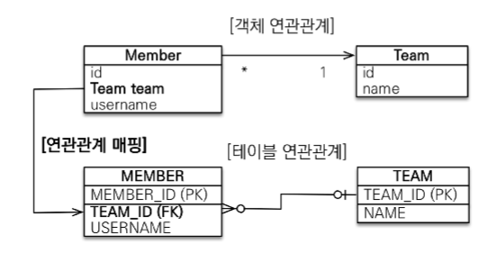
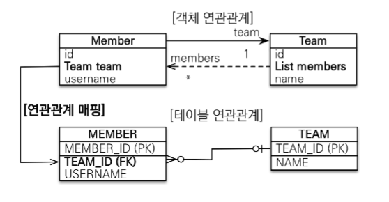
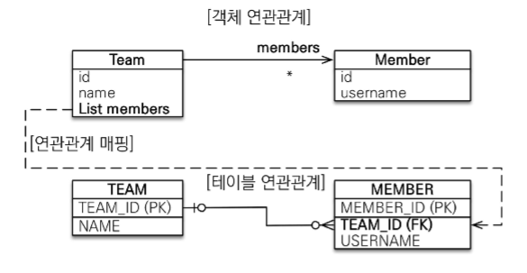
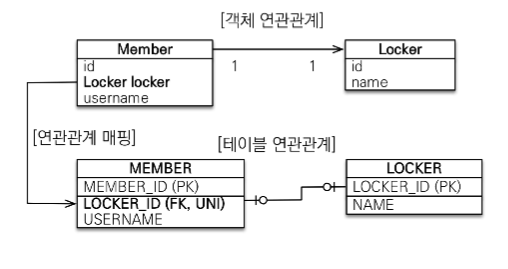
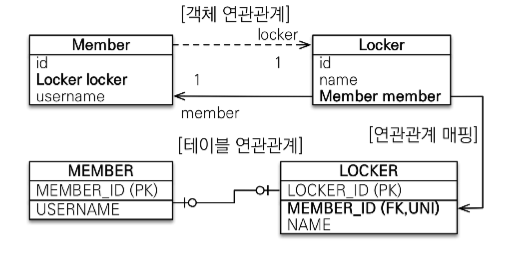
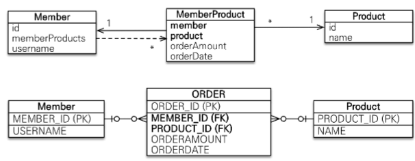

## 다대일 [N:1]

- 단방향, 양방향

  - 사실, 테이블은 방향이라는 개념이 없음.
  - 외래 키 하나로 양쪽 조인이 가능.
  - 객체의 경우, 참조용 필드가 있는 쪽으로만 참조 가능.

- 연관관계의 주인

  - 테이블은 외래 키 하나로 두 테이블 간의 연관관계를 맺음.
  - 객체 양방향 관계는 참조가 양쪽에 다 있어야 함.
  - 두 객체 중 한 곳에서만 외래 키를 관리해야 함.
  - 외래 키를 관리하는 쪽이 연관관계의 주인.
  - 주인이 아닌 엔티티(외래 키가 없는 쪽)에서의 수정, 삽입은 DB에 반영되지 않음. 즉, 조회용.

- 다대일 단방향

  - 
  - 가장 많이 사용하는 연관관계
  - N 쪽 테이블과 대응되는 객체에 참조 작성

- 다대일 양방향
  - 
  - N 쪽에 외래키 관리(DB 입장에서 당연한 것)
  - Team.members에 mappedBy = "team"을 작성해주어야 함.
  - 외래 키가 있는 Member 엔티티가 연관관계의 주인.
  - 객체에서 참조는 양쪽 객체 모두 작성.
  - Team 엔티티에서는 조회만 가능.

## 일대다 [1:N]

<mark>권장하지 않는 방식</mark>

- 일대다 단방향

  - 
  - Member 객체에서 Team을 알 필요가 없을 때.
  - <mark>근데, DB 입장에서, 무조건 N 쪽에 외래키가 들어가야 함.</mark>
  - Team.members를 수정하면 MEMBER의 TEAM_ID를 수정해야 함.

    ```java
    Member member = new Member();
    member.setUsername("hgr");
    em.persist(member);

    Team team = new Team();
    team.setName("Team1");
    // 이 부분에서, MEMBER의 외래키인 TEAM_ID가 업데이트되어야 한다.
    // 아니, team.getMembers~인데 MEMBER 쪽으로 UPDATE 쿼리가 나가는 구조가 이상하지 않나?
    // 성능 상 손해를 보게 됨. 디버깅할때에도 team만 손을 댔는데 member쪽으로 쿼리가 나간다? 버그나면 찾기 어려움.
    team.getMembers().add(member);
    em.persist(team);
    ```

  - 일대다 단방향 관계는 일 쪽이 연관관계의 주인.
  - 근데 외래키는 N쪽에 있음. 패러다임이 뒤틀림.
  - 객체와 테이블 간의 패러다임 차이 때문에 반대편 테이블의 외래 키를 관리하는 특이한 구조.
  - @JoinColumn을 꼭 사용해야 함. 그렇지 않으면 조인 테이블 방식으로 인해 중간에 테이블이 하나 생김.

- 일대다 단방향의 단점
  - 엔티티가 관리하는 외래 키가 반대편 테이블에 있음.
  - 연관관계 관리를 위해 추가로 UPDATE 쿼리가 나가게 됨.
  - <mark>따라서, 다대일 양방향 매핑을 사용하자.</mark>
- 일대다 양방향
  - 굉장히 억지스러운 설계
  - 스펙상 지원하는 것이 아닌, 야매로 가능.
  - 연관관계 주인 반대편에 `@JoinColumn(insertable = "false", updateable = "false")`를 넣어서 강제로 읽기 전용으로 바꿔버림. (INSERT 업데이트 X)
  - 그냥.. 다대일 양방향을 쓰도록 하자.

## 일대일 [1:1]

- 일대일 관계는 반대도 일대일
- 주 테이블, 대상 테이블 둘 중 아무거나 외래 키를 넣어도 됨.
- <mark>외래 키에 데이터베이스 유니크(UNI) 제약조건 추가</mark>
- <mark>유니크 제약조건: 해당 컬럼에 유이한 값만 들어가도록 하고 싶을 때.</mark>

1. 주 테이블에 외래 키 단방향, 양방향

   - 
   - Member은 하나의 Locker만을 가지고, 반대도 마찬가지.
   - 외래 키는 MEMBER이 보관한다.
   - 당연히, Member가 가질 수 있는 Locker은 유일하므로, LOCKER_ID 외래키에 유니크 제약조건을 걸어준다.
   - <mark>다대일 단방향 매핑과 같다. 어노테이션만 다르다.</mark>

   ```java
   @Entity
   public class Locker {

       @Id @GeneratedValue
       private int id;
       private String name;

       // 만약, 양방향으로 걸고 싶다면
       @OneToOne(mappedBy = "locker")
       private Member member;
   }

   @Entity
   public class Member {
       @OneToOne
       @JoinColumn(name = "LOCKER_ID") // 조인컬럼을 넣자. 디폴트값이 매우 지저분하기 때문.
       private Locker locker;
   }
   ```

   - 사실상 다대일 양방향이랑 같음.

2. 대상 테이블에 외래 키 단방향

   - 불가능. JPA에서 지원하지 않음.
   - 양방향만 가능.

3. 대상 테이블에 외래 키 양방향
   - 
   - 주 테이블 양방향 방식을 뒤집으면 됨.
   - Locker에서 외래 키를 관리하고, 연관관계 매핑을 하면 된다.

- 자, 그럼 외래 키는 어디에 두는게 나을까?

  - 사실, 어디다가 외래 키를 놓아도 올바르게 작동한다.
  - 근데 만약, 나중에 하나의 회원이 여러 개의 락커를 가질 수 있게 바뀐다고 해보자. DB 입장에서 먼저 보자.
    - 대상 테이블 외래 키의 경우, LOCKER.MEMBER_ID의 유니크 제약조건을 빼기만 하면 해결. 자연스럽게 일대다로 바꿀 수 있음.
    - 주 테이블 외래 키의 경우, 코드를 많이 변경해야 한다. MEMBER.LOCKER_ID는 그냥 지우자. 의미가 없다.
  - 근데, 개발자 입장에서는 Member 객체에 Locker 참조가 있는 것이 유리하다.
    - Member 객체를 더 자주 사용할텐데, 조회할 때 locker에 대한 정보도 같이 딸려오기 때문이다.
    - 반대의 경우, locker를 조회하기 위해 Locker 객체를 따로 조회해야 한다.
  - 우리는 개발자 입장에서 짜자. 미래 생각하지 말자.

- 정리

  - 주 테이블에 외래 키

    - 주 객체가 대상 객체의 참조를 갖고, 마찬가지로 주 테이블에 외래 키를 두고 대상 테이블을 찾는다.
    - 개발자가 선호하는 방식
    - JPA 매핑이 용이하다.
    - 장점: 주 테이블만 조회해도 대상 테이블에 데이터가 있는지 확인 가능하다.
      - member만 조회해도 locker 여부를 조회할 수 있다.
    - 단점: 값이 없다면 외래 키에 null값이 들어오게 된다.

  - 대상 테이블에 외래 키
    - 대상 테이블에 주 테이블과 대응하는 외래 키가 있다.
    - 전통적인 데이터베이스 개발자가 선호하는 방식
    - 장점: 주 테이블과 대상 테이블을 일대일 -> 일대다로 변경할 때 외래 키의 유니크 제약조건만 제거하면 된다.
      - member가 locker 여러 개를 가질 수 있게 바뀐다고 하자. 그렇다면 LOCKER의 MEMBER_ID의 유니크 제약조건을 제거하면 된다.
    - 단점: 프록시 기능의 한계로 지연 로딩으로 설정해도 즉시 로딩된다. (해당내용은 뒤에서 공부)

## 다대다 [N:M]

편안하게 듣자. 실무에서 쓰면 안 된다.

- 관계형 DB에서는 정규화된 테이블 두 개로 다대다 관계를 표현할 수 없다.
- 연결 테이블을 추가하여 일대다 다대일 관계로 풀어야 한다.
- 참고로, 객체는 다대다가 가능하다. 양쪽으로 리스트를 가지면 되기 때문.
- @ManyToMany로 하면 가능은 함.
- 근데 실무에서 사용할 수 없다.
  - 연결 테이블이 자동으로 만들어지지만, 사실 외래 키만 가지고 있는 연결 테이블로는 아무 것도 할 수 없기 때문.
  - member와 product 사이의 member_product 연결 테이블이 있다고 가정하자. 이 테이블은 각각 member의 PK, product의 PK를 FK로 갖는다.
  - 근데, 실무에서 연결 테이블에는 orderamount나 orderdate와 같은 추가 정보가 들어가야 한다. <mark>근데 @ManyToMany로 자동 생성된 연결 테이블에는 이런 컬럼을 추가하는 것이 불가능하다. </mark>
- ManyToMany -> OneToMany, ManyToOne. <mark>연결 테이블을 엔티티로 승격하자.</mark>

  - 
  - 참고로, 이런 경우에도 PK는 GeneratedValue를 쓰자. FK 두개를 묶어 PK를 쓴다면 제약이 생기게 된다. PK를 의미 없는 값을 쓰는게 자유롭다고 한다.

    ```java
    @Entity
    public class Member {

        @Id @GeneratedValue
        private Long id;

        private String username;

        @OneToMany(mappedBy = "member"); // 연관관계의 하인.
        private MemberProduct memberProduct;

    }

    @Entity
    public class MemberProduct {
        @Id @GeneratedValue
        private Long id;

        // Member에 대한 외래 키를 가지므로 연관관계의 주인
        @ManyToOne // Member 클래스와의 연관관계
        @JoinColumn(name = "MEMBER_ID") //
        private Member member;

        // Product에 대한 외래 키를 가지므로 연관관계의 주인
        @ManyToOne // Product 클래스와의 연관관계
        @JoinColumn(name = "PRODUCT_ID")
        private Product product;
    }

    @Entity
    public class Product {
        @Id @GeneratedValue
        private Long id;

        private String productName;

        @OneToMany(mappedBy = "product") // 연관관계의 하인
        private MemberProduct memberProduct;
    }
    ```
