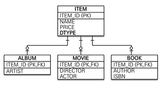
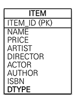
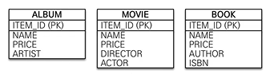

## 상속관계 매핑

- 관계디비는 상속 관계가 없다.
- 슈퍼타입 서브타입 관계라는 모델링 기법이 있는데, 이게 그나마 객체의 상속관계와 비슷하다.
- 상속관계 매핑: 객체 상속 <> DB 슈퍼타입 서브타입 관계를 매핑

- 슈퍼타입 - 서브타입 전략 세 가지
  1. 조인 전략 (JOINED)
     - 
     - 앨범 상품이 들어오면, ITEM, ALBUM에 정보를 나누어 INSERT(쿼리가 두 개 나가게 된다.)
     - ITEM의 DTYPE으로 상품 유형을 파악하고, 이를 바탕으로 ALBUM/MOVIE/BOOK과 조인한다.
  2. 단일 테이블 전략 (SINGLE_TABLE, 디폴트)
     - 
     - 그냥 테이블 하나에 다 때려넣는 방법.
     - DTYPE으로 구분
  3. 구현 클래스마다 테이블 전략 (TABLE_PER_CLASS)
     - 
     - ITEM 테이블을 없애고 각각 구현.
     - NAME, PRICE를 각각 다 가짐.
- JPA는 세 가지 구현 방법 모두 매핑할 수 있다.

- `@Inheritance(strateg=InheritanceType.XXX)`: 어떤 방식으로 상속관계를 구현할 것인지. 부모 클래스에 쓰자.
  - JOINED
  - SINGLE_TABLE
  - TABLE_PER_CLASS
- `@DiscriminatorColumn(name = "DTYPE")`
  - 부모 테이블에 작성
  - 부모 테이블에 자식 테이블 이름을 담는 컬럼을 포함.
  - DTYPE이 컬럼 이름 디폴트이다.
- `@DiscriminatorValue(name = "ALBUM")`

  - 자식 테이블에 작성
  - 부모 테이블에서 @DiscriminatorColumn을 사용했을 때, DTYPE 안의 값이 어떻게 표시되는지를 지정
  - 자식 테이블 이름이 A인데, 부모 테이블의 DTYPE에 ALBUM이라고 쓰고 싶다면 이 어노테이션을 쓰자.

- 단일 테이블 전략

  - 예를 들어, MOVIE 항목 하나를 INSERT한다고 해보자.
  - ARTIST, AUTHOR, ISBN은 NULL로 저장될 것이다.
  - INSERT문이 한 개만 나간다(JOINED는 두 개 나가야 함). 따라서 성능상의 이점을 가짐.
  - 조인이 필요 없다.
  - `@DiscriminatorColumn`을 작성하지 않아도 DTYPE이 디폴트로 생성된다. 반드시 있어야 구분이 가능하기 때문.

- 구현 클래스마다 테이블 전략
  - 부모 테이블을 없애고, 자식 클래스에 컬럼을 다 때려박음.
  - `@DiscriminatorColumn`이 의미가 없음. 써도 작동 안 함.
  - 아이템을 넣을 때에는 상관이 없는데, <mark>찾을 때 대참사가 일어난다. ITEM_ID로 아이템을 조회하면, 모든 테이블을 UNION하여 찾아야 한다. </mark>

### 장단점

- 조인 전략

  - 장점
    - <mark>정석적인 방법. 객체와도 잘 맞음.</mark>
    - 데이터 정규화
    - 외래 키 참조 무결성 제약조건 활용 가능
      - ITEM_ID를 가지고 있으면, NAME, PRICE와 같은 공통된 정보를 찾을 때에는 ITEM 테이블(부모 테이블)만 봐도 된다.
    - 저장공간 효율화
  - 단점
    - 조회할 때 조인 많이 사용. 성능 저하
    - 조회 쿼리가 복잡
    - 데이터 저장할 때 INSERT 쿼리 2번 나감

- 단일 테이블 전략

  - 장점
    - 조인이 필요 없음.
    - 조회 성능이 빠름
    - 조회 쿼리가 단순함
  - 단점
    - 자식 엔티티가 매핑한 컬럼은 모두 null값을 허용하게 됨
      - ALBUM 아이템을 넣으면 ICBN에는 null이 들어감
    - 단일 테이블에 모든 것을 저장하므로 테이블이 비대해질 수 있음. 따라서 성능이 느려지는 경우도 있다.(보통 잘 그러지는 않음)

- 구현 클래스마다 테이블 전략
  - <mark>일반적으로 쓰지 않는 방법. ORM 전문가와 데이터베이스 설계자 모두 추천 안함</mark>
  - 장점
    - 서브 타입을 명확하게 구분해서 처리할 때 효과적
    - not null 제약조건을 사용할 수 있음 (무결성 굿)
  - 단점
    - 여러 자식 테이블을 함께 조회할 때 성능 저하 (UNION)
    - 자식 테이블을 통합해서 쿼리하기 어려움.
      - price의 평균을 구한다고 하자. 그러면 테이블 세 개 다 가지고 와서 어쩌고저쩌고...

<mark>결론: 조인 전략이나 단일 테이블 전략 둘 중 하나를 고려해서 사용하자. </mark>

## MappedSuperclass

- 공통 매핑 정보가 필요할 때 사용(ex: id, name...)
- localtime, lastmodifiedby.... 이런걸 상속받아 쓰는 방법임
- BaseEntity에 공통 필드 다 때려넣고, 각 클래스에 extends 때려박자.
- BaseEntity에는 `@MappedSuperclass`를 넣어주자.
- <mark>상속관계 매핑이 아니다!
- 엔티티도 아니다! 테이블과 매핑되지 않는다.
- 부모 클래스를 상속받는 자식 클래스에 매핑 정보만 제공한다.
- 조회, 검색 불가 (em.find(BaseEntity))
- 직접 생성해서 사용할 일 X
- Abstract (추상 클래스) 권장
- 테이블과 관계 X. 엔티티가 공통으로 사용하는 매핑 정보를 모으는 역할.
- 등록일, 수정자, 등록자 등...
- 참고로, JPA에서 @Entity 클래스가 상속받을 수 있는 클래스는 @Entity, @MappedSuperclass. 이게 없으면 상속 자체가 안된다.
