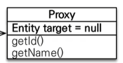
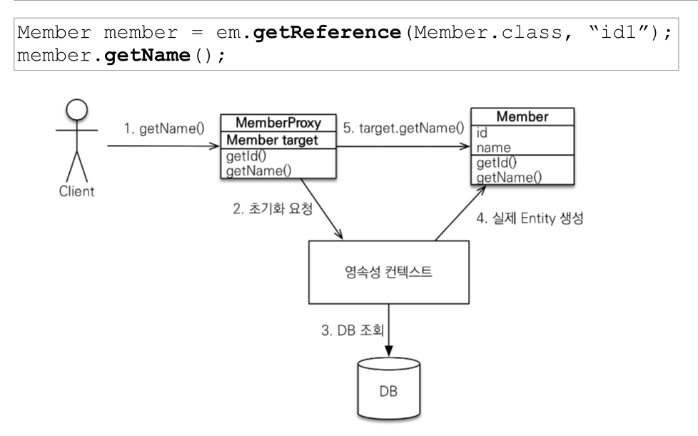
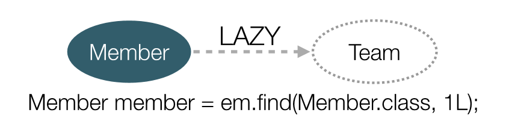
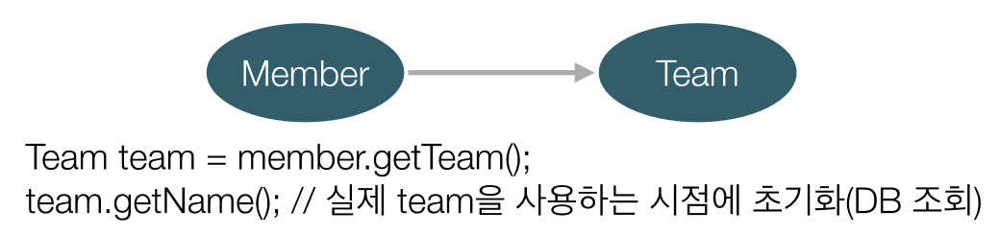

## 프록시

- em.find()
  - 데이터베이스를 통해서 실제 엔티티 객체 조회
  - 쿼리가 나간다.
- em.getReference()

  - 데이터베이스 조회를 미루는 가짜(프록시) 엔티티 객체 조회
  - 실제 쿼리가 나가지 않는다.

    ```java
    Member member = new Member();
    member.setUsername("hgr");
    em.persist();
    em.flush();
    em.clear();

    Member findMember = em.getReference(Member.class, member.getId()); // 이 시점에서 쿼리가 나가지 않는다.
    System.out.println(findMember.getClass());
    // DB 엔티티가 출력되지 않고, HibernateProxy~~~어쩌고가 나온다.
    // 하이버네이트가 강제로 만든 가짜(프록시) 클래스이다.
    System.out.println(findMember.getId()); // 여기에서도 쿼리가 나가지 않는다.
    // em.getReference에 member.getId()를 넣어주었기 때문에 이 값을 가져다가 사용한다.
    System.out.println(findMember.getUsername());
    // 여기서 쿼리가 나간다. 쿼리가 없으면 Username을 가져올 수 없기 때문이다.
    ```

  - 
  - 
  - Entity target은 진짜 객체 주소를 가리킴. 껍데기만 같고 내부는 텅 빈 엔티티.
  - 실제 클래스를 상속받아 만들어진다.
  - 실제 클래스와 겉 모양이 같다.
  - 사용자 입장에서는 진짜 객체인지, 프록시 객체인지 구분할 필요가 없다.

- 

- 프록시의 특징

  - 프록시 객체는 처음 사용할 때 한 번만 초기화된다.
  - <mark>프록시 객체를 초기화할 때, 프록시 객체가 실제 엔티티로 바뀌는 것이 아니다. (프록시 객체 내부의 target이 원래 엔티티를 가리킨다.)
  - <mark>프록시 객체 != 원본 엔티티이다. == 비교가 성립되지 않는다. 대신 instanceof를 사용하여야 한다.</mark>
    - 예를 들어, Member m1은 em.find로 가져오고, Member m2는 em.getReference로 가져오면, m1.getClass() == m2.getClass()는 false이다.
  - <mark>영속성 컨텍스트에 찾는 객체가 이미 있다면, getReference()해도 실제 엔티티가 반환된다.</mark>

    - ```java
        Member m1 = em.find(Member.class, member1.getId());
        Member ref = em.getReference(member.class, member1.getId());
      ```

    - 이 때, `m1.getClass(), ref.getClass()` 모두 class hellojpa.Member가 반환된다. 이미 find하여 영속성 컨텍스트에 m1이 올라갔기 때문에, 이후에 프록시 객체를 가져와도 진짜 객체가 가져와진다.
      - jpa의 원칙 중 하나가 같은 트랜잭션 내에서, 동일 엔티티에 대한 == 비교 `a == a`는 항상 true로 나와야 한다. (같은 객체임을 보장한다)
      - 해당 원칙에 입각하여 이미 영속성 컨텍스트에 올라와 있는 엔티티에 대해서는 프록시 객체를 불러와도 진짜 객체가 호출된다.
      - 이미 1차 캐시에 올라와 있는데 굳이 가짜 객체를 반환할 필요가 없다.
      - 만약, m1과 ref의 호출 순서가 바뀌었다고 해보자. ref 먼저 호출되면 ref.getClass()는 당연히 프록시이다. 그 후 m1을 find로 호출하여도, == 비교 성립을 위해 m1.getClass()는 프록시 객체여야 한다.
    - <mark>영속성 컨텍스트의 도움을 받을 수 없는 준영속 상태일 때, 프록시를 초기화하면 예외(org.hibernate.LazyInitializationException)가 발생한다. </mark>
      - 당연히, 영속성 컨텍스트로부터 가져올 수 없기 때문.

- 유틸리티 메소드
  - PersistenceUnitUtil.isLoaded(Object entity)
    - 프록시 인스턴스의 초기화 여부 확인
  - entity.getClass().getName() 출력
    - 프록시 클래스 확인 방법
  - org.hibernate.Hibernate.initialize(entity);
    - 프록시 강제 초기화

## 즉시 로딩과 지연 로딩

- 지연 로딩 LAZY를 사용해서 프록시로 조회
  - @ManyToOne(fetch = FetchType.LAZY) (지연 로딩)
  - Member id만 조회하고 싶을 때(team은 조회하고 싶지 않을 때)
  - 일단 프록시로 member를 가져온 후, 각 필드가 필요할 때(호출될 때) 쿼리가 나간다.
  - 
    - Team은 프록시 객체. 아직 호출되지 않았음.
  - 
    - 호출된 후에 프록시 객체 Team이 초기화됨. (쿼리가 나감)
      - getTeam의 경우 프록시에서 가져올 수 있음. 쿼리가 나갈 필요가 없음.
- 비즈니스 로직 상 member, team 모두 자주 사용하는 경우
  - @ManyToOne(fetch = FetchType.EAGER) (즉시 로딩)
  - 즉시 로딩이므로 프록시가 필요 없음. 초기화라는게 필요가 없음.
  - 조인을 사용해서 SQL 한 번에 조회.

### 주의사항

- <mark>실무에서, 지연 로딩만 사용하자.</mark>
  - 즉시 로딩 시 예상치 못한 SQL이 발생하기 때문.
  - 테이블 수만큼 조인이 나감. 개느림
  - ManyToOne, OneToOne은 디폴트가 즉시 로딩임. 레이지로 설정하자.
- 즉시 로딩 시 N+1 문제가 발생한다.
  - 1. 패치 조인. 원하는 애들만 조인 << 주로 이걸로 해결
  - 2. 어노테이션
  - 3. 배치 사이즈

### 지연 로딩 활용

- 걍 모든 연관관계에 지연 로딩을 사용하자.
- JPQL fetch 조인, 엔티티 그래프 기능을 활용하자.
- 즉시 로딩은 상상하지 못한 쿼리가 나간다.

## 영속성 전이 : CASCADE

- 특정 엔티티를 영속 상태로 만들 때 연관된 엔티티도 함께 영속 상태로 만들고 싶을 때.
- 부모 엔티티를 저장할 때 자식 엔티티까지 함께 저장하고 싶을 때.

  ```java

  public class Parent {
      //~~ id 생략 //

      @OneToMany(mappedBy = "parent", cascade = CascadeType.ALL)
      private List<Chlid> childList = new ArrayList<>();
  }
  public main {
      Child child1 = new Child();
      Child child2 = new Child();

      Parent parent = new Parent();
      parent.addChild(child1);
      parent.addChild(child2);

      em.persist(parent);
      em.persist(child1); // child1, child2 각각 persist해줘야 한다.
      em.persist(child2);
  }
  ```

- parent만 persist했을 때 chlid까지 persist하고싶다면 cascade 옵션을 주자.
  - 상속관계 이런거 다 필요 없이, 그냥 cascade 옵션 아래에 있는 객체까지 persist를 날려준다는 의미.
  - 연관관계 매핑과 아무 관련이 없음.
  - ALL, PERSIST 정도 옵션만 사용하자.
  - 소유자가 하나일 때 사용하자.
    - child가 다른 엔티티와도 연관관계가 있다, 이러면 사용하면 안 된다.
    - 단일 엔티티와 완전히 종속적일 때 사용하면 편하다.

### 고아 객체

- 고아 객체 제거
  - 부모 엔티티와 연관관계가 끊어진 자식 엔티티를 자동으로 삭제
  - orphanRemoval = true

```java
    Parent parent = em.find(Parent.class, id);
    parent.getChildren().remove(0);
    // 자식 엔티티를 컬렉션에서 제거

    // 이 때 DELETE 쿼리가 나간다.
    DELETE FROM CHILD WHERE ID = ?
```

- <mark>cascade와 마찬가지로, 참조하는 곳이 하나일 때에만 사용하자.</mark>
- 특정 엔티티가 개인 소유할 때 사용.
- cascadeType.REMOVE와 동작 방식이 비슷.

### 영속성 전이(cascade) + 고아 객체(orphanRemoval), 생명주기

- CascadeType.ALL + orphanRemoval=true
- 스스로 생명주기를 관리하는 엔티티는 em.persist()로 영속화, em.remove()로 제거할 수 있다.
- 두 옵션을 모두 활성화하면 부모 엔티티를 통하여 자식의 생명 주기를 관리할 수 있다.
  - 즉, DAO가 필요가 없음.
- 도메인 주도 설계의 Aggregate Root 개념을 구현할 때 유용하다.
  - repository는 aggregate root만 컨택, 나머지는 repository를 만들지 않는 설계 방식.

## 연관관계 관리

- 모든 연관관계를 지연 로딩으로 바꾸자.
- @ManyToOne, @OneToOne은 지연 로딩으로 바꾸자.
- Order -> Delivery cascade ALL 설정
- Order -> OrderItem cascade ALL 설정
