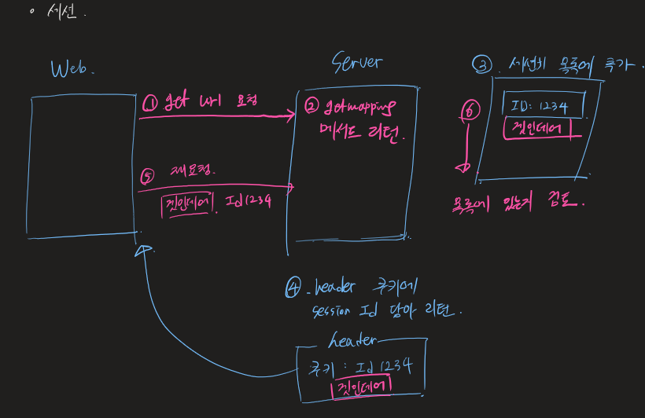
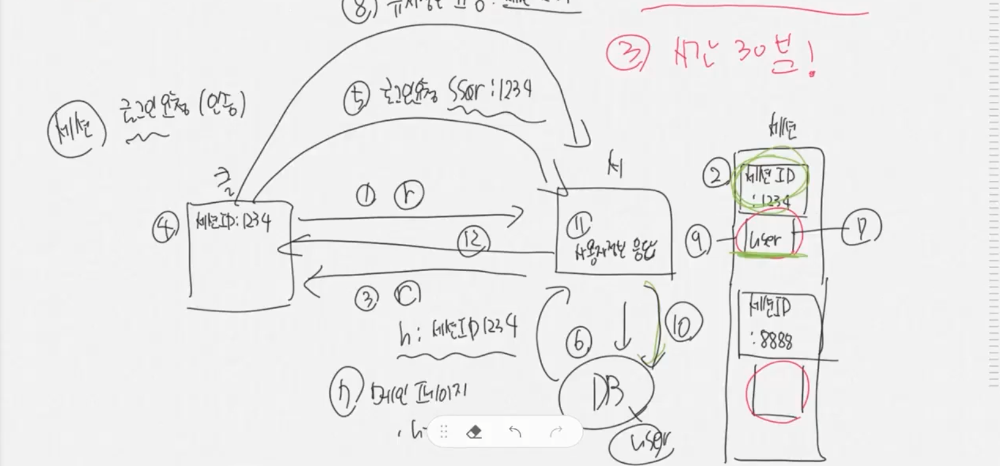
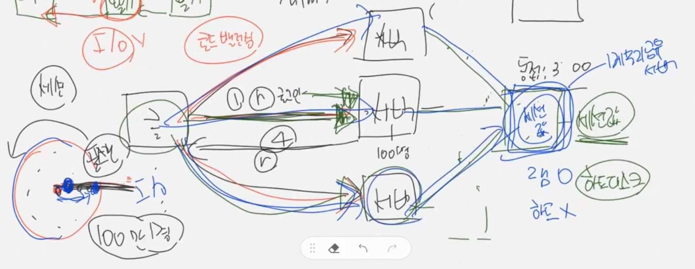
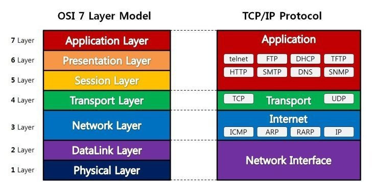
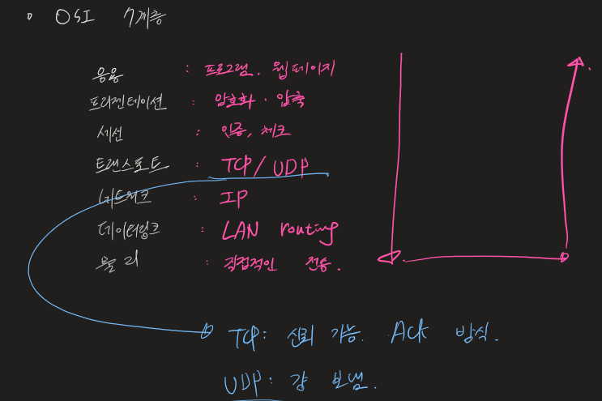

## 세션

세션 값이 사라지는 경우

- 서버 단에서 세션 값을 날리는 경우.
- 클라이언트가 브라우저를 모두 종료시키는 경우.
  - 쿠키가 날라감. 하지만 서버는 해당 값을 가지고 있음.
  - 따라서 재방문 시 새로운 세션 아이디를 부여한다.
- 서버 단의 세션 아이디는 보통 30분이 지나면 만료된다.

- 로그인 요청시 사용되는 세션

  - 1. 로그인 요청
  - 2. 서버 세션 저장소에 아이디 저장
  - 3. 서버는 세션 아이디를 리턴
  - 4. 클라이언트는 세션 아이디를 갖고 있음.
  - 5. 로그인 요청, 세션 아이디를 같이 줌
  - 6. DB에서 로그인 요청으로 들어온 값이 있는지 확인. 확인되면 세션 저장소의 세션 키에 유저 정보를 저장.
  - 7. 메인 페이지 리턴
  - 8. 클라가 유저 정보를 요청 (세션 아이디를 같이 줌)
  - 9. 서버는 세션 저장소에 해당 세션 아이디가 있는지 체크
  - 10. DB로부터 해당 사용자의 정보를 받아와서 돌려줌.

- 세션의 단점

- 클라이언트 동접자 수가 너무 많은 경우. 로드 밸런싱: 부하 분산, 다중 서버.
- 다중 서버를 두어 세션 아이디를 저장해야 함.
- 이 때 클라이언트에서 세션키를 체크하는 방법은 크게 두 가지가 있음.
  - 1.처음 접속했을 때의 서버 저장소에만 해당되는 세션 키를 저장하는 경우
    - 이 경우, 클라이언트가 초기에 어떤 서버로 접속하였는지 알아야 함.
  - 2.분산 서버 모두 전체 세션 키를 복사해서 가지고 있는 경우
    - 이 경우, 클라이언트 정보를 모든 서버가 가지고 있으므로 로드 밸런싱과는 관계가 없지만, 복사는 어떻게 함? 용량은?
  - 따라서, 다중 서버를 모두 연결시킨 하나의 DB에 세션 값을 저장시키는 방법을 사용함. (Redis)
    - 근데 이러면? 세션의 장점이 의미가 없음.
      - 세션은 메모리 레벨에서 빠르게 접근 가능한 것이 장점. 하지만 DB에 세션 값을 저장해놓으면 물리적 IO가 발생하게 된다. -> 더 느림!
- 이런 단점을 JWT를 통해 해결할 수 있다!..

## TCP

- OSI 7계층

  

## CIA

- Confidential - 기밀성
  - 문서를 암호화
  - 문서를 탈취당하더라도 기밀이 유지되어야 함
  - <mark>암호화 키를 어떻게 전달하는지가 문제.</mark>
- Integrity - 무결성
  - 문서가 변경되지 않아야 함
- Availability - 가용성
  - 전송 문서 자체를 빼앗기지 않는 것

## RSA

- 핵심 문제 두 가지: 열쇠 전달 문제, 인증 문제(문서 작성자가 누구인지) -> 서명
- RSA 암호화
  - public key - 공개 키
  - private key - 개인 키
  - A -> B 데이터 전달 가정
  - 1.암호화 방법
    - A가 B의 공개키로 데이터 암호화하여 전송
    - B는 B의 개인키로 복호 가능.
  - 2.인증 방법 (전자서명)
    - A가 A의 개인키로 데이터를 암호화하여 전송
    - 누구나 A의 공개키를 활용하여 복호 가능.
    - 단, 그 데이터를 전송한 사람은 A일 수밖에 없음. 개인키를 A만 가지고 있으므로.
- 이 두 가지를 합쳐서 인증과 암호화 과정을 모두 해결할 수 있다!

1. 암호화해서 보낼 데이터를 B의 공개키로 암호화한다.
2. 전송할 메시지 자체를 A의 개인키로 암호화한다.
3. 수신자 B 입장에서 A의 공개키로 메시지를 풀어본다.
   - 만약 A의 공개키로 암호화가 안 풀린다? -> A가 보낸 것이 아니다. 폐기
   - A의 공개키로 암호화가 풀린다! -> A 인증 완료
4. B는 받은 메시지를 B의 개인키로 복호화한다.

## RFC 문서

- http 프로토콜
- 통신 규칙을 규정해놓은 것
