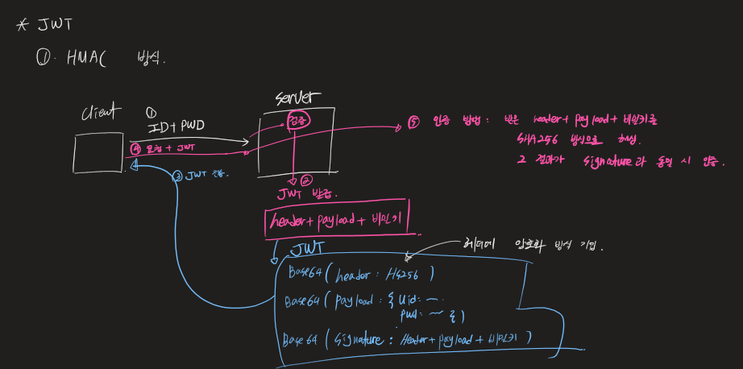
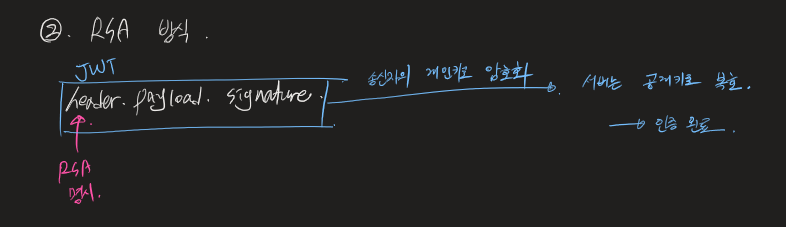

### [jwt 쉽게 생성해주는 라이브러리](https://mvnrepository.com/artifact/com.auth0/java-jwt/4.4.0)

## JWT 구조 이해

- 헤더.페이로드.시그니처
- 헤더
  - 무슨 알고리즘인지
  - 무슨 타입인지
  - BASE64로 인코딩되어 있다. -> 디코딩이 가능한 암호화
- 페이로드
  - 개인 클레임 (유저 아이디, 이름, 원하는 키벨류 값)
- 서명
  - 헤더, 페이로드, 키 암호화해서 전송

  
참고로, signature는 BASE64(HS256(header+payload+secret key))이다.



## CorsConfig

```java
@Configuration
public class CorsConfig {

    @Bean
    public CorsFilter corsFilter() {
        UrlBasedCorsConfigurationSource source = new UrlBasedCorsConfigurationSource();
        CorsConfiguration config = new CorsConfiguration();
        config.setAllowCredentials(true); // 내 서버가 응답할 때 json 파일을 자바스크립트에서 처리할 수 있게 함
        config.addAllowedOrigin("*"); // 모든 IP에 응답 허용
        config.addAllowedHeader("*"); // 모든 header에 응답 허용
        config.addAllowedMethod("*"); // 모든 method(post, get...)에 요청 허용
        source.registerCorsConfiguration("/api/**", config);
        return new CorsFilter(source);
    }
}
```

- Cors 문제를 해결하자.

## `httpBasic().disable()`

- 요청 header의 Authorization에 ID, PWD를 담아서 요청하는 방식
- 확장성은 좋은데, ID, PWD가 암호화되지 않음. 노출됨.
- https 방식을 사용하면 이거도 암호화되긴 함.
- 우리가 사용하는 방식은 Authorization에 토큰을 넣는 방식이다.
- 토큰이 노출된다고 해도 ID, PW가 노출되는 것은 아님.
- 토큰은 유효시간이 존재하므로 노출되어도 영구적인 노출은 아님.
- <mark>ID, PWD를 전달하는 방식을 Basic, 토큰을 전달하는 방식을 Bearer이라고 한다. </mark>

## 커스텀 필터 추가하는 방법

1. 필터 클래스를 만든다.

```java
public class MyFilter1 implements Filter {

    @Override
    public void doFilter(ServletRequest request, ServletResponse response, FilterChain chain) throws IOException, ServletException {
        System.out.println("필터1");
        chain.doFilter(request, response); // 1회성에 그치지 않고 다시 체인에 등록
        // securityConfig에 등록해주자.
    }
}

```

- SecurityConfig에 커스텀 필터를 `addFilterBefore`로 걸어준다.
- 이걸 하려면 어떤 기본 필터가 실행되는지 알아야 함.
- `  http.addFilterBefore(new MyFilter1(), BasicAuthenticationFilter.class)`

2. FilterConfig를 만든다

```java
@Configuration
public class FilterConfig {

    @Bean
    public FilterRegistrationBean<MyFilter1> filter1() {
        FilterRegistrationBean<MyFilter1> bean = new FilterRegistrationBean<>(new MyFilter1());
        bean.addUrlPatterns("/*"); // 모든 Url에 대하여
        bean.setOrder(0);  // 번호가 낮을수록 우선순위가 높다.
        return bean;
    }

    @Bean
    public FilterRegistrationBean<MyFilter2> filter2() {
        FilterRegistrationBean<MyFilter2> bean = new FilterRegistrationBean<>(new MyFilter2());
        bean.addUrlPatterns("/*"); // 모든 Url에 대하여
        bean.setOrder(1);  // 번호가 낮을수록 우선순위가 높다.
        return bean;
    }

}
```

- 내가 만든 필터보다 시큐리티 필터가 우선적으로 동작하는 것이 디폴트.
- 가장 먼저 실행되는 필터에 `addFilterBefore()`를 걸어주면 가장 먼저 실행시킬 수 있다.

## 임시 토큰 만들어 테스트해보기

- MyFilter3을 다음과 같이 구현하자.

  ```java
  public class MyFilter3 implements Filter {

      @Override
      public void doFilter(ServletRequest request, ServletResponse response, FilterChain chain) throws IOException, ServletException {
          HttpServletRequest req = (HttpServletRequest) request; // 상위 인터페이스로 캐스팅
          HttpServletResponse res = (HttpServletResponse) response;

          // 토큰 이름: hgr. 토큰이 hgr일 때에만 진입하고, 아니면 컨트롤러 접근을 막음.
          // ID, PW 정상적으로 로그인되면 토큰을 만들어주고 응답함.
          // 요청 때마다 header authorrization에 value 값으로 토큰을 가지고 옴
          // 그때 토큰이 넘어오면 이 토큰이 내가 만든 토큰이 맞는지만 검증하면 됨. (RSA, HS256)
          if (req.getMethod().equals("POST")) {
              System.out.println("POST request");
              String headerAuth = req.getHeader("Authorization");
              System.out.println("headerAuth = " + headerAuth);
              System.out.println("필터3");

              if (headerAuth.equals("hgr")) {
                  chain.doFilter(request, response); // 헤더 이름이 일치할 때에만 필터를 타게 하자.
              } else {
                  PrintWriter out = res.getWriter();
                  out.println("인증안됨");
              }
          }
      }
  }
  ```

- POST 매핑이 오고, 헤더 내부의 Authorization 값을 가져오자.
- 그 값이 기존에 지정해놓은 값과 동일하면 필터를 통과시킨다.
- SecurityConfig에 `http.addFilterBefore(new MyFilter3(), SecurityContextPersistenceFilter.class)`를 명시해야 한다.
- 시큐리티 필터 동작 전에 토큰 인증을 진행해야 하기 때문.

## 세션 vs JWT

- 유저네임, 패스워드 로그인이 정상이라면

1. 세션의 경우

   - 서버쪽 세션 ID를 생성
   - 클라이언트 쿠키 세션ID 응답
   - 요청할 때마다 쿠키에 세션ID를 들고 서버로 요청
   - 서버는 세션 ID가 유효한지만 판단
     - `session.getAttribute("세션값 확인");`
   - 유효하다면 인증이 필요한 페이지 접근 허가

2. JWT의 경우
   - 로그인이 정상적으로 수행되면 서버는 JWT 토큰을 리턴
   - 클라이언트는 필요할 때마다 토큰을 들고 서버에 요청
   - 서버는 jWT가 유효한지를 판단해야 함.
   - 이 필터를 만들어봅시다~
