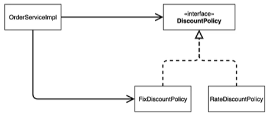

## 새로운 할인 정책 개발

## 새로운 할인 정책 적용과 문제점

<mark>- DIP: Dependency Inversion Principle</mark> <br> - 클래스를 직접 참조하지 말고, 그 대상의 상위 요소를 참조하자.

    - 즉, 추상 클래스나 인터페이스를 참조하자.



```java
    private final MemberRepository memberRepository = new MemoryMemberRepository();
    private final DiscountPolicy discountPolicy = new FixDiscountPolicy();

```

실제 OrderServiceImpl에서, discountpolicy 객체는 FixDiscountPolicy에 직접 접근하는 것을 알 수 있다. -> DIP 위반

<mark>- OCP: Open Close Principle</mark> <br> - 개방 폐쇄 원칙: 확장에 대해서는 개방적이고, 수정에 대해서는 폐쇄적이어야 한다.

    - 위의 예시에서, 할인 정책을 RateDiscountPolicy로 갈아끼우기 위해 MemberServiceImpl의 소스코드를 수정해야 한다. -> OCP 위반

`    private DiscountPolicy discountPolicy; // 인터페이스에만 의존`  
 이렇게 인터페이스에만 의존하도록 수정해야 한다. 하지만, 이러면 nullPointerException이 터진다.

## 관심사의 분리

- AppConfig
  - 구현 객체를 생성하고 연결하는 책임을 가지는 별도의 클래스
- BeforeEach
  - Test 실행 전에 먼저 실행되는 메소드

## AppConfig 리팩터링

- 중복, 역할에 따른 구현을 확실히 해야 한다.
- 리팩터링 단축키: ctrl+alt+M

## 새로운 할인 정책 적용

- 다른 코드 수정 없이, AppConfig의 discountPolicy의 fixDiscountPolicy를 rateDiscountPolicy로 변경하면 된다.

## 좋은 객체지향 설계

- 5가지
  - SRP: 단일 책임 원칙
    - 하나의 클래스는 하나의 책임만 가져야 한다.
  - DIP: 의존 관계 역전 관계
    - 추상화에 의존해야 하지, 구체화에 의존하면 안 된다.
    - 의존성 주입이 한 가지 방법
  - OCP: 확장에는 open, 변경에는 close

## IoC, DI, 컨테이너

- IoC: Inversion of Control. 제어의 역전

  - 클라이언트 구현 객체가 필요한 서버 구현 객체를 직접 생성하고 연결하고 실행하는 것이 자연스러운 흐름.
  - AppConfig의 등장으로, 구현 객체는 자신의 로직을 실행하는 일만 한다. 프로그램 제어 흐름에 대한 권한은 모두 AppConfig가 갖는다.

- 프레임워크 vs 라이브러리

  - 프레임워크: 내가 작성한 코드를 대신 실행하고 제어(JUnit)
  - 라이브러리: 내가 작성한 코드가 직접 제어의 흐름을 담당하면 라이브러리

- 의존관계 주입 (DI)

  - 정적 클래스 의존 관계
    - 프로그램을 실행시키지 않아도 알 수 있다.
    - import 목록을 보면 됨
    - OrderServiceImpl은 MemberRepository, DiscountPolicy에 의존한다.
  - 동적 클래스 의존 관계
    - 프로그램을 실행시켜야만 알 수 있다.
    - MemberRepository는 인터페이스다.
      - 이 인터페이스의 구현체가 MemoryMemberRepo인지, DBMemberRepo인지에 대해서는 실행하기 전까지는 알 수 없다.
      - 외부(AppConfig)가 지정하여 주입해주기 때문에, 인터페이스 자체는 어떤 객체가 주입되는지 실행하기 전까지 알 수 없다.
  - <mark>의존관계 주입: 앱 실행 시점에 외부에서 실제 구현 객체를 생성하고, 클라에 전달하여 클라와 서버의 실제 의존관계가 연결되는 것을 의미함.</mark>
  - 객체 인스턴스를 생성하고, 그 참조값을 전달하여 연결.
  - <mark>DI를 사용하면, 정적인 클래스 의존관계를 변경하지 않고도 동적인 의존관계를 변경할 수 있다.</mark>

- DI 컨테이너
  - AppConfig와 같이 객체 생성, 관리, 의존관계 연결해주는 주체.
  - IoC 컨테이너라고도 한다.
  - 어셈블러, 오브젝트 팩토리라고도 한다

## 스프링으로 바꾸기

##### 바꾸기 전에, 기존 코드를 백업하자.

- AppConfig.java

```java
package study.springbootbasic1;

import study.springbootbasic1.discount.DiscountPolicy;
import study.springbootbasic1.discount.FixDiscountPolicy;
import study.springbootbasic1.discount.RateDiscountPolicy;
import study.springbootbasic1.member.MemberRepository;
import study.springbootbasic1.member.MemberService;
import study.springbootbasic1.member.MemberServiceImpl;
import study.springbootbasic1.member.MemoryMemberRepository;
import study.springbootbasic1.order.OrderService;
import study.springbootbasic1.order.OrderServiceImpl;

public class AppConfig {

    public MemberService memberService() {
        return new MemberServiceImpl(memberRepository());
    }

    private MemberRepository memberRepository() {
        return new MemoryMemberRepository(); // 나중에 repo를 바꾸려면 이 부분만 수정하면 됨.
    }

    public OrderService orderService() {
        return new OrderServiceImpl(memberRepository(), discountPolicy());
    }

    private DiscountPolicy discountPolicy() {
        return new RateDiscountPolicy(); // 나중에 할인정책 바꿀 때 이 부분만 수정하면 됨.
    }


}
```

1. @Configuration, @Bean 어노테이션을 붙이자.
2. 그러면 스프링 컨테이너에 모두 등록된다.
3. 이제, AppConfig를 사용하는 곳에 `ApplicationContext applicationContext = new AnnotationConfigApplicationContext(AppConfig.class);` 를 써주자.
4. `applicationContext.getBean("memberService", MemberService.class);` 로 빈을 가져오자.
   - "memberService": 메소드 이름.
   - MemberService.class: 반환 타입.
5.
