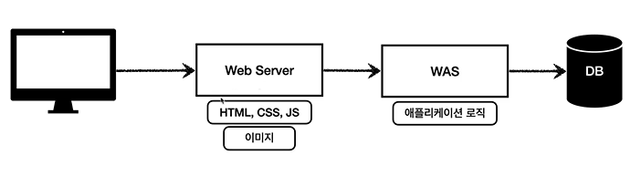
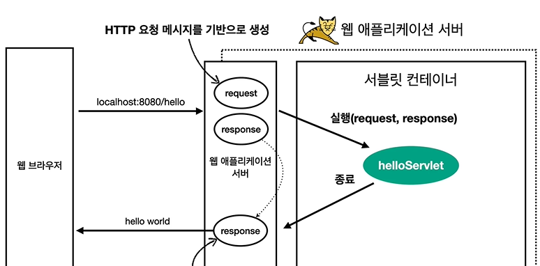
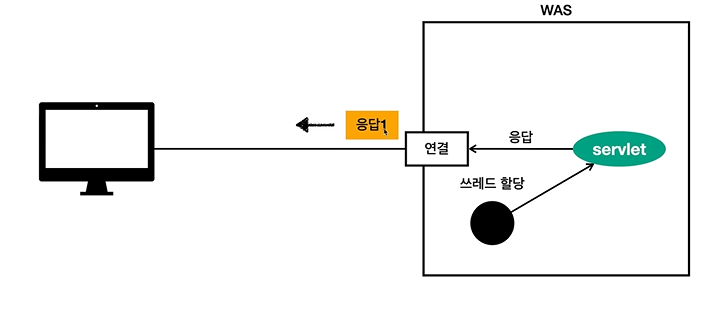
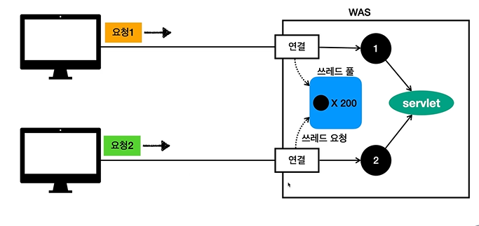
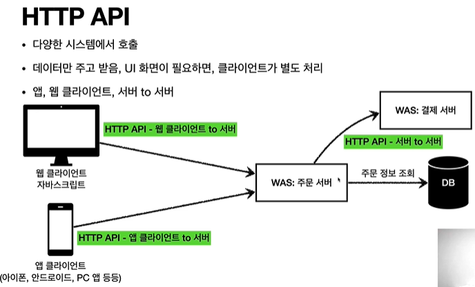

## 웹 서버, 웹앱 서버

- 웹 서버
  - HTTP 기반
  - 정적 리소스
  - HTML, CSS, JS
  - NGINX, APACHE
- 웹앱 서버 - WAS
  - HTTP
  - 프로그램 코드 실행 -> 앱 로직 실행
  - 동적 HTML, HTTP API
  - 서블릿, JSP, 스프링 MVC
  - 톰캣, Jetty
- 차이점
  - 정적 / 동적
  - 근데 사실 경계가 모호함.
  - WAS는 애플리케이션 코드를 실행하는데에 더 특화되어 있다.
    
- 동적 이미지는 웹서버가, 앱 로직은 WAS가 담당.
- 단순 정적 자료만 가져오는 웹서버는 잘 안죽음.
- 따라서 오류가 나도 오류화면 띄우기 가능.

## 서블릿

- 단순 회원 정보를 받아온 후 WAS가 수행해야 하는 일은 다음과 같다.
  1. 서버 TCP/IP 대기, 소캣 연결
  2. HTTP 요청 메시지를 파싱해서 읽기
  3. POST / save URL인지 구분
  4. Content type 확인
  5. HTTP 메시지 바디 내용 파싱
  6. 저장 프로세스
  7. 비즈니스 로직 실행
  8. 데이터베이스에 저장 요청
  9. HTTP 응답 메시지 생성
  10. HTTP 시작 라인 생성
  11. header 생성
  12. 바디에 HTML 생성해서 입력
  13. TCP/IP에 응답 전달
  14. 소캣 종료
- 할 일이 너무 많다.
- <mark>근데 이걸 7, 8 빼고 서블릿이 다 해준다!</mark>
- `HttpServletRequest request`
  - HTTP 요청 정보를 편리하게 사용할 수 있다.
- `HttpServletResponse response`

  - HTTP 응답 정보를 편리하게 제공한다.

- 서블릿 컨테이너

- request, response는 요청마다 새로 생성한다.
  - 고객마다 username, id 등 값이 제각각이기 때문
- 서블릿 컨테이너 내부의 Servlet 객체는 싱글톤이다.
  - 애플리케이션 로직은 공통적이기 때문. 굳이 새로 만들 필요가 없다.

### 서블릿 컨테이너

- 톰캣과 같이 서블릿을 지원하는 WAS를 서블릿 컨테이너라고 한다.
- 서블릿 컨테이너는 서블릿 객체를 생성, 초기화, 호출, 종료하는 생명주기를 관리한다.
- 서블릿 객체는 싱글톤이다.
  - 고객의 요청마다 서블릿 객체를 생성할 필요가 없다.
  - 애플리케이션 로직은 공통적이기 때문이다.
  - 최초 로딩 시점에 서블릿 객체를 하나 만들어놓고 재활용한다.
  - 모든 요청은 동일한 서블릿 객체 인스턴스에 접근한다.
  - <mark>따라서 공유 변수 사용에 주의하자.</mark>
  - 서블릿 컨테이너 종료 시 함께 종료된다.
- JSP도 서블릿으로 변환되어 사용한다.
- <mark>멀티 쓰레드 처리를 지원한다.</mark>

## 동시 요청 - 멀티 쓰레드

### 쓰레드

- 애플리케이션 코드를 하나하나 순차적으로 실행함
  - main 메소드를 실행하면 main이라는 이름의 쓰레드가 실행
- 쓰레드가 없다면 자바 애플리케이션 실행이 불가능하다.
- 쓰레드는 한 번에 하나의 코드 라인만 수행
- <mark>동시 처리가 필요하면 쓰레드를 추가로 생성해야 한다.</mark>

### 요청 마다 쓰레드 생성

- 장점
  - 동시 요청 처리 가능
  - 리소스가 허용할 때까지 처리 가능
  - 하나의 쓰레드가 지연되어도 다른 쓰레드는 정상 동작.
- 단점
  - 쓰레드 생성이 비쌈
  - 고객 요청마다 쓰레드 생성 시 응답 속도가 늦어짐
  - 쓰레드는 컨텍스트 스위칭 비용이 많이 발생
    - EX: CPU 코어 1개, 쓰레드 2개. 한 코어는 하나의 쓰레드만 처리 가능. 코어가 처리하는 쓰레드를 변경할 때 드는 비용을 컨텍스트 스위칭 비용이라 함.
  - 쓰레드 생성에 제한이 없다
    - 즉, 너무 많은 요청이 오면 서버가 죽을 수 있음.

### 쓰레드 풀

- 특징
  - 필요한 쓰레드를 쓰레드 풀에 보관하고 관리
  - 쓰레드 풀에 생성 가능한 쓰레드의 최대치를 관리. 톰캣은 200개가 기본 설정
- 사용
  - 쓰레드가 필요하면 이미 생성되어 있는 쓰레드를 쓰레드 풀에서 꺼내서 사용.
  - 사용 종료 시 반납
  - 쓰레드가 없으면 거절하거나 대기하도록 설정 가능
- 장점

  - 미리 생성되어 있음. 따라서 생성 종료 비용이 절약, 응답 시간이 빠름.
  - 생성 가능한 쓰레드 최대치가 있으므로 서버가 터지지 않음. 기존 요청은 안전하게 처리됨

- 실무 팁
  - WAS의 주요 튜닝 포인트는 <mark>최대 쓰레드 수</mark>
  - 값이 너무 낮으면
    - 서버 리소스는 여유로운데 클라이언트는 지연
  - 너무 높으면
    - CPU 메모리 리소스 임계점 초과로 서버 죽음
  - 장애 발생 시
    - 클라우드라면 서버를 늘리자.
    - 아니면 튜닝하자
- 적정 숫자를 찾는 법

  - 성능 테스트를 해봅시다.
  - 아파치 ab, 제이미터, nGrinder

- WAS의 멀티 스레드 지원 핵심
  - WAS가 알아서 다 해줌!!
  - 개발자가 멀티 스레드 관련 코드를 신경쓰지 않아도 됨.
  - 싱글 쓰레드 프로그래밍처럼 소스 코드를 개발하자.
  - 싱글톤 객체는 주의해서 사용
    - 서블릿, 스프링 빈

## HTML, HTTP API, CSR, SSR

- HTTP API

  - JSON 형태로 통신
  - UI 클라이언트 접점
    - 앱 클라
    - 웹브라우저에서 JS를 통한 HTTP API 호출
    - 리액트, Vue.js
  - 서버 to 서버

- 백앤드가 고민해야 할 세 가지

  - 정적 리소스 전달 방식
  - 동적 HTML 페이지 전달 방식
  - HTTP API 제공 방식

- SSR

  - HTML 최종 결과를 서버에서 만들어서 웹 브라우저에 전달
  - 주로 정적인 화면
  - JSP, 타임리프.

- CSR
  - HTML 결과를 JS를 사용해 웹 브라우저에서 동적으로 생성해서 적용
  - 주로 동적인 화면
  - 구글 지도, 구글 캘린더
  - React, Vue.js
