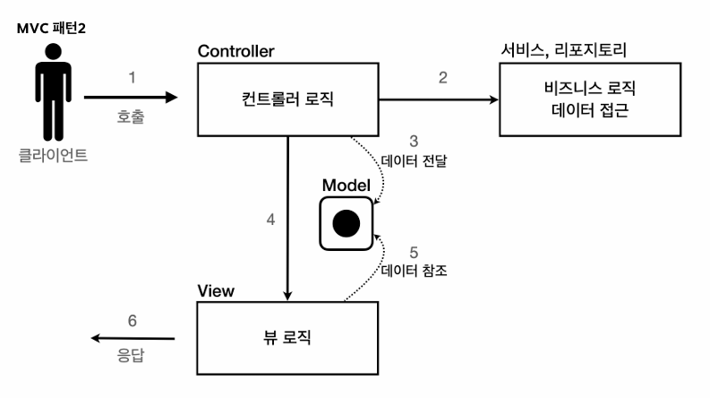

## MVC 패턴 - 개요

- 기존의 서블릿, JSP 문제점
  - 하나의 파일로 비즈니스 로직, 뷰 렌더링까지 모두 처리하면 너무 많은 역할
  - 유지보수가 어려움
  - 변경의 라이프 사이클
    - 둘 사이의 변경 라이프 사이클이 다르다.
  - 기능 특화가 필요
- MVC
  - Controller
    - HTTP 요청을 받음
    - 파라미터를 검증
    - 비즈니스 로직을 실행
    - 뷰에 전달될 결과 데이터를 모델에 담음
    - <mark>주로 비즈니스 로직은 서비스 계층을 만들어 처리</mark>
      - 컨트롤러는 이 서비스를 호출
  - Model
    - 뷰에 출력할 데이터를 담음
  - View - 모델에 담겨있는 데이터를 사용하여 그대로 화면에 뿌림 - HTML 생성
    

## MVC 패턴 - 적용

- 컨트롤러 - 서블릿
- 뷰 - JSP
- 모델 - HttpServletRequest request.setAttribute(), getAttribute()

## MVC 패턴 - 한계

- 포워드 중복
- viewPath 중복
- 공통 처리가 어렵다.
  - 즉, 컨트롤러가 호출되기 전에 공통 기능을 수행하는 수문장 역할이 필요하다.
    - 이를 프론트 컨트롤러라고 한다.
    - 공통적인 이슈를 해결
    - 입구가 한 개임
-
