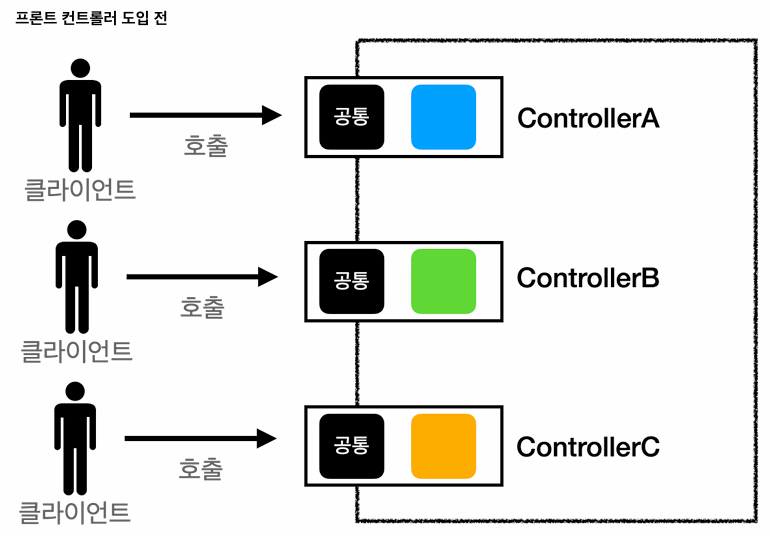
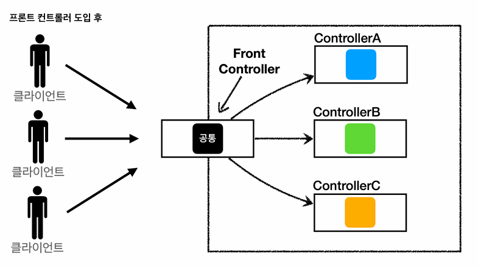

## 프론트 컨트롤러 패턴 소개

- 기존의 MVC는 공통 처리가 불가
- 
- 
- 프론트 컨트롤러 패턴
  - 프론트 컨트롤러 서블릿 하나로 클라의 요청을 받는다.
  - 프론트 컨트롤러가 요청에 맞는 컨트롤러를 찾아 호출한다.
  - 입구가 하나, 공통 처리 가능
  - <mark>따라서, 프론트 컨트롤러를 제외한 나머지 컨트롤러는 서블릿을 상속받을 필요가 없다.</mark>
- 참고로, 스프링MVC의 DispatcherServlet이 FrontController 패턴이다.
