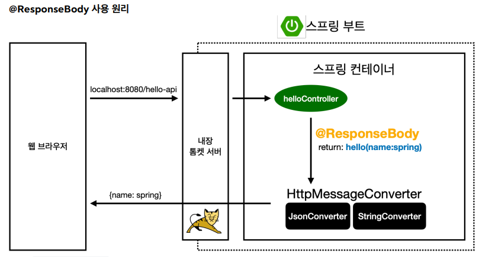

파일 위치:  
studyspringmvc1\springmvc\basic\LogTestController.java

## 로깅

- SLF4J + Logback

- 로그 레벨
  - trace > debug > info > warn > error
  - application.properties에서 `logging.level.projectname=debug` 식으로 출력 로그 레벨을 조정할 수 있음. <br>
- `@RestController`
  - `@Controller`는 반환 값이 String일 때 해당 이름의 뷰를 찾으러 감.
  - `@RestController`는 반환 값을 HTTP 메시지 바디에 그대로 박음. <br>
- 롬복 활용
  - 걍 @slf4j 박으면 됨
  - log.info("") 안에 + 연산을 사용하지 말자. {}를 활용하여 파라미터를 넘기자.
    - 불필요한 연산이 발생하게 됨.

```java
    @GetMapping(value = "mapping-param", params = "mode=debug")
    public String mappingParam() {
        log.info("mapping-param");
        return "ok";
    }
```

- 특정 파라미터가 왔을 때에만 실행

  - URL에 ?mode=debug가 아니면 실행되지 않음.
  - `params='!mode'`
  - `params = "mode != debug"` 가능

- 특정 미디어 타입일때 실행

  - `consumes = "application/json`

- `MultiValueMap`

  - 같은 키에 두 개 이상의 Value가 있을 때 사용.
  - `List<String> values = map.get("keyA");`
    - keyA에 대한 values가 리스트 형식으로 리턴

- HTTP 요청 파라미터 - 쿼리 파라미터, HTML Form

  - <mark>HTTP 요청을 통해 클라이언트에서 서버로 데이터를 전달하는 세 가지 방법</mark>
    - GET - 쿼리 파라미터
      - `/url?username=hgr&age=20`
      - 메시지 바디 없이 URL 쿼리 파라미터에 데이터를 포함하여 전달
      - 검색, 필터, 페이징 등에 사용
    - POST - HTML Form
      - content-type: application/x-www.form.urlencoded
      - 메시지 바디에 쿼리 파라미터 형식으로 전달
        - username=hello&age=20을 메시지 바디에 포함
      - 회원 가입, 상품 주문 등
    - Http message body에 데이터를 직접 담아 요청
      - HTTP API에서 주로 사용
        - JSON, XML, TEXT
      - 데이터 형식은 주로 JSON
      - POST, PUT, PATCH 방식에 사용됨.

- `@Responsebody`
  - `@RestController`가 아닐 때, return으로 String을 반환하면 해당 이름의 뷰를 찾게 된다.
  - 이 때 뷰를 찾지 않고 바로 html body에 찍고 싶으면 `@ResponseBody`를 사용한다.
- `@RequestParam`에서, `required = false`를 주면 해당 변수가 없어도 메서드가 실행된다.
  - 참고로, `RequestParam(required = false) int age` 하면 오류가 발생하는데, age 값이 null인 경우 int형에는 null값을 담을 수 없기 때문이다.
    - 이는 int 대신 Integer형을 사용하여 해결한다.
  - <mark>null과 ""는 다르다. ""는 null이 아님</mark>
- `defaultValue = "guest"

  - 값이 들어오지 않는다면 defaultValue값을 사용한다.
  - 이 경우, null뿐만 아니라 ""일 때에도 디폴트값으로 들어온다. required와의 차이점.

- <mark>requestParam을 map으로 받을 수 있다.</mark>
  - `public String requestParamMap(@RequestParam Map<String, Object> paramMap) `
  -

## ModelAttribute

파일: springmvc1/RequestParamController

- @Data
  - @Getter, @Setter, toString 등을 자동으로 만들어준다.
- `@ModelAttribute

```java
    @RequestMapping("/model-attribute-v2")
    public String modelAttributeV2(@ModelAttribute HelloData helloData) {

        log.info("helloData = {}", helloData);
        return "OK";
    }
```

- 받아온 데이터의 DTO코드가 따로 존재하면 (HelloData) `@RequestParam`으로 하나하나 매핑하는 것 대신 `@ModelAttribute`로 한 번에 가져올 수 있다.
- int age일 때 들어온 데이터가 int형이 아니면 오류가 뜬다.

- 심지어 @ModelAttribute 자체를 생략해도 된다. 근데 그러지 말자.

## HTTP 요청 메시지 - 단순 텍스트

- 클라에서 서버로 데이터를 요청하는 세 가지 방법 중 마지막 방법
- `Http message body`에 데이터를 직접 담아 요청
  - JSON, XML, TEXT
  - POST, PUT, PATCH 방식
- 요청 파라미터, form 형식으로 제공되는 데이터만 `@RequestParam, @ModelAttribute`로 매핑이 가능하다.
- 즉, HTTP 메시지 바디를 통해 데이터가 직접 오는 경우 매핑이 불가능하다.

  - InputStream을 활용하여 직접 읽을 수 있다.

- 방법 1. HttpServletReuqest
  - HttpServletRquest를 활용하여 InputStream 받아오기
  - StreamUtils를 활용하여 String으로 변환.
  - Servlet이 통째로 필요하지 않다. (Stream만 받아올건데 굳이 Servlet을 쓸 필요가 없음.)

```java
    // 방법 1
    @PostMapping("/request-body-string-v1")
    public void requestBodyString(HttpServletRequest request, HttpServletResponse response) throws IOException {
        ServletInputStream inputStream = request.getInputStream();
        String messageBody = StreamUtils.copyToString(inputStream, StandardCharsets.UTF_8);

        log.info("messageBody = {}", messageBody);

        response.getWriter().write("OK");
    }
```

- 방법 2. InputStream 바로 받아오기
  - Writer도 그냥 쓰자

```java
    // 방법 2
    @PostMapping("/request-body-string-v2")
    public void requestBodyStringV2(InputStream inputStream, Writer responseWriter) throws IOException {

        String messageBody = StreamUtils.copyToString(inputStream, StandardCharsets.UTF_8);

        log.info("messageBody = {}", messageBody);

        responseWriter.write("OK");
    }
```

- 방법 3. HttpEntity 사용
  - stream을 String으로 변환시켜주는 코드를 알아서 해줌.
  - <mark>요청 파라미터 조회(RequestParam, ModelAttribute)와 전혀 관계 없음!!!!!!!!!!!!!</mark>
    - 아까도 말했듯, 요청 파라미터는 get의 쿼리 스트링 파라미터나 post의 form..

```java
    // 방법 3
    @PostMapping("/request-body-string-v3")
    public HttpEntity<String> requestBodyStringV3(HttpEntity<String> httpEntity) throws IOException {

        String messageBody = httpEntity.getBody();
        log.info("messageBody = {}", messageBody);

        return new HttpEntity<>("ok");
    }
```

- <mark>ResponseEntity를 활용하여 상태 코드를 반환할 수 있다.</mark>

  - `return new ResponseEntity<String>("msg", HttpStatus.CREATED);`

- `public HttpEntity<String> requestBodyString(@RequestBody String messageBody)` 와 같이 @RequestBody 어노테이션을 사용하면 HttpEntity로 안받아도 됨.

- 정리
  - <mark>요청 파라미터 조회: @RequestParam, @ModelAttribute</mark>
  - <mark>HTTP 메시지 바디를 직접 조회: @RequestBody</mark>
  - @ResponseBody: 응답 결과를 메시지 바디에 직접 담아서 전달.
    - view를 사용하지 않음!!

## HTTP 요청 메시지 - JSON

파일: basic/request/RequestBodyJsonController

```java
@Slf4j
@Controller
public class RequestBodyJsonController {
    private ObjectMapper objectMapper = new ObjectMapper();

    // json을 받아봅시다
    @PostMapping("/request-body-json-v1")
    public void requestBodyJsonV1(HttpServletRequest request, HttpServletResponse response) throws IOException {
        ServletInputStream inputStream = request.getInputStream(); // inputStream 받기
        String messagebody = StreamUtils.copyToString(inputStream, StandardCharsets.UTF_8);

        HelloData helloData = objectMapper.readValue(messagebody, HelloData.class);
        response.getWriter().write("OK");
    }

    // @RequestBody 사용. json 알아서 변환해서 가져옴
    @ResponseBody
    @PostMapping("/request-body-json-v2")
    public String requestBodyJsonV2(@RequestBody String messageBody) throws IOException {
        log.info("messageBody={}", messageBody);
        HelloData helloData = objectMapper.readValue(messageBody, HelloData.class);
        log.info("hellodata = {}", helloData);

        return "OK";
    }

    // objectMapper까지 생략. 받는 과정에서 알아서 helloData로 매핑
    @ResponseBody
    @PostMapping("/request-body-json-v3")
    public String requestBodyJsonV3(@RequestBody HelloData helloData) {
        log.info("hellodata = {}", helloData);

        return "OK";
    }

}
```

- <mark>`HttpEntity<HelloData> httpEntity`를 사용해도 된다. 이 경우 `HelloData data = httpEntity.getBody();`로 데이터를 꺼내야 함.</mark>

- `@ResponseBody`는 들어올 때에도, 나갈 때에도 json으로 변환이 가능하다.(Http 메시지 컨버터 사용) 따라서 json 형태의 객체를 그대로 반환할 수 있다.

```java

    // 리턴도 json으로 하는 방법
    @ResponseBody
    @PostMapping("/request-body-json-v4")
    public HelloData requestBodyJsonV4(@RequestBody HelloData helloData) {
        log.info("hellodata = {}", helloData);

        return helloData;
    }
```

- 정리
  - `@ResponseBody` 요청
    - <mark>JSON 요청 -> HTTP 메시지컨버터 -> 객체</mark>
  - `@ResponseBody` 응답
    - <mark>객체 -> HTTP 메시지컨버터 -> JSON 응답</mark>

## HTTP 응답 - 정적 리소스, 뷰 템플릿

- <mark>요청과 마찬가지로, 스프링 서버 -> 응답 데이터를 만드는 방법은 크게 세 가지이다.</mark>
  - 정적 리소스
    - 브라우저에 정적인 HTML, css, js 사용
    - static 폴더
  - 뷰 템플릿 사용
    - 브라우저에 동적인 HTML -> 뷰 템플릿 사용
    - templates 폴더
  - HTTP 메시지 사용
    - HTTP API 제공 시 HTML이 아닌 데이터를 전달해야 하므로, 메시지 바디에 JSON과 같이 데이터를 실어 보냄.

```java
    // 1. ModelAndView 사용. 뷰이름, 모델을 직접 넘김
    @RequestMapping("/response-view-v1")
    public ModelAndView responseViewV1() {
        ModelAndView mav = new ModelAndView("response/hello")
                .addObject("data", "hello!");
        return mav;
    }

    // 2. String을 리턴. 이러면 자동으로 뷰 이름으로 매핑됨.
    // 여기에 ResponseBody 쓰면 재앙임. 뷰 안찾고 걍 문자 그대로 써버림.
    @RequestMapping("/response-view-v2")
    public String responseViewV2(Model model) {
        model.addAttribute("data", "hello!");
        return "response/hello"; // 뷰 이름으로 매핑.
    }
```

- `@ResponseBody`가 없으면 return 값(response/hello)로 뷰 리졸버가 실행됨. 해당 이름의 뷰를 찾고 렌더링함.
  - templates/response/hello.html를 찾아 실행.
- `@ResponseBody`가 있으면 그냥 HTTP 메시지 바디에 리턴값을 때려박음.

## HTTP 응답 - HTTP API, 메시지 바디에 직접 입력

- HTTP 바디에 데이터를 그냥 실어보내자.

```java

    @GetMapping("/response-body-string-v1")
    public void ResponseBodyV1(HttpServletResponse response) throws IOException {
        response.getWriter().write("OK");
    }

    // ResponseEntity를 활용하여 상태코드 리턴
    @GetMapping("/response-body-string-v2")
    public ResponseEntity<String> ResponseBodyV2() {
        return new ResponseEntity<>("ok", HttpStatus.OK);
    }

    // @ResponseBody 사용
    @ResponseBody
    @GetMapping("/response-body-string-v3")
    public String ResponseBodyV3() {
        return "OK";
    }

    // json 리턴
    @GetMapping("/response-body-json-v1")
    public ResponseEntity<HelloData> responseBodyJsonV1() {
        HelloData helloData = new HelloData();
        helloData.setUsername("hgr");
        helloData.setAge(20);
        return new ResponseEntity<>(helloData, HttpStatus.OK);
    }

    // json 리턴 - ResponseBody 사용
    @ResponseStatus(HttpStatus.OK) // 상태코드 설정 어노테이션
    @ResponseBody
    @GetMapping("/response-body-json-v2")
    public HelloData responseBodyJsonV2() {
        HelloData helloData = new HelloData();
        helloData.setUsername("hgr");
        helloData.setAge(20);
        return helloData;
    }
```

- <mark>`@Controller` + `@ResponseBody` = `@RestController`</mark>
  - 메서드마다 ResponseBody 붙이기 귀찮으면 걍 선언을 RestController로 하자.
  - <mark>이렇게 하면 뷰 템플릿을 사용하지 않고, HTTP 메시지 바디에 직접 데이터를 전달한다. 이름 그대로 REST API (HTTP API)를 만들 때 사용하는 컨트롤러이다.</mark>

## HTTP 메시지 컨버터

- 뷰 템플릿을 사용하지 않고 HTTP API를 이용하는 등, JSON 데이터를 HTTP 바디에 직접 읽고 쓰는 경우 HTTP 메시지 컨버터를 사용하자.
- 
- 스프링 MVC는 다음의 경우에 HTTP 메시지 컨버터를 적용

  - HTTP 요청: `@RequestBody`, `HttpEntity(RequestEntity)`
  - HTTP 응답: `@ResponseBody`, `HttpEntity(ResponseBody)`

## 여러 단축키들
- 파일 추가: ctrl + alt + insert
- test 만들기: ctrl + shift + T
- 변수 추출하기: ctrl + alt + V
- static import: alt + enter
- 같은 단어 선택: alt + j