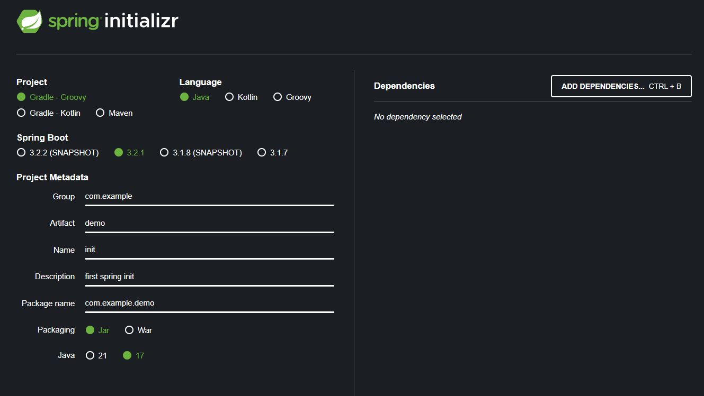
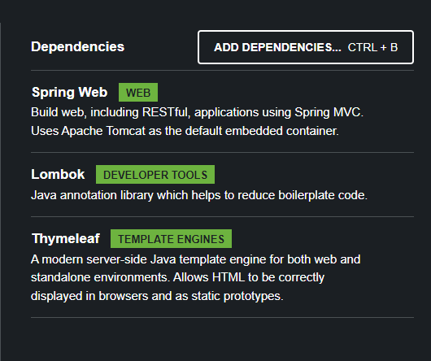
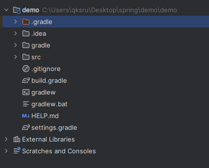
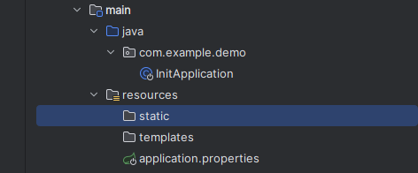

## 스프링을 쓰는 이유

- 기업한테 좋음 ㅋㅋ
- 성능이 좋음 -> 멀티쓰레딩
- 관리의 일관성
- 메이븐: 예전에 쓰던거  
  maven pom.xml

- 그래들: 요즘 쓰는거  
  build.gradle

- 자카르타 EE: 기업 에디션. 저작권 문제로 Java EE에서 이름이 바뀜.
- spring boot: 프레임워크의 프레임워크. 스프링을 빠르게 시작할 수 있게 해주는 도우미 느낌.  
  

Java EE -> 너무 비쌈. 어려움.  
spring -> 오픈소스로 사람들이 만듦. 마개조 버전.  
groovy -> 아파치 그루비. 자바를 발전시킨 객체지향 언어. 아파치에서 관리중  
자바 패키지 ~= 폴더 개념  
packaging

- jar: java archive: 앱 통째로 jar로 묶음. 이대로 배포 가능
- war: web application archive: Servlet, jsp  
  spring boot를 사용한다면 jar를 사용하자.  
  Lombok: 어노테이션 라이브러리

```
 class Ksr{
    int age;
    String address;

    int getAge ~~~~~
}
```

이런거 직접 작성 대신, @Getter, @Setter로 대체 가능.  
Thymeleaf(SSR): 템플릿 엔진. \<div th: hgr>hi</div>와 같이, 사용자 정의 태그를 div 안에 넣어서 html로 읽을 수 있게 해줌.

요즘엔 CSR의 react, vue.js를 많이 사용.  
참고로, 정부 사이트나 학교 사이트 등은 아직도 SSR을 사용. 정보를 단순히 보여주기 위한 사이트는 굳이 CSR로 고생해서 만들 필요가 없기 때문.

jsp: 자바 서버 엔진. html과 비슷함. 사용자 정의 속성 등, 문법이 html과 다르기 때문에 읽을 수 없음.

  
이제 다운로드하고, build.gradle을 오픈하자  
  
.gradle: 설정 파일  
.idea: intellij iDEA 설정 파일. 만질 필요 없다.  
src에서 작업할 예정  
  
static: css, 이미지 파일 등.  
templates: js, 타임리프  
.gitignore: git에 올릴 때 빼고 올릴 것들

웹 서버(WS)

- 정적인 사이트 서비스
- static, html, css, 영상
- 요즘엔 웹 애플리케이션 서버를 많이 씀

웹 애플리케이션 서버(WAS)

- 템플릿 엔진 (ex: DB에 있는 정보를 가져와서 뿌려주는 웹앱)
- NGINX, apache 등  
  static page vs dynamic page

우리는 tomcat을 사용  
CRUD: create, read, update, delete. 게시판의 기본

TODO
컨트롤러에서 GET요청을 게임회사의 정해진 URL로 보냄  
-> 받아서 변수에 저장 String ocid = get(ALKASJ), String[] pet = get(ocid)  
model.addAttribute(pet)  
-> html  
-> \<th> ~~~
