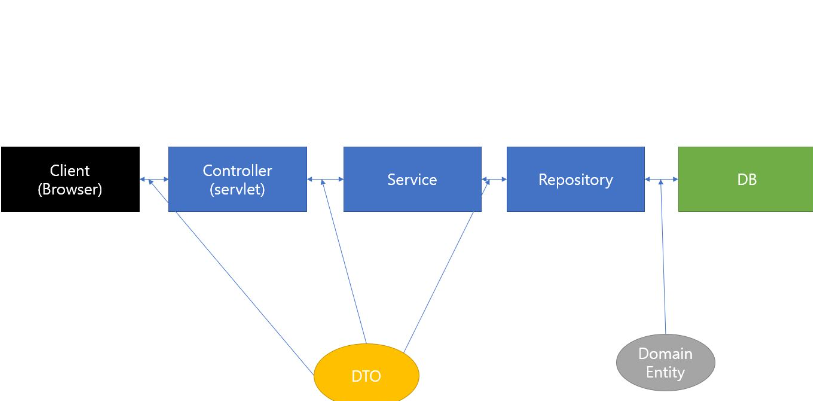

# 231229 스프링 스터디 복습



## DTO(data transfer object)

- 데이터 저장 담당 클래스이다. 계층 간의 데이터 교환에 사용된다. 로직을 갖지 않은, 순수한 데이터 객체이며 getter, setter 메소드를 가지고 있다.

```java
// AccountDTO
@Getter @Setter
@AllArgsConstructor
@ToString
public class AccountDTO {
    private String puuid;
    private String gameName;
    private String tagLine;
}
```

AccountDTO는 riot api에서 가져온 계정 정보에 대한 모델이다. puuid, gameName, tagLine으로 구성되어 있다. 이 외에 작성한 3개의 DTO가 더 있는데, 특별한 특이사항은 없다.

## controller

- 요청 url에 따른 view, mapping 처리를 담당
- @Autowired service를 활용하여, service의 메소드를 이용
  - @Autowired: 의존성 주입할 때 사용하는 어노테이션. 의존 객체의 타입에 해당하는 빈을 찾아 주입해준다.

```java
// HomeController
@Controller
public class HomeController {

    @GetMapping("/")
    public String home() {
        return "home";
    }
}
```

- @GetMapping: 클라이언트가 "/"에 해당하는 url의 GET 요청을 보냈을 때, GET: localhost:8080/ 요청을 public String home() 메소드와 mapping해주는 역할을 한다.  
  즉, GET 방식으로 localhost:8080/ 요청이 오면 해당 home() 메소드가 실행되는 것이다.
- public String home() 메소드는 "home"을 리턴한다. 이는 templates의 home.html로 매핑된다.

```java
public class SearchController {

    private final AccountService accountService;
    private final SummonerService summonerService;
    private final ChampionMasteryService championMasteryService;

    @GetMapping("/search")
    public String search(@RequestParam String gameName, @RequestParam("tagLine") String tagLine, Model model) {
        // 1. gameName, tagLine으로 PUUID를 받아온다.
        AccountDTO accountDTO = accountService.getAccountInfomation(gameName, tagLine);
        System.out.println("accountDTO = " + accountDTO);
```

- private final~의 세 줄은 서비스 객체를 생성함.
- @GetMapping("/search")가 왔을 때 search() 메소드를 실행.
- @RequestParam("name"): "name"이 key. 만약 key 값을 넣어주지 않는다면 default로 같은 이름을 매핑해서 가져온다.

```html
<form action="/search" method="get">
  <input type="text" name="gameName" />
  #
  <input type="text" name="tagLine" />
  <button type="submit">검색</button>
</form>
```

위의 코드는 home.html의 form 태그이다. /search가 get 요청으로 들어왔을 때 input form에 입력된 값들을 각각 gameName, tagLine으로 전송하는 역할을 한다. @RequestParam은 이 전송된 값들을 자동으로 매핑하여 가져오는 역할을 수행한다.

```java
        // 2. PUUID를 가지고 소환사 정보를 받아온다.
        SummonerDTO summonerDTO = summonerService.getSummonerInformationByPUUID(accountDTO.getPuuid());
        System.out.println("summonerDTO = " + summonerDTO);
        model.addAttribute("summonerDTO", summonerDTO);
        model.addAttribute("profileIconURL", summonerService.getSummonerProfileIcon(summonerDTO.getProfileIconId()));

        // 3. PUUID를 가지고 숙련도 정보를 받아온다.
        List<ChampionMasteryDTO> championMasteryDTOList = championMasteryService.getChampionMasteryInformationsByPUUID(accountDTO.getPuuid(), 5);
//        for (ChampionMasteryDTO championMasteryDTOEach : championMasteryDTOList) {
//
//        }
        model.addAttribute("championMasteryDTOList", championMasteryDTOList);

        return "search";
    }
}
```

- summonerDTO 객체를 만든다. 이 객체는 summonerService의 getSummonerInformationByPUUID 메소드로부터 summonerDTO 형식의 객체를 리턴받은 것이다.
- model.addAttribute: model 객체에 param으로 들어온 데이터를 싣는 메소드이다. SearchController은 마지막에 return "search"를 해주는데, search.html에 "summonerDTO", "profileIconURL" 등의 이름으로 모델의 데이터를 전달해주는 것이다.
- List<championMasteryDTO>: championMasteryDTO를 값으로 갖는 리스트 객체를 형성한다. 파이썬 마렵다..

## Service

- model 데이터를 가공하거나, controller로부터 온 사용자의 요청을 수행하는 역할
- 사실상의 비지니스 로직..?

```java
@Service
public class AccountService {
    @Value("${riot.api.key}")
    private String API_KEY;

    public AccountDTO getAccountInfomation(String gameName, String tagLine) {
        String api_url ="https://asia.api.riotgames.com/riot/account/v1/accounts/by-riot-id/" + gameName + "/" + tagLine;
        HttpHeaders headers = new HttpHeaders();
        headers.set("X-Riot-Token", API_KEY);

        RestTemplate restTemplate = new RestTemplate();
        ResponseEntity<AccountDTO> response = restTemplate.exchange(
                api_url,
                HttpMethod.GET,
                new HttpEntity<>(headers),
                AccountDTO.class

        );
        AccountDTO accountDTO = response.getBody();
        return accountDTO;
    }
}
```

- @Value~: resources.application.properties의 riot.api.key에 저장된 값을 가져옴. api key는 수정될 수 있으므로, 이렇게 매핑해서 사용해야 유지보수 용이.
- public AccountDTO getAccountInformation(): AccountDTO를 리턴하는 메소드. param인 gameName, tagLine은 SearchController 클래스 내부의 search 메소드의 @RequestParam으로 가져옴.
- HttpHeaders의 set 메소드: ("X-Riot-Token"의 이름에 "API_KEY") 값을 세팅한다.
- RestTemplate: Rest 방식의 api를 호출할 수 있게 해주는 클래스. json, xml 방식을 받아올 수 있다.
- exchange 메소드: api_url로부터 response를 받아온다.

## 정리

1. 클라이언트가 "/" url에 접근한다. (GET 요청을 보낸다.)
2. HomeController 클래스의 home() 메소드가 @GetMapping("/")에 의해 "home.html"을 리턴한다.
3. home.html을 서버 사이드 랜더링한다. (타임리프는 서버 사이드 랜더링. )
4. 클라이언트가 gameName, tagLine 정보를 입력하고 button으로 submit한다.
5. form action에 의해 /search url 요청을 get 방식으로 보낸다.
6. SearchController의 search 메소드가 이를 받는다. search 메소드의 param은 @RequestParam에 의해 쿼리 파라미터에서 가져온다.
7. search 메소드 내부의 accountService.getAccountInformation 메소드를 실행한다.
8. AccountService 클래스는 @Value 어노테이션을 통해 application.properties에서 riot.api.key를 API_KEY에 미리 저장해놓는다.
9. getAccontInformation 메소드는 HttpHeaders 객체를 생성하고 헤더를 세팅한다.
10. restTemplate에 api_url과 작성한 헤더를 넣고 response를 받아온다.
11. 받아온 response.getBody()로부터 필요한 정보를 accountDTO 객체에 넣고 이를 리턴한다.
12. 다시 SearchController로 돌아와서, 받아온 데이터를 model.addAttribute 메소드를 활용하여 모델에 싣는다.
13. return "search", 모델을 search.html로 전달한다.
14. search.html에서 모델에 들어 있는 summonerDTO를 활용하여 랜더링된 html을 클라이언트에서 실행한다.
