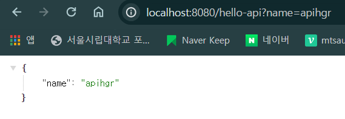

# 스프링 입문 - Section 1

- main.resources.static.index.html: 메인 화면. 디폴트로 잡아준다.

웹 개발

1. 정적 컨텐츠: 서버에서 하는 일 없이 파일을 그대로 웹브라우저에 내려줌.  
   링크에 static/hello-static.html과 같이 static 이하의 파일명을 그대로 때려박으면 파일 그대로를 보여준다.
2. MVC, 템플릿 엔진: 서버에서 변형해서 웹브라우저에 내려줌.

3. API: JSON 구조 포맷으로 데이터를 전달해줌. 클라이언트가 화면을 정리함. (CSR)  
   아래의 코드를 작성하면 다음과 같이 json 형식을 리턴한다.

```java
    @GetMapping("hello-api") // API 방식. JSON 형식으로 내려준다.
    @ResponseBody
    public Hello helloApi(@RequestParam("name") String name) {
        Hello hello = new Hello(); // Hello 객체 생성
        hello.setName(name);
        return hello; // 객체 반환
    }

    static class Hello {
        private String name;

        public String getName() {
            return name;
        }

        public void setName(String name) {
            this.name = name;
        }
    }
```


