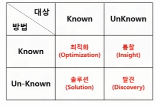
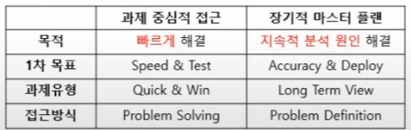
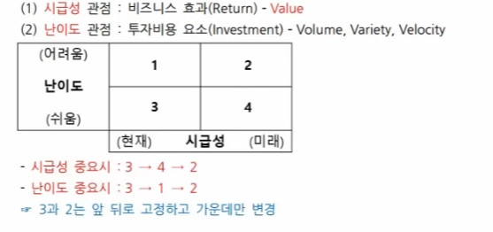
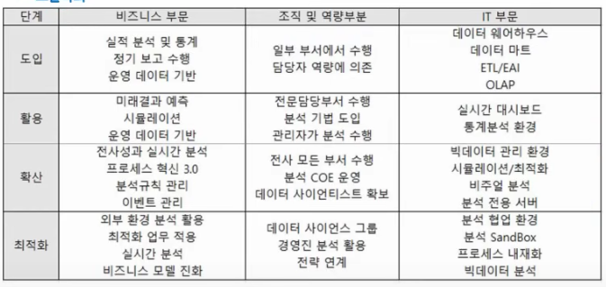
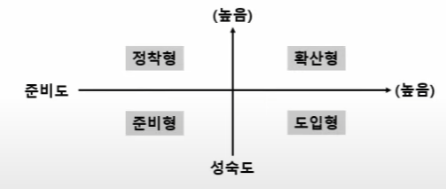

## 데이터분석 기획의 이해

- 분석 대상과 방법
- 

  - 방법: 요리법
  - 대상: 식재료

- 분석 기획 방안
- 

### 분석 방법론

- 구성요소
  - 절차, 방법, 도구와 기법, 템플릿과 산출물

1. 계층적 프로세스 모델: 단계(baseline) -> 테스크 -> 스텝(workPackage)
2. 폭포수: 탑다운
3. 나선형
4. 프로토타입
5. 반복적 모델
   - 증분형: 전체 시스템을 작은 기능 단위로 나눠서
   - 진화형: 핵심 부분 먼저, 요구사항 덧붙이기
6. 애자일

### KDD 분석 방법론

순서중요

1. 데이터선택
2. 전처리
3. 변환: 변수 선택 및 차원축소
4. 마이닝: 알고리즘을 선택해서 분석 수행
5. 결과 평가

### Crisp-DM 분석 방법론

업데데이트모델평가전

1. 업무 이해
2. 데이터 이해
3. 데이터 준비
4. 모델링: 모델 작성 및 평가
5. 평가: 분석결과, 모델링 과정 평가, 모델 적용성 평가
6. 전개: 전개 계획, 모니터링 유지보수, 리뷰

### 빅데이터 분석 방법론

PPADD

1. planning
   - 비즈니스 범위 설정(SOW: statement of works)
   - 프로젝트 위험계획 수립: 회 전 완 수 (회피 전이 완화 수용)
2. preparing
   - 데이터 스토어 설계 (정형 / 비정형 / 반정형)
3. analyzing
   - 분석용 데이터 준비
   - 의사 코드
   - 모델링
   - 모델 평가 및 검증
4. developing
5. deploying

### 하향식 접근 방법

- 문제 탐색 -> 문제 정의 -> 해결방안 -> 타당성 검토

1. 문제 탐색
   - 비즈니스 모델 캔버스 단순화 측면: <mark>"지원인프라" "업무" 중에 "고객"이 "제품"을 "규제와 감사" 했다.</mark>
   - 거시적 관점: STEEP(사회, 기술, 경제, 환경, 정치)
2. 문제 정의
   - 비즈니스 문제를 데이터 문제로 변환
3. 해결 방안
   - 기존 시스템 활용, 아웃소싱
4. 타당성 검토
   - 경제적(비용대비 편익), 데이터(데이터 존재여부, 분석역량), 기술적 타당성 검토

### 상향식 접근 방법

- 문제 정의 자체가 어려울 때 What 관점으로.
- 주로 비지도학습 (정답이 없음)

### 혼합 방법

- 발산 단계: 상향식, 가능 방안 도출
- 수렴 단계: 하향식, 도출 방안 분석

### 디자인 싱킹

- 사용자 공감으로 시작, 아이디어 발산/수렴, 피드백으로 발전

### 분석 과제에서 고려해야 할 5가지 요소

- 데이터 크기, 속도, 데이터 복잡도, 분석 복잡도, 정확도/정밀도
- 이때 정확도와 정밀도는 trade off 관계

### 프로젝트 관리 지식 체계 10가지 영역

이범통이 의자에서 시원한 조리품을 먹었다.
이해관계자, 범위, 통합, 의사소통, 인적자원, 시간, 원가, 조달, 리스크, 품질

## 분석 마스터플랜

- IT 프로젝트 우선순위 선정 기준

  - 중장기 마스터플랜
  - ISP 활용

- 데이터 분석 프로젝트의 우선순위 선정 기준
  - 

## 분석 거버넌스 체계 수립

### 구성 요소

- 조직, 프로세스, 시스템, 데이터, 분석관련 교육 및 마인드 육성체계
- 시조프로마인드데

### 데이터 분석 수준 진단

- 분석 준비도
  - IT문데기인파
  - IT 인프라
  - 분석 문화
  - 분석 데이터
  - 분석 기법
  - 인력 및 조직
  - 분석적 업무파악

### 분석 성숙도

- CMMI 모델 기반 (1~5단계)
- 도입: 환경, 시스템 구축
- 활용: 업무에 적용
- 확산: 전사 차원 관리, 공유
- 최적화: 혁신, 성과향상에 기여
- 도활확최
- 

### 데이터 분석 성숙도 모델

- 준비형: 준비도, 성숙도 낮음
  - 아무것도 준비 안되어 사전 준비 필요
- 정착형: 준비도 낮음, 성숙도 높음
  - 인력, 조직, 분석업무, 분석기법을 제한적으로 사용
- 도입형: 준비도 높음, 성숙도 낮음
  - 인력, 조직 준비도는 높지만 분석업무 기법 부족
- 확산형: 둘 다 높음
  - 6가지 분석 요소 모두 갖추고 있음.
    "도준정확" 사사분면부터.

### 분석 지원 인프라 방안 수립

- 플랫폼 구조 적용
- 광의의 분석 플랫폼: 분석 서비스 제공 엔진, 분석 어플, API, 하드웨어
- 협의의 분석 플랫폼: 데이터 처리 프레임워크, 분석엔진, 분석라이브러리. 좁은 범위

### 데이터 거버넌스

- 전사 차원에서 데이터에 대해 표준화된 관리 체계 수립
- 구성요소: 원조프. 원칙, 조직, 프로세스
- 거버넌스 체계
  - 데이터 표준화: 메타데이터 및 사전 구축
  - 데이터 관리 체계: 효율성을 위함
  - 데이터 저장소 관리: 저장소 구성
  - 표준화 활동: 모니터링, 표준 개선 활동

### 조직 및 인력방안 수립 (DSCoE: 분석조직)

- 집중 구조: 독립적인 전담 조직 구성(중복 업무 가능성)
- 기능 구조: 해당 부서에서 직접 분석
- 분산 구조: 분석 조직 인력을 현업 부서에 배치
