## 데이터마트

### 데이터마트

- 데이터 웨어하우스의 한 분야
- 특정 목적을 위해 사용

### 요약변수와 파생변수

- 요약변수: 수집된 정보를 종합한 변수. 재활용성이 높다. (1개월간 수입)
- 파생변수: 의미를 부여한 변수. 논리적 타당성 필요. (고객구매등급)

## 결측값과 이상값 검색

### EDA (탐색적 자료 분석) (exploartory data analysis)

- 데이터의 의미를 찾기 위해 통계, 시각화를 통해 파악
- 저잔재현
- 저항성의 강조: 자료 변동에 민감하지 않음
- 잔차 계산: 값들이 주경향으로부터 얼마나 벗어나 있는지 확인하는 척도
- 자료변수의 재표현: 원래 변수를 적당한 척도로 변환
- 그래프를 통한 현시성: 시각화를 통하여 효율적으로 파악

### 결측값 처리

- 존재하지 않는 데이터. null/NA

  1. 완전분석법: 결측값 삭제
  2. 평균대치법(= 비조건부 평균 대치): 단순 평균으로 대치
  3. 회귀 대치법(= 조건부 평균 대치): 회귀분석의 결과로 대치
  4. 단순 확률 대치법: 확률적으로 선택하여 대치

     - Nearest Neighbor: 가장 가까운 응답으로 대치
     - Hot-Deck: 현재 데이터 셋에서 비슷한 성향으로 대체
     - Cold-Deck: 유사한 외부 셋에서 대체

  5. 다중 대치법: 대치 -> 분석 -> 결합

### 이상값 처리

- 극단적으로 크거나 작은 값
- 의미 있는 데이터일수도 있음 (ex: 체중 3키로)
- 항상 제거하면 안됨

1. ESD(Extreme Studentized Deviation)
   - 평균으로부터 표준편차 3배 이상 데이터는 이상값으로 판단
2. 사분위수 - Box plot
   - Q1 - 1.5IQR보다 작거나 Q3 + 1.5IQR보다 큰 경우 이상값.
   - IQR = Q3-Q1
   - 
   - 
3. Z-Score
   - 데이터 정규화 (평균 0 표준편차 1) 후 일정 임계 값 초과 시 이상값
4. DBScan
   - 밀도를 이용하여 밀도가 적은 부분의 데이터를 이상값으로 판단

## 통계분석

### 전수조사와 표본조사

- 전수조사: 전체 다 조사. 오래걸림
- 표본조사: 일부만 추출하여 모집단 분석
- 표본집단으로 모집단을 예측하는 것이 목표
- 예측하는 과정에서 가설검정 필요

### 자료의 척도 구분

1. 질적 척도
   - 명목척도: 어느 집단에 속하는지 나타내는 자료 (대학교, 성별, 지역)
   - 순서척도(서열척도): 서열관계가 존재(학년, 순위)
2. 양적 척도
   - 등간척도(구간척도): 구간 사이 의미가 있음. 덧셈 뺄셈만 가능. (온도, 지수)
   - 비율척도: 절대적 기준 0 존재. 사칙연산 가능 (무게, 나이, 시간)

### 확률적 표본 추출 방법

1. 랜덤 추출법
2. 계통 추출법: 일정 간격으로 추출
3. 집락 추출법(=군집 추출법)
   - 군집 내 이질적, 군집 간 동질적
4. 층화 추출법
   - 군집 내 동질적, 군집 간 이질적
   - 층간 비율 동일 시 비례 층화 추출법
5. 복원 / 비복원

### 비확률적 표본 추출 방법

1. 편의 추출법: 연구자가 쉽게 접근 가능한 대상으로 표본 추출
2. 의도적 추출법: 연구자가 기준을 정하고 표본 추출
3. 할당 추출법: 특정 기준으로 나누고 그 그룹에서 할당된 수만큼
4. 눈덩이 추출법: 다단계. 초기 응답자로부터 다음 응답자 추천
5. 자기선택 추출법: 응답자가 스스로 조사에 참여할지 결정

### 기초 통계량

1. 중심경향성 측면
   - 산술평균
   - 기하평균: 모두 곱하고 n제곱근 (비율적 증가율)
   - 조화평균: 
     - n / (역수의 산술평균)
   - 중앙값, 최빈값
2. 분산 정도 측면
   - 분산
   - 표준편차: 분산에 제곱근
   - 사분위수 (IQR): Q1~Q3의 중간 범위
3. 관계 측면
   - 공분산: 두 확률변수의 상관정도
   - 공분산 = 0: 상관이 없음
   - 공분산 > 0: 양의 상관관계
   - 공분산 < 0: 음의 상관관계
   - 하지만 최소 / 최대값이 없으므로 강약 판단이 불가능함  
       
   - 상관계수: 상관정도를 -1~1로 표현
   - 1이면 정, -1이면 반비례. 0이면 상관없음
   - <mark>두 변수가 독립이면 -> 공분산은 0, 역은 성립하지 않는다.</mark>

### 첨도와 왜도

1. 첨도: 자료 분포가 얼마나 뾰족한지
   - 첨도 = 3인 경우 정규분포
   - 시험문제에서 3을 빼서 0을 기준으로 정규분포를 파악하기도 함.
   - 
2. 왜도: 자료의 비대칭 정도
   - 0일 때 대칭
   - 왜도 > 0: 평균값 > 중앙값 > 최빈값
   - 왜도 < 0: 평균값 < 중앙값 < 최빈값
   - 즉, 평균값은 꼬리를 따라감
   - 

### Summary 함수 결과의 해석

- Age는 요약변수가 존재하므로 수치형 변수임
- 중앙값이 평균값보다 작음. 즉 왜도가 0보다 큼
- NA: 결측치 수
- Survived 변수는 집단의 빈도 수이므로 범주형 변수임.

### 기초 확률 이론

1. 확률: 통계적 현상의 확실함을 나타내는 척도. 수학적, 통계적
2. 사건: 시행을 통해 결과로서 나타나는 표본공간의 부분 집합
3. 표본공간: 통계실험을 통해 일어날 수 있는 모든 결과
   - ex) 동전던지기 S = {HH, HT, TH, TT}
4. 확률변수: 표본공간의 각 원소에 해당하는 값을 대응하는 함수
   - ex) 키 150~160 확률: P(150<=X<=160)
5. 조건부확률: 특정 사건 B가 발생했을 때 A가 발생할 확률
   - P(A|B) = P(A∩B)/P(B)
6. 독립사건: A, B가 영향을 주지 않음. 즉 P(A|B) = P(A)
   - P(A∩B) = P(A)P(B)
7. 배반사건: 같이 일어날 수 없는 사건. A∩B = 0
8. <mark>베이즈 정리: 두 확률변수의 사전 확률과 사후 확률 사이의 관계를 나타내는 정리</mark>
   - <mark>P(A|B) = P(B|A)P(A)/P(B)</mark>

### 이산확률분포 - 확률질량함수

- 이산균등분포
- 베르누이분포(결과가 두가지 중 한가지로만 나오는 베르누이시행)
- 이항분포: N번의 베르누이 중 K번 성공할 확률
- 기하분포: 성공률이 p 이상인 베르누이시행에서 처음으로 성공할 때까지의 시행횟수 분포
- 음이항분포: ~번 성공할 때까지의 반복 시행 수
- 초기하분포: 비복원추출로 원하는 결과가 k번 나올 확률 분포
- 다항분포: 각 시행이 여러 개의 결과를 가질 수 있는 확률 분포
- 포아송분포: 단위 시간 내 발생할 수 있는 사건 발생 수에 대한 분포 (한 시간 동안 걸려온 전화 수)
- "베 포 항 항 하"

### 연속확률분포 - 확률밀도함수

- 정규분포: Z검정에 활용
- t분포: 정규분포와 유사하지만 꼬리가 더 두꺼움

  - T검정에 활용
  - 표본이 30개보다 작은 집단에 대한 평균 검정

- 카이제곱분포: 독립적 정규분포를 따르는 변수들의 제곱합
- F분포: 서로 다른 카이제곱 분포 비율

### 확률분포의 기댓값

- 확률변수 X의 f(x) 확률분포에 대한 기댓값 E(X)
  - 이산적 확률변수: $E(X) = \sum xf(x)$
  - 연속적 확률변수: $E(X) = \int xf(x)$
- 

### 중심극한정리

- 임의의 모집단으로부터 추출된 표본평균분포는 표본크기가 충분히 크다면 정규분포를 이룬다. (30개 이상)
- <mark>모집단의 분포와 관계없이 표본평균분포가 정규분포를 이룬다.</mark>
- 표본평균의 평균 = 모평균
- 
- 표본평균의 분산 = 모분산 / n
- 
- 표본평균의 표준편차는 루트를 씌우자.
- 
- 
- 표본평균의 표준화
- 

### 점추정

- 모집단을 특정한 값으로 추정. 추정량으로 모수를 추정
- 추정량의 조건 - 불효일충
- 불편성, 효율성, 일치성, 충족성
- 대표적인 추정량
  - 

### 구간추정

- 모집단이 특정한 구간으로 추정 (주로 95%, 99%)
- 신뢰구간 95%: 1.960
- 신뢰구간 99%: 2.576
- 
  - $1-a$는 신뢰구간을 의미함. 즉, 신뢰구간 0.95일 때 a는 0.05. Z_0.025를 의미함.
- 모분산을 모르는 경우 t분포를 활용하자. 단 자유도는 n-1로 계산한다. 표준편차 역시 표본표준편차 s를 활용한다.
- 
  - 이때 t분포는 표로 준다.

### 가설검정

- 귀무가설(H0): 일반적인 사실.
- 대립가설(H1): 귀무가설을 기각하는 가설. 증명하고자 하는 가설. 어떤 확률변수의 차이가 존재한다 / 크다 / 작다
- 유의수준(a): 귀무가설이 참일 때 기각하는 1종 오류를 범할 확률의 허용 한계(일반적으로 0.05)
- 유의확률(p-value): 귀무가설을 지지하는 정도를 나타내는 확률  
- ex) 평택시의 한달 강수량을 예측해보려고 한다.
  - 일반적으로 한달 강수량은 200mm로 알려져 있다.(H0, 귀무가설)
  - 나는 평택시 강수량이 300mm라고 예측한다.(H1, 대립가설)
  - 가설검정 결과 강수량 300mm가 틀릴 확률이 7%로 나왔다. (p-value = 7%)
  - 유의수준은 5% (0.05)이다.
  - 따라서 대립가설 H1을 기각하고 귀무가설을 채택한다.
  - 이때 귀무가설 H0이 옳지만 이를 옳지 않다고 판단하는 경우를 1종 오류라고 한다.
    - 이 오류가 발생할 확률의 한계치가 유의수준이다.
  - 반대로 H0이 거짓이지만 참이라고 판단하는 경우를 2종 오류라고 한다.
- 

### 가설검정 문제 풀이 방법

1. 차이가 없다, 동일하다 -> 귀무가설
2. 양측 / 단측 검정 확인
   - 대립가설의 값이 '같지 않다' -> 양측검정
   - 대립가설의 값이 '작다', '크다' -> 단측검정
3. 일표본 / 이표본 확인 -> 모집단 수와 동일
4. 귀무가설 채택 혹은 기각
   - p-value > 유의수준: 귀무가설 채택, 대립가설 기각
   - p-value < 유의수준: 대립가설 채택(예측 성공)
5. <mark>t검정인 경우</mark>
   - 단일표본: 모집단에 대한 평균검정
   - 대응표본: 동일 모집단에 대한 평균비교 검정
   - 독립표본: 서로 다른 모집단에 대한 평균비교 검정

### 비모수 검정

- 모집단에 대한 정보가 없을 때의 검정. 관측 자료가 특정 분포를 따른다고 보기 어려울 때.
- 두 관측 값의 순위나 차이로 검정
- <mark>부호, 순위, 민-휘트니, U, 크러스칼-윌리스, 프리먼드, 카이제곱</mark>

## 기초 통계분석

### 회귀분석

- 방정식 만들어서 y 예측하는거
- 독립변수: 원인을 나타내는 변수 (x), 광고비
- 종속변수: 결과를 나타내는 변수 (y), 수익
- 잔차: 계산값과 예측값의 차이 (~= 오차)
- $\text{y}_{수익} = \beta_1 \, \text{x}_{tv광고} + \beta_2 \, \text{x}_{인터넷광고} + \beta_3 \, \text{x}_{인스타광고} + \beta_i$

- 회귀계수 추정방법
  - 최소제곱법(최소자승법): 잔차의 제곱합(SSE = sum of squares error)이 최소가 되는 회귀계수와 절편을 구하는 방법
    - 이걸 활용해서 위의 식에서 가중치(베타)들을 추정해야 함.
    - 제곱하는 이유? 회귀선 아래에 있는 관측값의 잔차는 음수임. 제곱해야 잔차의 합이 상쇄되지 않음.
    - 당연히 제곱이니 2차함수. 2차함수의 극솟값 지점을 찾는 것이 최소제곱법의 목표(이 값은 각 회귀계수(weight)와 절편의 값이 됨)
    -
- 회귀모형 평가
  - R-square: 총 변동 중에서 회귀모형에 의해 설명되는 변동이 차지하는 비율
    - 0과 1 사이의 값을 가지며, 1에 가까울수록 모델의 설명력이 높다고 볼 수 있음.
  - 
  - 가장 쉽게 생각할 수 있는 회귀선은 y의 평균값인 상수함수임.
  - 이 회귀선을 기준으로, 새로 구한 회귀선과 비교해봤을 때, 새로 생긴 회귀선은 평균값보다 R만큼 개선되었다고 할 수 있음.
  - 또한 새로 구한 회귀선과 실제 관측값 간에는 여전히 차이가 존재하는데 이를 E라고 할 수 있음.
  - R^2의 목적은 새로 구한 회귀선이 얼마나 관측값을 반영하는지에 대한 수치.
    - 즉, 개선된 차이(R) / 전체 오류(T = 평균값~관측값)
  - SST: sum of squares total: 관측값에서 평균값을 뺌
    - 
  - SSR = sum of squares regression: 추정값(regression)에서 평균값을 뺌
  - SSE = sum of squres error: 관측값에서 추정값을 뺌
  - R^2 = SSR/SST = 1 - SSE/SST

### 선형회귀분석의 가정

<mark>선 분 정 독</mark>

1. 선형성: 종속변수(y)와 독립변수(x)는 선형관계
2. 등분산성: 잔차의 분산이 고르게 분포
3. 정상성(정규성): 잔차가 정규분포의 특징을 지님
4. 독립성: 오차가 서로 독립. 독립변수간 상관관계가 없음.
   - <mark>다중공선성: 독립변수들간(x1, x2 간) 강한 상관관계가 나타나는 문제</mark>
   - VIF(분산팽창인수) 값이 10 이상이면 다중공선성이 존재한다고 판단함.
     - VIF = 1/(1-R^2)

### 회귀분석 종류

1. 단순회귀: 하나의 독립변수와 종속변수의 선형관계
   - y = ax + b
2. 다중회귀: 2개 이상의 독립변수와 종속변수의 선형관계
   - y = ax1 + bx2 + cx3 + ... + z
3. 다항회귀: 2개 이상의 독립변수와 종속변수가 2차 이상의 관계
   - y = ax1^2 + bx^3 ...
4. 릿지회귀(L2 norm, L2 규제): L2 norm을 포함.
   - 유클리디안 거리 기반
   - $\sum W^2$
5. 라쏘회귀(L1 norm, L1 규제): L1 norm을 포함.
   - 맨하탄 거리 기반
   - $\sum |W|$
6. 교호항이 포함된 회귀
   - 교호작용: 두 개 이상의 독립변수가 상호작용하여 종속변수에 영향을 미치는 경우
   - y = w1x1 + w2x2 + b
   - y = 고혈압, x1 = 비만, x2 = 유전정보
   - w1 = 2, w2 = 4라고 가정해보자. 즉, 비만은 고혈압에 두 배 기여하고, 유전정보는 네 배 기여한다고 가정하자.
   - 이때 새로운 독립변수 x3 = (x1 ∩ x2), 즉 비만과 유전인자를 모두 가진 케이스라고 하자.
   - y = w3x3 + b'에서, w3이 20이라고 해보자.
   - 즉, x1과 x2가 상호작용하여 종속변수 y에 더 큰 영향을 미치게 되었는데, 이를 교호작용이라고 한다.

### 최적의 회귀 방정식 탐색 방법

1. 전진선택법: 변수를 하나씩 늘려가면서. x1, x2, x3, ... 추가
2. 후진선택법: 변수를 하나씩 줄여가면서.
3. 단계별 선택법: 전진전택법 + 후진제거법
   - AIC(아카이케 정보 기준): 편향과 분산이 최적화되는 지점 탐색. 자료 많을수록 부정확
   - BIC(베이즈 정보 기준): AIC를 보완. AIC보다 큰 페널티를 갖는다.
   - AIC, BIC 모두 작을수록 좋음.

### 회귀분석의 분산분석표(ANOVA)

- 회귀 자유도 = p
- 잔차 자유도 = n - p - 1 (걍 외우자 증명보니 어지럽다)
- 전체 자유도 = n - 1
- 수정된 R-square =  = 1-(n-1)(MSE/SST)
- 전체 자유도는 회귀계수 자유도(p) + 잔차 자유도(n-p-1)을 더한 값이다.
- 데이터 수는 자유도 + 1. 즉 n

### 회귀 모형의 검정

- y = w1x1 + w2x2 + b

1. 독립변수와 종속변수 설정 (x, y)
2. 회귀계수 값의 추정 (w1, w2, b)
3. 모형이 통계적으로 유의미한가: 모형에 대한 <mark>F검정</mark> 수행 -> p-value를 구해보자.

- 귀무가설 H0: 모든 회귀계수는 0이다.
  - 당연히 이를 기각시켜야 한다. weight가 0이면 회귀 모형이 존재하지 않는다는 것을 의미함.
- 첫번째 귀무가설을 기각시켰다면, 각각의 회귀계수 (w1, w2, w3, ..., b)에 대해 각각 0인지 다시 검정.
  - 귀무가설: w1은 0이다. w2는 0이다. ... b는 0이다.
    - 당연히 싹 다 기각시켜야 함.
    - 이 때 각각의 회귀계수에 대해서는 <mark>T검정</mark>을 수행함.
- 최종적으로, 두 귀무가설이 모두 기각되었다면 해당 모델을 활용할 수 있음.
- 모델의 설명력 -> R square 값으로. R^2 = SSR / SST

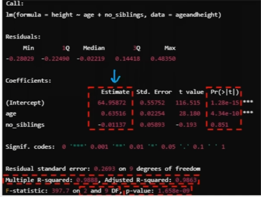

- 종속변수(y): height
- 독립변수(x): age, no_sibilings
- 회귀모형 F검정 -> p-value = 1.65e-09 <= 0.05이므로 귀무가설을 기각 (귀무가설: 모든 독립변수 가중치는 0이다)
- 각 회귀계수의 t검정
  - age의 p-value(pr(>|t|))는 4.34e-10이므로 귀무가설 기각 (유효함)
  - no_sibilings의 p-value는 0.851로 재수행 권장
- 이 모형은 다중회귀 모델 (종속변수가 두 개 이상)
- R-squared가 0.9888이므로 설명력이 98%
- 회귀 자유도 2, 잔차 자유도 9이므로 전체 자유도는 11, 데이터 수는 12
- 회귀식 y = 0.63416x_height - 0.01137x_no_sibilings + 64.95872

### 교호항이 포함된 모형 검정

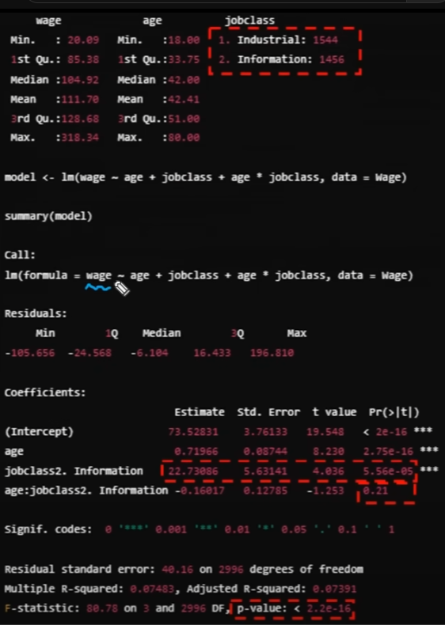

- 종속변수 wage
- 독립변수 age, jobclass
- jobclass 변수는 범주형 변수
- 아래 분석에서 jobclass2. Information만 나와있으므로 Industrial을 0으로 보고 Information을 1로 본다.
- 이 때 jobclass_Information의 회귀계수가 22.73086이므로 임금에 양의 방향으로 기여 -> information이 industrual보다 임금이 높다.
- y_wage = 0.71966age + 22.73086jobclass_information - 0.16017(age \* jobclass_information) + 73.52831
  - 이때 - 0.16017(age \* jobclass_information) 이 교호항이다.
- F검정의 p-value는 2.2e-16이므로 귀무가설 기각 -> 유의미
- age, intercept, jobclass_information의 t검정 p-value는 모두 유의미
- age\*jobclass_information 교호항의 p-value는 0.21 > 0.05이므로 교호작용이 유의미하지 않다.

## 다변량 분석

### 상관분석

- 두 변수간 선형적 관계가 존재하는지 파악하는 분석

1. 피어슨 상관분석: 양적 척도, 연속형 변수, 선형관계 크기 측정
   - 피어슨 계수가 1이면 양의 방향으로 선형적 (1차함수 모양)
   - 피어슨 계수가 0보다 크고 1보다 작으면, 증가함수지만 선형적이지 않음.
   - 피어슨 계수가 음수이면 감소함수지만 선형적이지 않음.
   - 피어슨 계수가 -1이면 음의 방향으로 선형적
2. <mark> 스피어만 상관분석: 서열 척도, 순서형 변수, 선형/비선형적 관계</mark>
   - 스피어만 상관계수는 x와 y가 선형 관계가 아니더라도 +1, -1 값을 가질 수 있다.

- 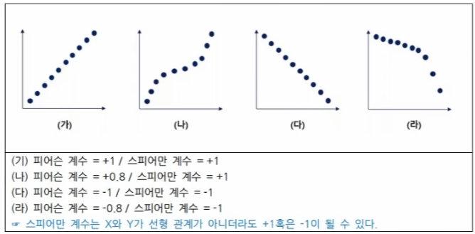

### 주성분 분석 (PCA)

- 선형 결합으로 차원을 축소해 새로운 변수 생성
  - ex) 종속변수 y가 집값인 경우, 독립변수 x는 지역, 건설사, 역과의 거리, ... 등등 많은 변수가 존재함. 각 변수 개수만큼의 차원을 가짐.
  - 자료의 분산이 가장 큰 축을 기준으로 차원 축소 진행 (고유값을 활용하자.)
  - 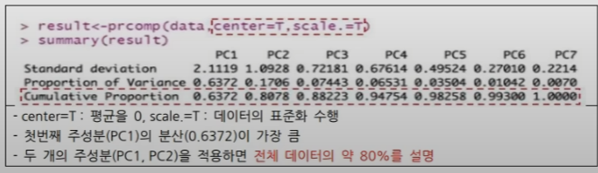
    - deviation: 표준편차
    - variation: 분산

### 스크리플롯(Screeplot)

- 주성분들의 분산을 표에 기입한 후 그래프가 완만해지기 직전까지의 주성분을 채택한다.
- 여기서 분산은 위의 R 코드로부터 얻은 표준편차를 제곱하여 얻는다.
- 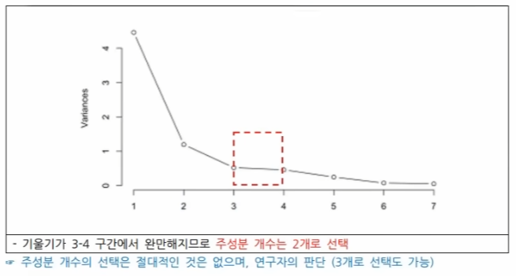

### 다차원 척도법 (MDS: multi-dimensional Scaling)

- 데이터 간 거리 정보의 근접성을 보존하는 방식으로 차원 축소
- Stress 값이 0에 가까울 수록 좋음.
- x/y축 해석이 불가능함
- 계량적 MDS -> 양적척도
- 비계량적 MDS -> 순서척도

## 시계열 예측

### 시계열 분석

- 시간의 흐름에 따라 관찰된 자료의 특성을 파악하여 미래를 예측 (주가, 기온.. )

### 정상성

- 모든 시점에 일정한 평균과 분산을 가지는 정상성을 만족해야 함
  - 주가, 기온은 시간이 가면서 계속 그래프가 변하므로, 평균 및 분산이 계속해서 변화함
  - 이를 정상 시계열로 변환해야 함

1. 차분: 현재 데이터에 이전 데이터를 빼줌
   - 그러면 데이터의 차이만 남게되므로 평균과 분산이 일정해짐

- 차분을 수행하기 전 / 후의 삼성전자 주가  
  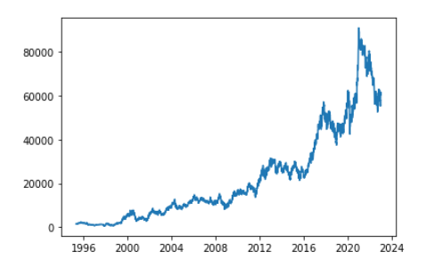
  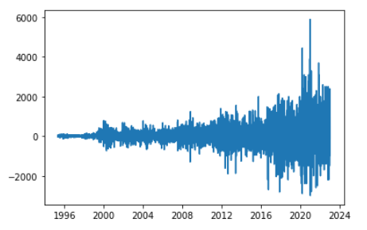

2. 이동평균법: 시계열 데이터 특: 위아래로 엄청 흔들림 -> 평균 내서 이평선 만들기
3. 지수평활법: 최근 시간 데이터에 가중치를 줌
4. 그 외: 지수변환, 로그변환, Box-Cox 변환

### 백색잡음

- 시계열 모형의 오차항을 의미함
- 평균이 0이라면 가우시안 백색잡음이라고 함

### 시계열 모형

1. 자기회귀 모형 (AR)
   - 말 그대로, 자기자신의 과거 값이 미래를 결정하는 모형
   - 부분자기상관함수 (PACF) 활용하여 p+1 시점 이후 급격히 감소하면 AR(p)를 선정함.
   - 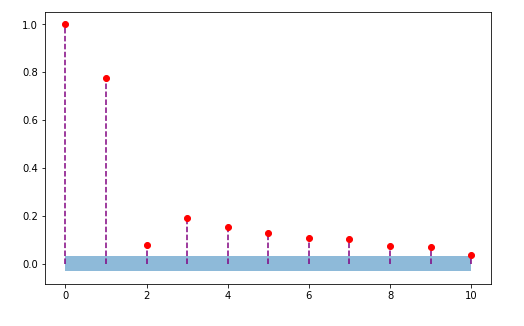
   - 이 경우 p = 2, AR(2) 채택
2. 이동평균 모형 (MA)
   - 이전 백색잡음들의 선형결합으로 표현되는 모형
   - 자기상관함수(ACF)를 활용하여 q+1 시점 이후 급격히 감소하면 MA(q)를 선정함.
3. 자기회귀누적이동평균(ARIMA)
   - AR + MA
   - ARIMA(p, d, q)
     - p는 AR, q는 MA, d는 차분 횟수
     - 문제에서 차분 몇번 했냐 하면 d 쓰면됨
   - p = 0 -> IMA 모형
   - d = 0 -> ARMA 모형
   - q = 0 -> ARI 모형

### 분해시계열

- 시계열에 영향을 주는 일반적인 요인을 시계열에서 분리해 분석하는 방법
  -> <mark>추운 계절의 순환이 불규칙하다.</mark>

1. 추세 요인: 장기적으로 증가 / 감소하는 추세
2. 계절 요인: 계절과 같이 고정된 주기에 따라 변화
3. 순환 요인: 알려지지 않은 주기를 갖고 변화(경제 전반, 특정 산업.. )
4. 불규칙 요인: 몰?루

## 정형 데이터 마이닝

### 데이터마이닝

- 방대한 데이터 속에서 규칙, 패턴을 찾고 예측하는 분야
- 지도학습
  - 정답이 있는 데이터를 활용
  - 인공신경망, 의사결정트리, 회귀분석, 로지스틱회귀
  - <mark>인공의사회귀</mark>
- 비지도학습
  - 정답이 없는 데이터 사이의 규칙을 파악(no labelling)
  - 군집분석, SOM, 차원축소, 연관분석

### 과대적합과 과소적합

- 과대적합: 모델이 지나치게 데이터 학습
  - overfitting
  - 높은 분산, 낮은 편향(bias) -> 오차가 없음, 분산이 높음
- 과소적합: 데이터를 충분히 설명하지 못하는 단순한 모델
  - underfitting
  - 낮은 분산, 높은 편향(bias) -> 오차가 큼
    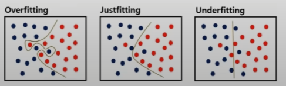

### 데이터 분할

- 과대적합, 과소적합 방지, 데이터 불균형 문제 해결
- 훈련용 (training set)
  - 모델 학습에 사용
- 검증용 (validation set)
  - 모델의 과대/과소 적합을 조정하는데 사용
- 평가용 (test set)

  - 모델을 평가

- 학습 및 검증 방법
  - 홀드아웃: 검증용 셋 필요 없음. 훈련용 / 평가용만 나눔
  - k-fold: 데이터를 k개로 나누고 k-1로 훈련, k번째로 테스트, 이를 k번 반복.
  - LOOCV(leave one out cross validation): 1개의 데이터로만 평가. 나머지는 훈련. 데이터 적을 때
  - 부트스트레핑: 복원추출로 데이터 셋 생성. 데이터 적을 때, 불균형 문제 해소.

## 분류분석

### 로지스틱 회귀분석

- 범주형 데이터를 대상으로 성공/실패 2개의 집단을 분류하는 문제에 활용

1. 오즈(odds)
   - 성공확률 / 실패확률
   - Odds = P/(1-P)
2. 로짓 변환(logit)
   - 오즈에 자연로그를 취해 선형 관계로 변환
   - ln(P/(1-P)) = ax + b (선형으로 변환됨)
3. 시그모이드
   - 로짓 함수의 역함수를 취해 0~1 사이의 확률을 도출하는 함수로 바꿈
   - 독립변수 x가 n 증가하면 확률이 e^n 만큼 증가함.

- 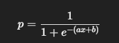

### KNN(K-nearest neighbors)

- 거리 기반으로 이웃에 더 많은 데이터가 포함되어 있는 범주로 분류
- 단순, 효율적. 훈련 필요 없음, lazy model
- k에 따라 결과가 바뀜

### 나이브베이즈 분류

- 베이즈 정리
- 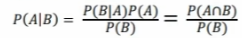
- 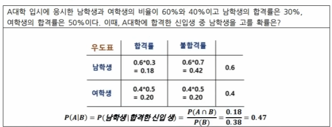
- 나이브베이즈 분류
  - 나이브(독립) + 베이즈. 범주에 속할 확률 계산
  - 서로 독립적이라는 가정이 필요
  - 과거의 경험을 활용하는 <mark>귀납적 추론 방법</mark>

### 의사결정나무(decision tree)

- 스무고개 형식임
- 노드 내 동질성이 커지고, 노드 간 이질성이 커지는 방향으로

1. 분류(범주형) 분할 방법
   - CHAID: 카이제곱 통계량
   - CART: 지니계수 활용
   - C4.5/C5.0: 엔트로피지수 활용
2. 회귀(연속형) 분할 방법
   - CHAID: ANOVA, F-통계량
   - CART: 분산감소량

- 지니계수
- 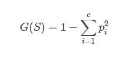
- 엔트로피
-   
  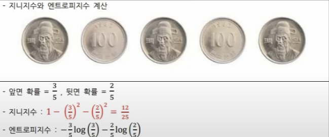

- 과적합 방지 방안
  - 의사결정나무는 가지를 계속 내릴 수 있으므로 과적합 문제가 발생함
    - 정지규칙: 분리를 더이상 수행하지 않고 나무 성장 멈추기
    - 가지치기: 일부 가지를 제거해서 과적합 방지

### SVM(서포트벡터머신)

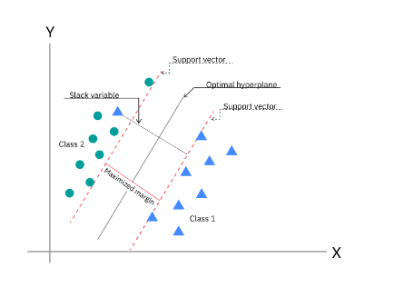

- 마진이 최대가 되는 초평면을 찾음
- 선형/비선형 이진분류, 회귀에서 활용 가능한 다목적 모델
- 하이퍼플레인(초평면): 데이터를 구분하는 기준이 되는 경계
  - 가중치벡터와 편향으로 결정함
- 서포트벡터: 클래스를 나누는 하이퍼플레인과 가까운 위치의 샘플
- 마진: 서포트벡터 <-> 하이퍼플레인 사이의 거리
- <mark>커널함수: 저차원 -> 고차원 데이터 변경 함수</mark>
- 하드마진분류: 오류 비허용
- 소프트마진분류: 마진 내 어느 정도 오류 허용

### 앙상블

- 여러 개의 예측 모형을 조합하여, 전체적인 분산을 감소시켜 성능 향상

1. 보팅(voting)
   - 다수결 방식으로 최종 모델 선택
2. 배깅(bagging) - Bootstrap Aggregation  
   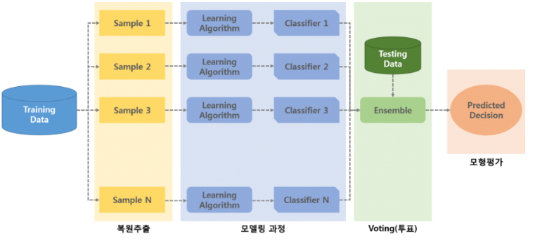
   - 복원추출에 기반을 둔 부트스트랩을 생성
   - 학습 후 보팅으로 결합
   - 복원추출을 무한히 반복할 때 특정 하나의 데이터가 선택되지 않을 확률은 36.8%이다.
     - N개의 데이터 중에서 특정 한 개가 선택될 확률은 1/N
     - 즉, 특정 데이터가 선택되지 않을 확률은 1-1/N
     - 이걸 무한히 N번 반복하면 lim(1-1/N)^N = 36.8%
     - 따라서, 부트스트래핑으로 선택되지 않은 비율은 36.8%이고, 이를 테스트셋으로 활용한다.
     - 부트스트래핑으로 선택된 나머지 데이터는 학습에 사용된다.
3. 부스팅(Boosting)  
   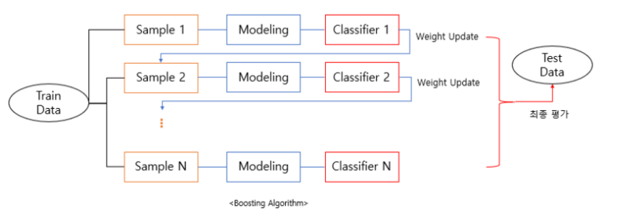
   - 잘못된 분류 데이터에 가중치를 둠
   - 이상치에 민감하다.
   - A 셋으로 학습 -> 조정 -> B 셋으로 학습 -> 조정 ...
   - AdaBoost, GBM, XGBoost(GBM의 향상, 규제 포함), light GBM(학습 속도 개선)
4. 스태킹(stacking)  
   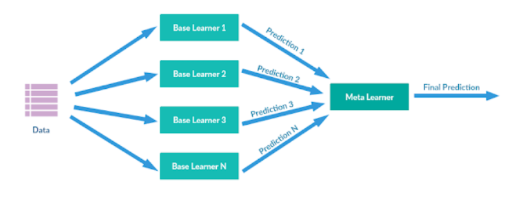
   - 각 모델에서 학습한 결과를 합쳐서 다시 학습
5. <mark>랜덤포레스트</mark>
   - 배깅 + 의사결정트리
   - 성능이 좋고 이상치에 강함

- <mark>보팅, 배깅, 랜덤포래스트는 병령 가능. 부스팅은 병렬이 불가능하다.</mark>
- 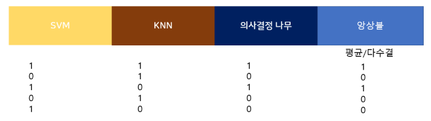

### 인공신경망

- 인간 뇌 구조를 모방한 퍼셉트론을 활용한 추론모델
- 단층 신경망: 입력층, 출력층으로 구성
- 다층 신경망: 입력층, 출력층 사이 하나 이상의 은닉층 보유 (다층 퍼셉트론)

  - <mark>이때 은닉층 수는 하이퍼파라미터</mark>

- 은닉층에서의 활성 함수: 인공신경망의 선형성 극복.

  - 시그모이드: 0~1 사이. 로지스틱 회귀 분석과 유사함
  - Tanh: 시그모이드 함수의 <mark>기울기 소실문제</mark>를 지연시킴. -1~1 사이.
  - ReLU: <mark>기울기 소실문제 극복</mark>. max(0, x)
    - vanishing gradient: back propagation 과정 중 출력층에서 멀어질수록 gradient 값이 매우 작아지는 현상
    - 시그모이드의 경우, 값이 커지거나 작아지는 경우 기울기가 0에 가까워짐.
    - tanh도 마찬가지로 유의미한 미분값이 나오는 구간이 늘었지만 여전히 매우 크거나 작은 값에 취약
    - ReLU는 입력 값이 양수일 경우 언제나 기울기가 1. 그 외 0. 게다가 함수도 존나 간단해서 연산도 빠름.
      - 다만, 인풋이 음수인 경우 기울기가 0이 되어버림. -> Dying ReLU
      - 이를 보안하기 위해 도입한 것이 leaky ReLU. 음수에 0 대신 매우 작은 값을 출력하도록 함.
  - Leaky relu, gelu, elu...

- 출력층에서의 활성 함수

  - 시그모이드: 이진 분류의 경우. 0~1 사이임
  - 소프트맥스: 다중 분류의 경우. 확률 합이 1이 된다. 고양이, 강아지, 소, 닭 등을 분류할 때.

- 손실함수: 예측값과 실제값의 차이를 측정하는 함수

  - 목표는 이 손실함수의 최소값을 구하는 것.
  - MSE(Mean square error): 회귀 모델에 사용
  - Cross-entropy: 분류 모델에 사용

- 학습 방법
  - 순전파(forward propagation)
  - 역전파(back propagation): 가중치를 수정하여 손실함수의 값을 줄임.
  - 경사하강법(gradient descent algorithm)
    - 편미분 써서 최적해 찾기
  - gradient vanishing(기울기 소실)
    - 시그모이드 쓰면 기울기 사라짐
    - 렐루 써

### 딥러닝

1. DNN
2. CNN
   - 이미지 패턴 찾는 신경망. convolution layer, pooling layer, flatten.
3. RNN
   - 순차적 데이터 학습
   - 과거 정보가 전달되지 않는데 이거 해결법으로 LSTM, GRU 씀
4. 오토인코더

### 분류모델 평가지표

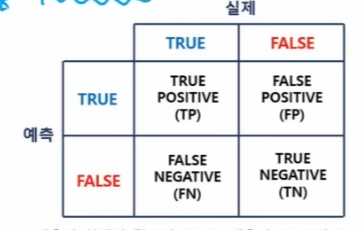  
1:42:39~
