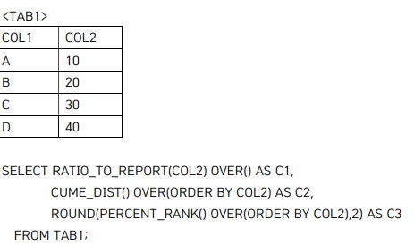
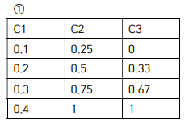
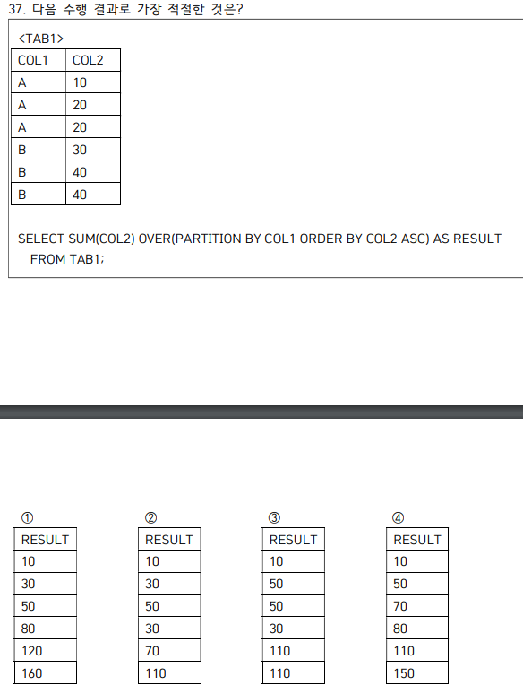

## 데이터 모델링의 이해

## 데이터 모델링의 특징

- 추상화
- 단순화
- 명확성

## 모델링 단계

- 모델링할 땐 테이블과 프로그램과의 연계성을 낮춰야 함.
- 개념->논리->물리
- 개념적
  - 기술용어 x. 고객 BM 분석
- 논리적
  - 식별자 도출, 정규화, 릴레이션
- 물리적
  - 실제 구축
  - 인덱스, 테이블 등 생성
- 데이터 모델링의 관점
  - 데이터 관점: 정적
  - 프로세스 관점: 동적
  - 데이터와 프로세스 관점: CRUD
- ERD 순서

  - 엔티티 도출, 그리기
  - 엔티티 배치
  - 관계 설정
  - 관계명 서술
  - 참여도 설정
  - 필수 여부

- 3층 스키마
  - 외부
  - 개념
  - 내부

## 엔티티는 명사임

- 유형과 무형에 따른 분류
  - 유형
    - 업무에서 도출
    - 지속 사용
  - 개념
    - 물리 형태 없음
    - 거래소 종목, 생명보험 상품
  - 내부
    - 비즈니스 프로세스를 진행하면서 생성
    - 주문, 체결
- 발생 시점
  - 기본
  - 중심
  - 행위

## 관계

- 존재에 의한 관계
- 행위에 의한 관계
- 관계 표기법
  - 관계명, 관계차수, 선택성

## 속성

- 분해 여부에 따른 속성의 종류
  - 단일
  - 복합
  - 다중값
- 특성에 따른 속성

  - 기본
  - 설계
  - 파생

- 주식별자
  - 최소성
  - 대표성
  - 유일성
  - 불변성
  - 존재성
  - not null
- 후보키
  - 최소성 + 유일성
- 슈퍼키
  - 유일성만
- 대체키
  - 후보키중 기본키가 아님
- 기본키는 고유키 + not null

- 식별자

  - 대표성
    - 주
    - 보조
  - 생성 여부
    - 내부
    - 외부
  - 속성의 수
    - 단일
    - 복합
  - 대체여부
    - 본질
    - 인조

- 선택도
  - 값의 범위 / 전체값
- 카디널리티
  - 하나의 컬럼에서 distinct한 값
  - 중복값이 적을수록 높다.

## 정규화

- 제1
  - 속성의 원자성
- 제2
  - 부분 함수 종속성
- 제3
  - 이행적 함수 종속성
- BCNF
  - (학번, 과목번호) -> 교수, 교수 -> 과목번호

## 반정규화 기법

- 계산된 칼럼 추가
- 테이블 수직 분할 (컬럼을 나눔)
- 테이블 수평 분할 (로우를 나눔)
  - 파티션 기법
  - range, list, hash, composite
- 테이블 병합
  - 1대1을 하나로 병합
- 슈퍼/서브타입

  - oneToOne
  - single
  - plus

- 식별 vs 비식별

## 무결성

- 개체 무결성
  - 테이블의 기본키를 구성하는 컬럼은 null, 중복 값을 가질 수 없다.
- 참조 무결성
  - 부모-자식 간 외래키 제약조건을 의미
- 도메인 무결성
  - 주어진 속성 값은 정의된 도메인 내에 있어야 함
- null 무결성
  - 특정 속성에 대해 널값을 허용하지 않음.

## LIKE

- %: 0개 이상의 문자와 일치
  - A%: A로 시작하는 모든 문자
  - %A: A로 끝나는 모든 문자
  - %apple%: apple을 포함하는 모든 문자
  - \_: 임의의 한 문자와 일치

## 연산자 우선순위

- NOT>AND>OR
- 괄호가 없으면 위의 순서대로 동작

## null

- null과 연산하면 항상 null (null + 5..)
- 집계함수는 NULL을 제외
- count(\*)는 null을 포함
- null과의 비교연산은 false를 리턴

## 관계디비의 특징

- 데이터 무결성 보장
- 분류 정렬 탐색 빠름
- 기존 스키마 수정이 어려움
- 복잡해서 디비 부하 분석이 어려움

## select

- table alias를 쓰면 테이블 명 사용 불가
- 마지막에서 두 번째로 실행. order by가 가장 늦음.

## where

- 그룹 함수를 사용한 조건 전달 불가

## group by

- column alias 사용 불가능
- table alias는 사용 가능
- 주로 집계함수와 사용
- select 절에 나열된 모든 컬럼은 group by에 명시되어 있거나, 집계함수로 처리된 값이어야 한다.
- null 그룹을 생성할 수 있다.
  - deptno 별 sum(sal)을 group by로 묶었을 때, deptno가 null인 값에 대해서도 출력
- 나열되는 컬럼의 순서는 그룹에 영향을 주지 않는다.

## having

- 그룹함수가 없는 일반 조건도 사용이 가능하다.
- count, having을 같이 쓸 경우, having을 만족시키는 그룹이 없는 경우 공집합을 리턴한다. (3회차 20번)

## order by

- 가장 늦게 실행된다.
- select 절에 없는 컬럼도 사용할 수 있다.
- group by와 함께 쓰는 경우, group by에 없는 컬럼을 쓸 수 없다.
- 집계함수에 의해 파생된 값도 사용할 수 있다. 즉, `select sum(col3) as "sum" ~~ order by sum`이 가능하다.
- 단, 위의 쿼리에서 `order by col3`은 불가능하다. 그룹화되어있지 않기 때문.
- 오라클에서, null을 포함한 값을 정렬하면 null이 가장 아래에 배치된다.
- 물론, desc로 정렬하면 가장 위에 배치된다.
- `order by col nulls first` 하면 맨 위에 온다.
- order by를 사용하지 않으면 그냥 입력데이터 순대로 출력된다.
- 컬럼 별칭을 쓸 수 있다.
- 컬럼명과 숫자를 동시에 쓸 수 있다.
  - `order by col1, 2, 3, col4`

## TO_DATE

- 'RRMMDD'
  - 두 자리 숫자가 1~49인 경우 2000년대, 50~99인 경우 1900년대
- `to_date('11', 'dd')
  - 년, 월은 오늘 날짜를 기준으로 세팅됨.
- 30/24/60
  - 30 \* 1/24/60을 의미함.
  - 하루를 24로 나누고(1시간) 이를 다시 60으로 나누므로 1분. 이걸 30이랑 곱하니까 30분임.

## TO_CHAR

- to_char('123', '123.45')
  - 이러면 123.00이 리턴된다.

## NOT IN 조건에서의 null

- `where col NOT IN (1, 2, null)`
- col에 어떤 값이 오더라도 null과 비교가 불가능하다. 따라서 아무 값도 리턴되지 않는다.

## 연관 서브쿼리

- 메인쿼리가 먼저 실행된다.

## offset

- `offset 2 rows fetch first 2 rows only`
- 디폴트 오프셋은 1.
- offset 2는 오프셋 + 2한다는 의미.
- 3부터 2개를 가져옴. 즉, 3, 4를 가져옴

## 정규표현식

- `REGEXP_SUBSTR('string123 string123', '[^0-9]+')`
- 0~9가 아닌 문자열을 추출
- string이 리턴된다.
- substr 함수는 주로 [^,]와 같이 사용되는데, 이는 ,를 구분자로 앞 문자열을 가져오라는 의미.

- `REGEXP_REPLACE('string', 'regexp', '치환될 문자열', offset, 몇 번째로 발견되는걸 치환?)`
  - regexp_replace('010-1010-1010', '\d+', 'xxx', 1, 2)
  - 오프셋은 1. 제일 처음부터, 두 번째 발견되는 문자열을 xxx로 치환하자.
  - 결과는 010-xxxx-1010
- 'AB|C+'는 AB이거나, CCCCCCCCCCC~를 의미.
- `[XY-]+Z?`
  - X, Y, -가 하나 이상 반복되고, Z가 있거나 없거나 한 문자열.

## commit, rollback

- DDL, DCL 하면 자동 커밋
- DDL
  - create
  - alter
  - drop
  - truncate
- DCL
  - grant
  - revoke
- 일단 커밋 조지면 커밋 위의 savepoint로 rollback 시도 시 에러
- 커밋 조지면 절!대로 안바꿔준다

## DDL 관련

- 오라클에서 디폴트 값을 포함한 새 컬럼을 만들면 기존 데이터 값의 새 컬럼에 디폴트 값이 들어간다.
- 하지만 그냥 컬럼을 추가한 후 alter table로 디폴트 값을 설정하면 기존 데이터에는 반영되지 않는다.
- alter table 이후에 삽입되는 값에만 디폴트값이 적용된다.
- 그냥 그 col 자체 입력값이 없어야 디폴트가 들어간다.
- 즉, col = null 이런식으로 넣으면 진짜 널이 들어간다.
- create, alter, drop, truncate
- truncate는 존재 말소형. 걍 없앰. 부분삭제 불가능
- drop은 테이블 구조를 삭제함. 따라서 이거 하면 테이블 조회를 못함.

## DML 관련

- update로 여러 컬럼을 동시에 수정할 수 있다.
- dml 시 반드시 커밋 / 롤백을 해줘야 한다. 안해주면 락이 걸려서 다른 사람이 쓸 수 없다.
- delete 사용 시 from은 생략이 가능
- DML: CRUD
  - insert
  - select
  - update
  - delete
- rollback 가능

## 제약조건

- unique는 널을 허용한다.

## distinct

- select 문에서만 사용 가능
- distinct 뒤의 컬럼 순서가 바뀌어도 결과는 바뀌지 않음
- distinct \*가 가능하다.

## round, trunc

- round('2020/01/04 13:11:11', MONTH)
- 이러면 월 단위로 반올림/버림 수행
- 두번째 인수가 없으면 디폴트는 '일' 단위.

## decode

- decode(no, 1, 'a', 'b', 2, 'c', 'd')가 가능하다.
  - no가 1이면 a, 아니면 b. 2이면 c, 아니면 d

## NVL, NVL2, ISNULL, NULLIF, COALESE

- NVL(col1, 100)
  - col1값이 null이면 100. 아니면 col1
  - 첫번째 인수와 두번째 인수의 데이터 타입이 같아야 한다.
- NVL2(col1, not_null_value, null_value)
  - col1이 널이면 세번째, 낫널이면 두번째 밸류 리턴.
- ISNULL은 NVL과 동일
- NULLIF(col1, col2)
  - col1 = col2이면 null. 아니면 col1
- COALESE(col1, col2, col3 .. )
  - 가장 먼저 낫널인거 리턴.

## create table as select ~

- 새 테이블을 select를 사용하여 생성함
- select의 결과가 새 테이블에 삽입됨
- 원본 테이블 컬럼의 데이터 타입, 길이는 복제됨.
- 원본 테이블의 제약조건(pk, unique, fk, default), index을 복제하지 않음. 단 not null은 복제.

## DCL 관련

- 중간 관리자가 with grant option으로 부여받은 권한을 제 3자에게 부여한 경우, 관리자는 제 3자의 권한을 회수할 수 없다.
- 하지만 중간 관리자의 권한을 회수하면 제 3자의 권한 역시 회수된다.
- 관리자가 with admin option으로 중간 관리자에게 권한을 부여한 경우, 중간 관리자의 권한을 회수해도 제 3자의 권한은 회수되지 않는다.

## alias

- 컬럼 별칭에 공백이 있으면 "" 쌍따옴표로 묶는다.

## 문자열 대소 비교

- 1, 6, 8, 11, 12를 문자열 기준 정렬 시 1, 11, 12, 6, 8이 된다.

## inner join

- inner join은 from 절에서 조인 조건을 정의한다는 의미.
- `select col {from table inner join table2 on ~~}`에서, on 절은 from 절 안에 포함되어있다.
- inner join은 on 또는 using을 반드시 사용해야 한다.
- using은 두 테이블의 컬럼 이름이 같을 때, using same_name_col 과 같이 사용한다.

## 스칼라 서브쿼리

- 하나의 로우에 해당하는 스칼라 서브쿼리 결과는 반드시 1개 이하여야 한다.
- 0개라면 널로 출력된다.
  - 이걸 활용해서, NVL과 조합하면 널값에 대한 처리 가능
- 메인쿼리와 스칼라 서브쿼리의 연결 조건이 필요하다면, 스칼라 서브쿼리 내부에 정의해야 한다.
- 스칼라 서브쿼리는 outer join을 하지 않아도 연결 조건에 만족하지 않는 행을 출력한다.
- **서브쿼리에 일치하는 값이 없으면 널을 리턴**
  
- E1.MGR이 nullable하다. 서브쿼리 밖에서 널값이 들어와야 NVL이 사용되므로, 4번이 정답이다.
-

## 집합 연산자

- union, intersect, minus
- 두 테이블의 컬럼 수, 데이터 타입이 일치해야 함
  - 근데 컬럼 사이즈는 또 달라도 됨.
- 위의 테이블 이름을 따름
  - select _ from tab1
    union
    select _ from tab2
    이러면 tab1을 따름

## grouping sets, cube, rollup

- rollup(deptno, job) = grouping sets((deptno), (deptno, job), ())
- cube(deptno, job) = grouping sets((deptno), (job), (deptno, job), ())

## LAG, LEAD

- LAG(col1, 2, 0)
  - 2칸 전의 값을 가져옴
  - 가져올 값이 없으면 0을 리턴.
  - 만약 세 번째 인자가 없다면 널값을 채워넣음.

## ratio to report, cume dist, percent rank

  

- ratio_to_report
  - 전체 값에 대한 상대적 기여도
  - sum 값에 대한 각 컬럼의 비율을 리턴함
- cume_dist
  - 누적 분포
  - (현재 행보다 작거나 같은 행 개수) / (전체 행 개수)
- percent_rank
  - 첫 행은 반드시 0
  - 상대적인 순위를 의미한다.

## connect_by_path

- 왼쪽이 상위, 오른쪽이 하위
- -루트-상위부서-중위-하위-...

## pivot

- pivot 시 for 앞에는 반드시 집계함수가 쓰인다.
- from절에 사용하지 않은 컬럼이 있는 경우 그 컬럼을 기준으로 피봇팅을 한다.........
-

## union vs union all

- union은 정렬 과정을 거친 후 중복을 제거한다.
- union all은 정렬을 하지 않고 중복을 포함한다.
- 따라서 성능은 union all이 더 우수

## window function

- over 다음 열을 기준으로 앞 뒤를 지정하려면 `rows`를 사용한다. (`between` 아님!)
- `rows between 1 preceding and 1 following`

## top N

- rownum을 사용하기 전에 데이터를 정렬한 후 rownum을 부여하는 방식이 더 좋다
- fetch 절을 사용하면 단일 쿼리로도 상위 N개에 대한 값을 얻을 수 있다.
- sql server의 `top n with ties`를 사용하면 마지막 순위에 대해, 중복 값이 존재한다면 이를 가져올 수 있다.

  - `top 3 with ties`에 대한 3가지 케이스
    - 1. (1, 100), (2, 200), (3, 300), (4, 400)
      - 이 경우 그냥 100, 200, 300만 가져온다.
    - 2. (1, 100), (2, 200), (3, 300), (4, 300)
      - 이 경우, 마지막 순위(3순위)의 값이 두 개 존재한다.(3, 300), (4, 300). 따라서 네 개의 결과값을 리턴
    - 3. (1, 100), (2, 200), (3, 200), (4, 200)
      - 이 경우, 중복이 발생했지만 마지막 순위가 아니므로 (200은 2등임) 100, 200, 200을 가져온다.

- 오라클에선 fetch, mysql에선 limit을 쓴다.
- `fetch first 5 rows only`
- `limit 5 offset 10`
  - 오프셋 1 + 10부터 5개. 즉 11~16을 가져옴

## 트랜잭션

- ACID
- atomicity: 모두 수행되거나 모두 안되거나
- consistency: 트랜잭션 전후가 일관적이어야 함
- isolation: 다른 트랜잭션으로부터 독립적, 고립적. 서로 영향 x
- durability: 트랜잭션 완료 시 그 결과는 영구적

## 오라클 식 outer join

- null값이어도 출력되어야 할 컬럼의 반대편에 (+)를 붙인다.
- `where emp1.mgr = emp2.empno (+)`
- 매니저가 없는 emp를 출력할 때의 쿼리문
- `emp1 left join emp2 where emp1.mgr = emp2.empno` 해도 됨.

## over partiton

- 놀랍게도 이 문제의 정답은 3번이다. 누적합을 구할 때 다음 값이 동일하면 하나의 그룹으로 묶이기 때문이다. 나오면 틀려야지

## LPAD

- LPAD('x', 5, 'x')
- xxxxx 리턴. 5개를 채워넣는다는 소리가 아니고, 리턴 값의 길이가 5가 되도록 채우라는 의미이다.

## INSTR

- INSTR('www.hdatalab.co.kr','.',5,2)
- 오프셋 5. '.'이 두 번째 나타나는 곳의 인덱스
- 16

## LTRIM

- LTRIM('aababaa', 'a')
- 왼쪽에서부터 a가 더이상 나오지 않을 때까지 제거
- 디폴트는 공백값을 제거하는데에 쓰임.
- babaa

## ROUND

- round(12345.678, -2) = 12300
- -1은 일의 자리에서 반올림. -2는 십의 자리에서.

## NUMBER 자릿수

- number(5,2) 이러면 총 길이 5에 소수점 2를 할당한다는 의미. 즉, 소수가 아닌 정수부의 길이는 3이어야 함.
- 따라서 네 자리 수 입력 불가능.1234.52 이런거 불가.

## 바커 표기법

- \*: 기본키
- \#: 대체키. 유일한 값을 가짐. 유니크를 나타낼 때에도 사용
- o: 널값 허용
