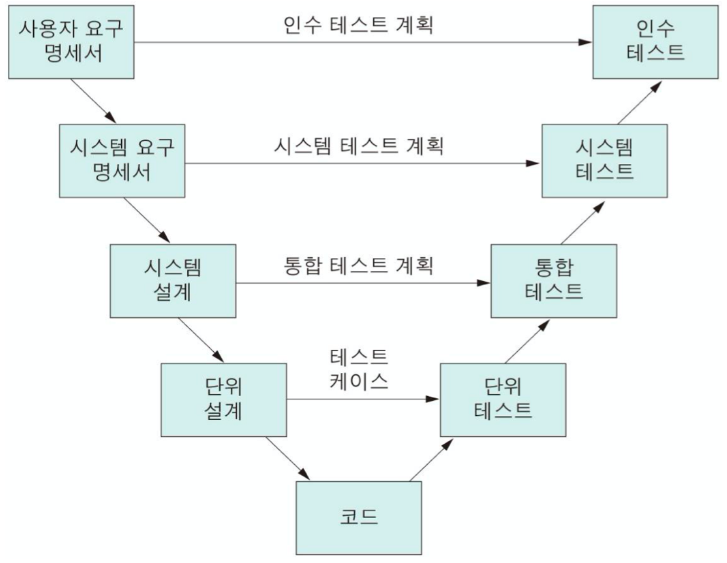
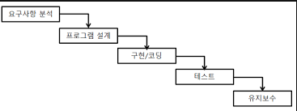

## 2024.07

### 소공 - 워크스루

- 사용사례를 확장하여 명세
- 설계 다이어그램, 원시 코드, 테스트 케이스 등에 적용할 수 있다
- 복잡한 알고리즘 또는 반복, 실시간 동작, 병행 처리와 같은 기능이나 동작을 이해하려고 할 때 유용하다.
- 단순한 테스트 케이스를 이용하여 프로덕트를 수작업으로 수행해 보는 것을 의미한다.

### 인터페이스 구현 검증 도구

- watir: Ruby를 사용하는 애플리케이션 테스트 프레임워크
- xUnit: NUnit, Junit 등 다양한 언어 지원 테스트 프레임워크
- FitNesse: 웹 기반 테스트케이스 설계 실행 결과 확인 등을 지원하는 프레임워크
- NTAF: Naver 테스트 자동화 프레임워크. FitNesse + STAF
- STAF: 서비스 호출 및 컴포넌트 재사용 등 다양한 환경을 지원하는 테스트 프레임워크

### STUB

- 제어 모듈이 호출하는 타 모듈의 기능을 단순히 수행하는 도구.
- 일시적으로 필요한 조건만을 가지고 있는 시험용 모듈

### 트리의 차수

- 노드의 차수
  - 한 노드가 가진 직접적인 자식의 수
  - 한 노드가 세 개의 자식을 가지고 있다면 그 노드의 차수는 3
- 트리의 차수
  - 노드의 차수 중 가장 큰 값
  - 즉 트리에서 한 노드가 가질 수 있는 최대 자식 노드의 수

### 인수 테스트

- 알파 + 베타 테스트를 의미
- 알파 테스트
  - 개발자의 장소에서 사용자가 개발자 앞에서 행하는 테스트
- 베타 테스트
  - 선정된 최종 사용자가 여러 명의 사용자 앞에서 행하는 테스트

### 물리데이터 파티션 설계

- 범위 분할 (range partitioning)
  - 지정된 열의 값을 기준으로
- 해시 분할 (hash partitioning)
  - 해시 함수로
  - 특정 파티션에 데이터가 집중되는 범위 분할의 단점을 보완
- 조합 분할 (Composite partitioning)
  - 범위 분할 후 해시 분할
- 목록 분할 (List partitioning)
  - 지정한 열 값에 대한 목록을 만들어 이를 기준으로
  - 예를 들어 '아시아', '유럽' 등
- 라운드 로빈 분할
  - 레코드를 균일하게 분배
  - 기본키가 필요 없음

### 소프트웨어 품질 목표

- portablilty: 이식성. 하나 이상의 하드웨어 환경에서 운용되기 쉽게 수정 가능
- efficiency: 효율성. 할당된 시간 동안 한정된 자원으로
- usability: 사용성. 사용자가 정확하게 이해 가능.

### 파레토 법칙 (Pareto)

- 소프트웨어 테스트에서 오류의 80%는 전체 모듈의 20%에서 발견된다.

### 순환 복잡도 (Cyclomatic)

- 걍 사이클 수 세면 됨
- V(G) = E - N + 2

### 소프트웨어 버전 등록 용어

- 저장소(Repository)
  - 최신 버전의 파일들과 변경 내역에 대한 정보들이 저장
- 가져오기(import)
  - 버전 관리가 되고 있지 않은 아무것도 없는 저장소에 처음 파일을 가져옴
- 체크아웃
  - 저장소에서 소스 파일과 함께 버전 관리를 위한 파일들을 받아옴
- 체크인
  - 체크아웃한 파일의 수정을 완료한 후 파일을 새로운 버전으로 갱신
- 커밋
  - 체크인 후 충돌나면 diff 도구로 수정한 후 갱신 완료
- 동기화(update)
  - 저장소에 있는 최신 버전으로 자신의 작업 공간을 동기화

### 소프트웨어 생명 주기 모델

- V모델
- 
  - 폭포수 모델의 변형
  - 요구사항 -> 분석 -> 설계 -> 구현, 각 단계를 모두 테스트함
  - Perry가 제안
  - 세부적인 테스트 과정으로 구성되어 신뢰도 높은 시스템 개발 가능
  - 검증과 확인을 병행하고 품질 보증을 강화
  - 결과의 검증에 초점을 둠
- 폭포수 모델
- 
  - 간결. 이해쉬움
  - 각 단계가 완료되어야 다음 단계로 넘어감
  - 전 단계로 못돌아감

### O(NlogN) 정렬 알고리즘

- 합병 정렬, 힙 정렬
- 참고로 버블, 선택, 삽입은 n^2임

### 블랙박스 vs 화이트박스 테스트

- 블랙박스
  - 입력 자료에 대한 아웃풋을 체크
  - 외부 동작에 초점
  - 사용자 관점
  - 내부 결함 알빠아님
  - 내부 코드 구현 전혀 고려 X
  - 경계값 분석, 오류 예측, 동등 분할 기법
  - 동치 분할 검사
- 화이트박스
  - 개발자관점
  - 내부 로직, 알고리즘, 코드 동작 경로 검사
  - 어려움
  - 조건, 루프 검사
  - 기초 경로 검사
    - 절차적 설계의 논리적 복잡성을 측정할 수 있게 해줌
    - 실행 경로의 기초를 정의하는 데에 사용
  - 제어 구조 검사
    - 조건 검사
    - 루프 검사
    - 데이터 흐름 검사
