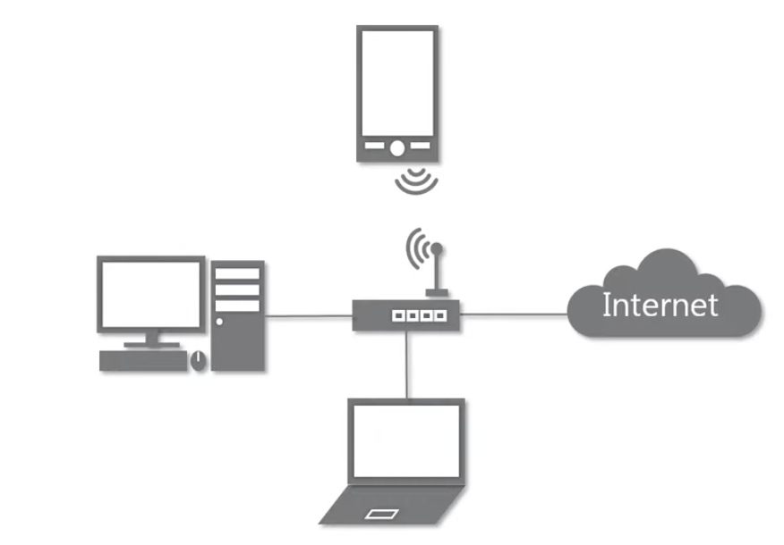

## 01. 네트워크

- 인터넷 != www

  - 인터넷은 가장 큰 규모의 네트워크
  - 인터넷의 많은 서비스 중 하나가 www

- 크기에 따른 분류

  - LAN
    - local area net
    - 지역끼리만 연결
    - 스타 LAN UDP. 같은 피시방에서 가능
  - WAN
    - wide area net
    - LAN과 LAN을 연결
  - MAN
  - VLAN

- 연결 형태에 따른 분류

  - star
    - 중앙 장비에 모두 연결
    - 
    - 중앙 장비 고장나면 다 망함
  - mesh
    - 여러 노드들이 서로 그물처럼 연결
    - 고장에 견고함

- 통신방식

  - 유니캐스트 - 1대1
  - 멀티캐스트 - 1대N, 특정 다수
  - 브로드캐스트 - 1대N, 같은 대역의 모두에게

- 프로토콜
  - 어떤 노드가 다른 노드에게 데이터를 어떻게 보내야 하는지에 대한 약속/양식
  - 근거리 (MAC)
    - 이더넷
  - 원거리 (IP)
    - ICMP
    - IPv4
    - ARP
  - 여러 프로그램 (포트번호)
    - TCP
    - UDP
