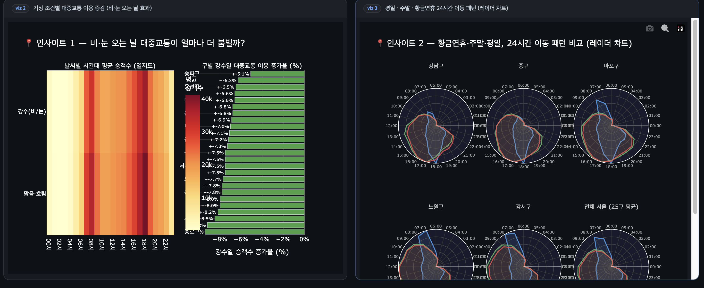
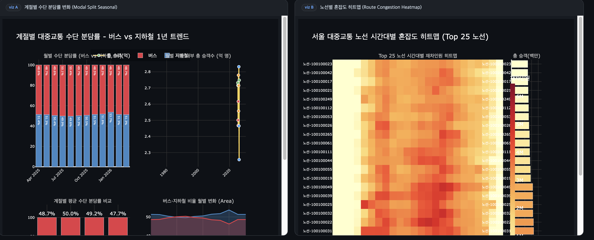
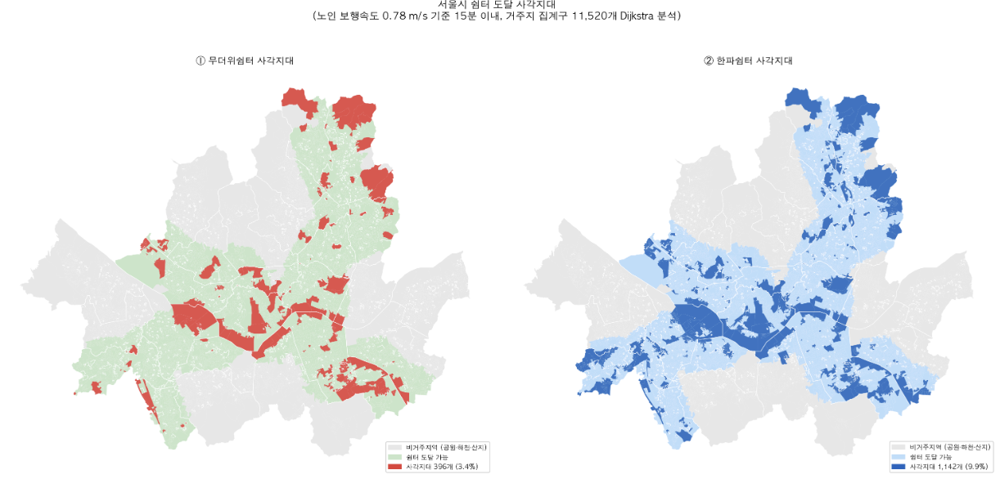
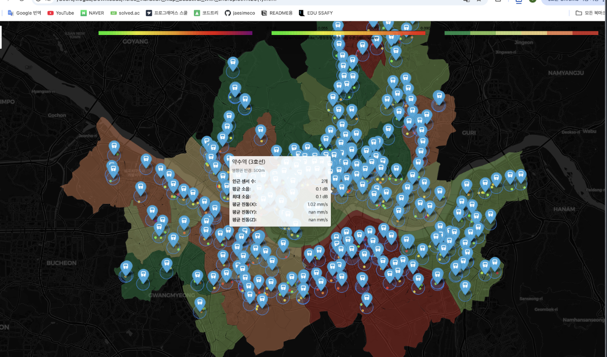
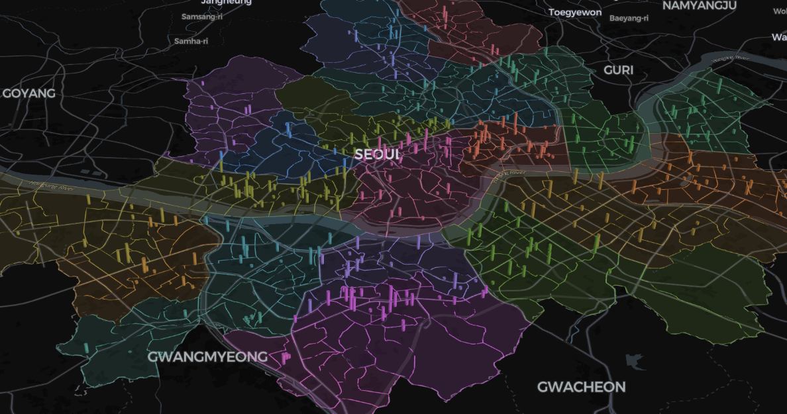
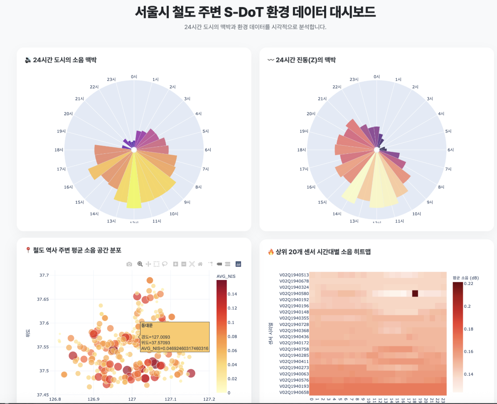

# 팀 회의록

> **일시**: 2026. 04.18
> **참석자**: 김성령, 양석준, 이정태, 심재현, 유호준

---

## 1. 아이디어 발표

### 양석준

- 서울 구별 대중교통 시간대별 혼잡도 시각화
- 강수(비·눈) 여부에 따른 대중교통 이용 히트맵
- 황금연휴 / 주말 / 평일 24시간 이동 패턴 비교 차트

### 김성령

- **끊어진 서울**: 지상 철도로 인한 물리적 단절 시각화
- **30분 도보 일상권 – 소외된 고령층**
  - 청년과 노인의 '30분'이 실질적으로 다름을 강조
  - 청년 대비 노인 보행 속도를 기준으로 도달 가능 거리의 격차 시각화
  - 노인 보행 속도로 접근 불가한 폭염쉼터·한파쉼터, 지하철 엘리베이터 시각화

### 이정태

- 인구 공동화 현상 시각화
- 출·퇴근 시간대에 따른 유동인구 vs 상주인구 차이 시각화

### 심재현

- **인터랙티브 대시보드 (HTML)**: Plotly 기반, 7개 핵심 차트를 포함한 종합 대시보드
  - **공간 분포**: 지도 위 소음 수치별 역사 위치·규모 시각화
  - **소음 히트맵**: 상위 20개 고소음 센서의 24시간 변화 패턴 분석
  - **도시의 맥박 (Polar Chart)**: 새벽부터 밤까지 순환하는 소음·진동 리듬 시각화
  - **상세 추이**: 시간대별 소음 및 진동(X·Z축)의 평균/최대 변화 그래프
  - 전처리 데이터셋: `sdot_hourly_preprocessed.csv`로 저장, 향후 추가 분석 대비

### 유호준

- 노인 교통사고 다발 구간 시각화
- 골목길·중앙버스차로에서의 교통사고 집중 현황 분석

---

## 2. 아이디어 수렴: 30분 도보 일상권 – 고령층 중심

### 채택 배경

**① 고령사회 진입에 따른 인구구조 변화**

> 2020년 서울 인구 구성: 유소년(0~14세) 10.6%, 청년(15~34세) 27.2%, 중장년(35~64세) 46.7%, 노년(65세 이상) 15.4%. 노년인구는 146.9만 명으로, '초기노인'(65~74세)이 노년인구의 60%를 차지하며 2010년부터 연평균 3.1% 증가. 75세 이상 노년인구는 연평균 6.8% 증가.  
> _(출처: 2040 서울플랜, 26p)_

**② 가속화되는 저출생·고령화**

> **2040년 서울 고령인구 비율은 약 32%** 로 전망되며, 늘어나는 복지·의료 수요에 대한 대응이 필요하다. 서울은 2018년 기준 고령인구 비율 14.4%로 이미 고령사회에 진입했으며, 2026년에는 초고령사회 진입이 예측된다.  
> _(출처: 2040 서울플랜, 34p)_

### 선정 이유

- 2040 서울플랜의 '30분 도보 일상권' 정책은 청년·일반 성인을 기준으로 설계됨
- **노인의 시간 관점에서, 서울은 얼마나 친절한가**를 데이터로 시각화

---

## 3. 역할 분담

| 팀원   | 담당 분야                       |
| ------ | ------------------------------- |
| 유호준 | 교통                            |
| 심재현 | 생활 인프라 (전통시장, 은행 등) |
| 이정태 | 의료                            |
| 양석준 | 복지시설, 녹지(공원)            |
| 김성령 | 기후 + 프로젝트 뼈대 구축       |

---

## 4. 할 일 (TODO)

- [ ] 각자 활동 내역 PR로 기록
- [ ] 담당 분야 시각화 아웃풋 제작
  - 시각화 결과물로 유의미한 인사이트 도출 가능해야 함
  - 사용 데이터의 신빙성 검증 필수
  - 즉, 각 분야에서 의미 있는 결과물 완성을 목표로 함
