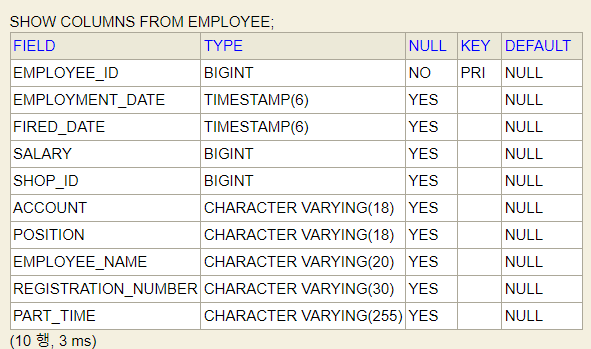

## 테이블 정의서 관련

- 컬럼 속성 변경
  - H2 기준이긴 한데, 오라클도 비슷할 거라 생각.
  - 만약 다르다면 추후에 오라클 기준으로 수정
- 
  - id 부분 VARCHAR -> BIGINT
  - 날짜 관련 DATE -> TIMESTAMP(6)
  - NOT NULL 조건 다 넣어줘야 함.
  - CHAR(18), CHAR(20) 통일
